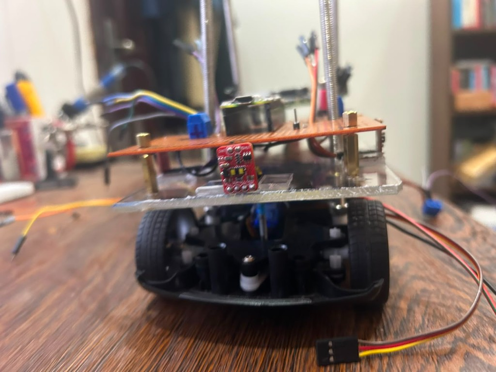
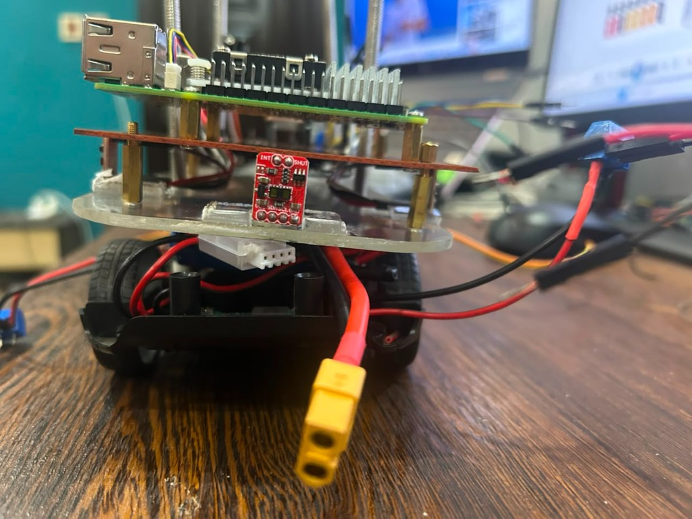
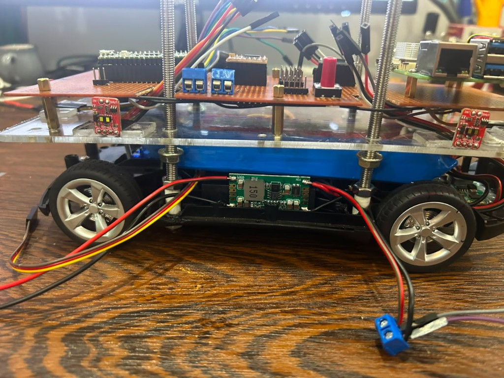
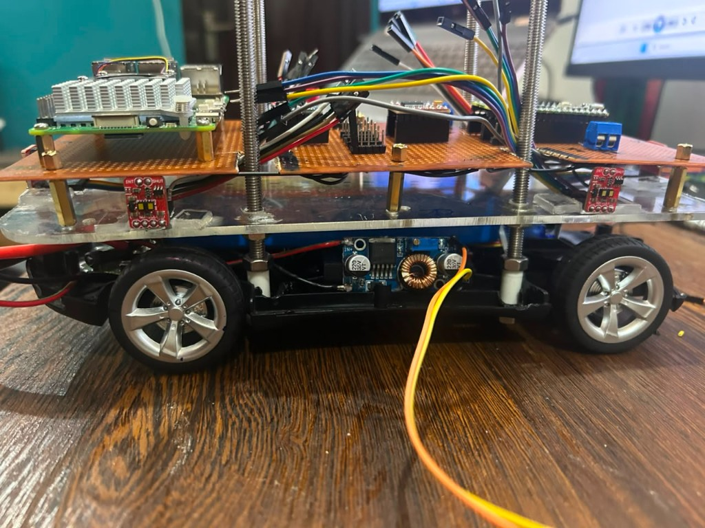
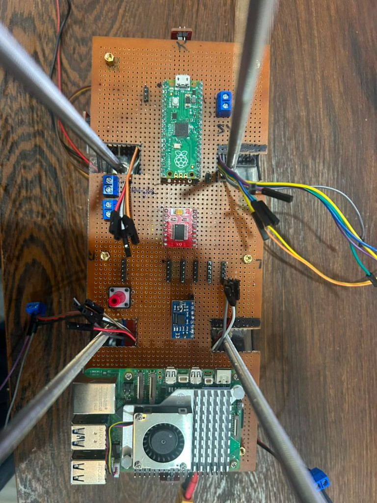
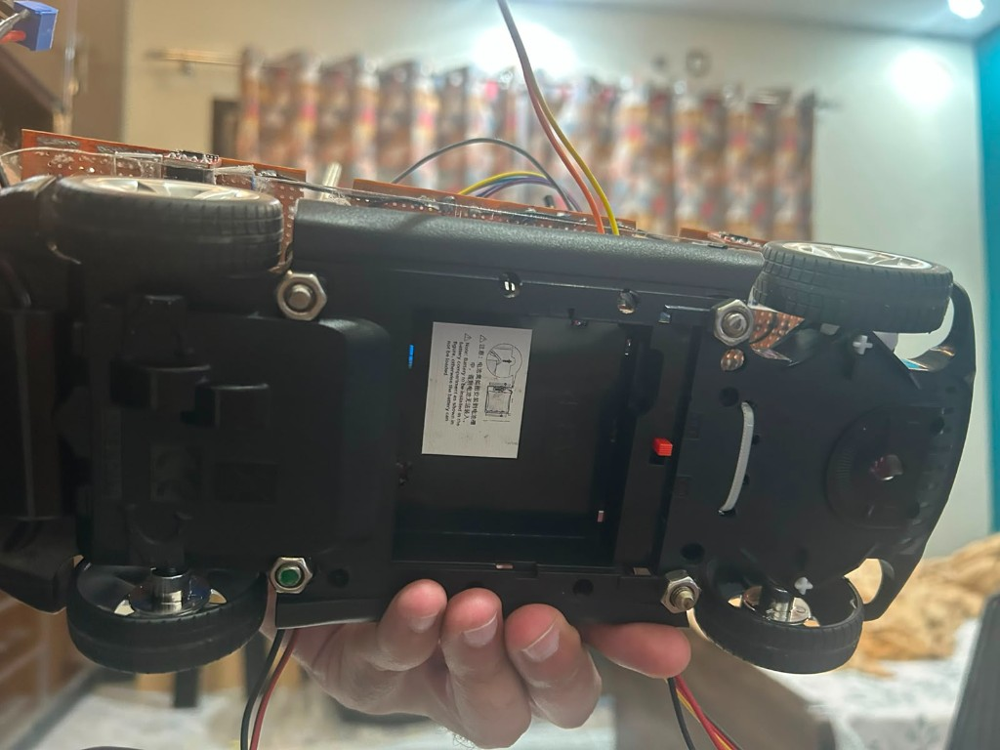

# SECTION 1 — Project Zero Error

We are Team Zero Error, a team of three students from St. Francis Schools and Colleges in
Sara-i-Alamgir, Pakistan, competing in the WRO 2026 Future Engineers category. For this
challenge, we developed an autonomous 1:16 scale self-driving car that independently navigates a
three-lap track, avoids obstacles, and parks itself without any remote control.

This document records **how the car was designed, not only what it became**. Where a subsystem is
not yet finished, the heading exists with a status marker so our progress is visible rather than
hidden.

| Marker | Meaning |
| --- | --- |
| `DONE` | Built, measured, and the measurement is recorded here |
| `IN PROGRESS` | Hardware exists, characterisation not complete |
| `PENDING` | Designed on paper, not yet built or measured |

---

# SECTION 2 — The Challenge

**Competition Overview**

The World Robot Olympiad (WRO) Future Engineers category is an advanced robotics competition
focused on the design and implementation of autonomous, self-driving cars. The challenge requires
engineering a scale vehicle capable of navigating complex, dynamic environments using real-time
sensor data, computer vision, and steering algorithms without any human intervention.

**Challenge Architecture**

The competition is divided into two distinct challenges. Note: parking is integrated into the
second challenge rather than existing as a standalone event.

1. **Open Challenge:** The vehicle must autonomously complete 3 full laps on a walled track. The
   robot must identify the correct driving direction, maintain lane control, and bring itself to a
   complete stop in the correct section after the final lap.

2. **Obstacle Challenge:** This phase adds traffic signs. The vehicle must complete 3 laps while
   navigating around red and green pillars, following the passing rules:
   - **Red pillars:** must be passed on the right (Rule 9.19)
   - **Green pillars:** must be passed on the left (Rule 9.19)

3. Parking is part of the Obstacle Challenge scoring rather than a separate event. For the
   September scope, we retained the **parking-lot start** and exit (Rule 1.8.1, 7 points) but
   descoped parking-in (Rules 1.8.2/1.8.3, 22 points). Our revised target is **107/122 points**.

**Field Specifications**

| Property | Value | Rule |
| --- | --- | --- |
| Mat size | 3200 × 3200 mm | 13.1 |
| Inner racetrack | 3000 × 3000 mm | 13.1 |
| Wall height, exterior and interior | 100 mm | 13.3, 13.5 |
| Corridor width, Open Challenge | **1000 mm or 600 mm**, ±100 mm at the International Final; design against 500 mm worst case for international progression | §8 |
| Corridor width, Obstacle Challenge | Always **1000 ±10 mm** at the International Final | §8 |
| Traffic sign dimensions | 50 × 50 × 100 mm | 13.19 |
| Red sign colour | RGB (238, 39, 55) | 13.21 |
| Green sign colour | RGB (68, 214, 44) | 13.22 |
| Parking limitation colour | Magenta, RGB (255, 0, 255) | 13.27 |
| Parking lot width | 200 mm | §5 |
| Parking lot length | **1.5 × robot length** | §5 |
| Maximum vehicle dimensions | 300 × 200 mm, 300 mm height; maximum mass 1.5 kg | 9.17 / 11.2 |

Two constraints from this table shaped our design more than any other:

- **The narrow Open corridor.** The nominal 600 mm corridor may be 500 mm at the International
  Final tolerance. Our geometry measurements showed that a single-arc 90° turn is not feasible
  with our 504 mm design radius, so narrow Open rounds require a multi-point turn.
- **The parking lot scales with our own vehicle.** Because the bay is 1.5 × our robot's length,
  a longer robot does *not* get a proportionally easier park — the clearance stays at 0.5 × our
  length regardless. But a longer robot needs a larger turning radius to enter that bay. **Shorter
  is strictly better for parking.**

**Scoring Breakdown**

| Assessment Area | Maximum Points |
| --- | --- |
| Open Challenge | 30 |
| Obstacle Challenge | 62 |
| Technical Documentation | 30 |
| **Total** | **122** |

**Easily missed rules we have written into our checklist**

| Rule | What it means for us |
| --- | --- |
| 9.17 | Dimensions are checked. Exceeding them after a 3-minute repair window ends the round |
| 9.18 | In the Open Challenge the vehicle **may not touch the outer boundary wall** at all. Interior-wall contact is tolerated only if nothing moves |
| 9.20 / 13.15 | A pillar may be touched only if it stays within an 85 mm circle around its seat |
| 9.24.7 | Touching a **parking lot limitation** stops the round |
| 9.21 | Driving opposite the round direction is allowed for two sections only |
| 13.18 | Mat and object colours may differ from spec — on-site colour recalibration is expected |
| §6 | A **surprise rule** is expected in the 2026 season. Our software must be modular enough to absorb a new behaviour |
| 11.10 | Built-in wireless must be off and judge-verifiable. The Pico is a non-W model with no radio; the Pi 5 Wi-Fi/Bluetooth shutdown procedure is still `OPEN` |

---

# SECTION 3 — The Team

<table>
  <tr>
    <td align="center">
      <br>
      <strong>Abiha Zainab</strong><br>Brain — Software
    </td>
    <td align="center">
      <br>
      <strong>Tawassal Zahra</strong><br>Body — Hardware and Documentation
    </td>
    <td align="center">
      <br>
      <strong>Nukhba Tanveer</strong><br>Senses — Sensors and Power
    </td>
  </tr>
</table>

**Student Biographies**

- **Abiha Zainab — Brain layer (Software)**
  - Responsible for architecting the vehicle's autonomous navigation logic and decision-making
    frameworks. Implements the finite state machine that handles the track environment, integrates
    sensor data into decisions, and tunes the steering control feedback loop for lane-keeping and
    obstacle avoidance.
  - Technical interest: software development, control algorithms, and system logic.

- **Tawassal Zahra — Body layer (Hardware and Documentation)**
  - Responsible for the physical chassis, structural integrity, and mechanical integration.
    Manages the layout and mounting of the controllers, drive motor, steering servo, and power
    distribution, and owns the steering conversion described in Section 4c. She also coordinates
    the engineering documentation and integrates the team's approved material into this repository.
  - Technical interest: mechanical engineering principles, chassis dynamics, and robust hardware
    design.

- **Nukhba Tanveer — Senses layer (Sensors and Power)**
  - Owns the sensing and power subsystems: ToF sensor configuration and addressing, IMU
    integration, encoder odometry, power distribution and wiring. She also owns the data-logging
    protocol for sensor and power tests.
  - Technical interest: `[NUKHBA TO WRITE IN HER OWN WORDS — do not inherit the previous
    member's text. Judges may ask a student to explain their own subsystem.]`

The three roles map directly onto the three layers described in Section 5 — Body, Senses and
Brain. Each of us owns one layer end to end, from the hardware to the code that drives it.

### Repository and documentation workflow

Most commits in this repository were made through **Tawassal's student account**. While the team
was learning Git, we chose a single-editor workflow to avoid merge and pull-request confusion:
Abiha and Nukhba prepared and submitted material for their own layers, and Tawassal checked the
formatting, integrated it into the shared document and committed the result.

The Git commit author therefore identifies the **repository integrator**, not necessarily the sole
author of every engineering decision in that commit. Technical ownership remains as listed above:
Abiha owns Brain work, Nukhba owns Senses and Power work, and Tawassal owns Body work and
documentation integration. To make shared authorship clearer, collaborative commits should name
the contributing students in their descriptions or use `Co-authored-by` trailers where practical.

### Use of AI as an engineering and learning tool

We initially updated the repository manually. As the project grew, we began using **Cursor Agent**
to streamline repetitive repository work, organise documentation and accelerate parts of the
coding and debugging workflow.

This project includes **AI-assisted and AI-generated code and documentation text**. We use AI as a
tool, not as a substitute for engineering ownership. The student responsible for each layer
reviews the relevant output, understands how it works and remains responsible for testing it on
the actual vehicle. Measurements, wiring checks, calibration results and design decisions are
accepted only when the team can verify them; an AI suggestion is not treated as evidence.

We began this project with roughly one year of microcontroller experience. AI helped us ask
technical questions, study unfamiliar concepts, compare possible approaches, find faults and
improve our writing. This accelerated our learning and deployment process while expanding our own
knowledge and practical skills. The goal has never been to hide the use of AI, but to use it
responsibly while ensuring that we can explain and defend the system we build.

**Coaching & Guidance**


**Haider Abbas** provides organisational oversight and strategic guidance as the team coach. His
role covers administrative facilitation and milestone tracking, ensuring that the student
engineering team retains complete autonomy over both hardware fabrication and codebase execution.

---

# SECTION 4 — Our Vehicle

This section covers the physical setup and the compute setup of our autonomous car.

## a) Chassis

**Mechanical Specifications**

| Property | Value | Status |
| --- | --- | --- |
| Scale | 1:16 RC car, converted | `DONE` |
| Drive configuration | Rear-wheel drive, single motor | `DONE` |
| Steering | Front-wheel Ackermann, servo actuated | `DONE` |
| Wheelbase | 160 mm | `DONE` |
| Track width, wheel centre to wheel centre | 90 mm | `DONE — 3 READINGS` |
| Overall width at front tyres | 105 mm | `DONE — 3 READINGS` |
| Rear axle centreline to current front ToF face, `L_f` | 210 mm; remeasure after acrylic bracket | `DONE — CURRENT MOUNT` |
| Overall L × W × H | `[PENDING — must be inside 300 × 200 × 300 mm, Rule 9.17]` | `PENDING` |
| Mass, race-ready | `[PENDING — 1.5 kg maximum, Rule 11.2]` | `PENDING / OPEN COMPLIANCE RISK` |
| Minimum turning radius | Left 496 mm; right 504 mm; design `R = 504 mm` | `DONE — 3 RUNS EACH` |

**Current assembled-vehicle views**

<p>
  
  
</p>
<p>
  
  
</p>
<p>
  
  
</p>

*Current assembled configuration on 2026-08-20, showing the layered electronics, Raspberry Pi 5,
Raspberry Pi Pico, sensors, wiring, power hardware and underside chassis. All six current assembled
views exist. These views must be re-shot if the final hardware arrangement changes.*


*Early packaging check against the 300 × 200 mm footprint limit. This is not the final
race-ready dimension measurement: the completed vehicle, including sensors and electronics,
must still be measured in length, width and height.*

**Why a converted RC chassis instead of a scratch build?**

We evaluated three options before committing.

- **Build from scratch (acrylic or aluminium plate, bought wheels and axles).** Maximum design
  freedom. Rejected because our team is code-strong and new to mechanical fabrication, and we do
  not have reliable access to machining. Building a rigid, square, low-backlash steering linkage
  from raw stock is a multi-week job with a high chance of a floppy result.
- **A kit robotics platform.** Fast and reliable, but the kits available to us are
  differential-drive. The category explicitly asks for kinematics *different* from differential
  drive, so this would have missed the point of the challenge.
- **Convert a commercial 1:16 RC car. — Chosen.** The chassis already gives us a rigid moulded
  frame, a proper Ackermann steering knuckle set, a rear differential and bearings that we could
  not fabricate to the same tolerance. The conversion work is bounded and specific: replace the
  radio receiver and the crude steering actuator with our own electronics.

**Trade-off accepted:** we lose control over the geometry. We inherit the manufacturer's
wheelbase, track and steering throw, and we must design our sensor and electronics mounting around
an existing shape. We judged this a good trade — mechanical rigidity is expensive to buy with
labour and cheap to buy with a donor chassis.

**Rule compliance — why a single motor and a mechanical differential are allowed**

The rules prohibit steering by commanding the left and right wheels at different speeds
(differential or skid steering). They do **not** restrict how many wheels are driven — front,
rear and four-wheel drive are all acceptable, provided direction of travel is set by a steering
mechanism.

Our chassis has a mechanical differential in the rear axle. This is not differential *drive*: it
passively splits torque between two wheels and is not commanded by the controller. Our single
motor physically cannot produce a commanded speed difference, which is exactly the property the
rule protects.

> We initially misread this rule during our own design discussion and nearly rejected a valid
> chassis option because of it. Re-reading the rule text — not a summary of it — corrected the
> mistake before it cost us anything.

**Sourcing and Redundancy Strategy**

- **Local sourcing.** The chassis was procured from local suppliers, so replacement parts can be
  obtained without long shipping delays. Given our competition timeline, a part that takes three
  weeks to arrive is effectively unavailable.
- **Hardware redundancy.** `[CONFIRM STATUS BEFORE PUBLISHING: does the second chassis physically
  exist and is it untouched? If it is still only planned, mark this PENDING rather than claiming
  it.]` Our intent is to keep an identical second chassis untouched as a backup so that a
  mechanical failure during testing can be resolved by swapping components rather than halting the
  project.

**Chassis modifications made so far**

| Modification | Reason | Status |
| --- | --- | --- |
| Radio receiver and ESC removed | Replaced by our own control electronics | `DONE` |
| Steering actuator replaced with SG90 servo | Original mechanism had no position feedback | `DONE` |
| Motor wired to TB6612FNG H-bridge | Bidirectional PWM control | `DONE` |
| Electronics deck | To carry Pi 5, Pico, power board | `PENDING` |
| Camera mast | Height set by Rule 9.17 envelope and pillar visibility | `PENDING` |
| ToF sensor brackets | Placement described in Section 4f | `PENDING` |
| Encoder disc and sensor mount | See Section 4f | `IN PROGRESS` |

> **Mechanical layout drawing to be added:** `schemes/mechanical_layout.png`
> Top view and side view showing wheelbase, track, sensor positions and centre of mass.
> *(Required for Criterion 1 above level 2.)*

---

## b) Compute Architecture

We split the processing into a two-layer compute architecture to handle high-level logic and
low-level physical control separately.

- **Raspberry Pi 5 (The Brain):** Runs Linux headless (Raspberry Pi OS Lite 64-bit) and handles
  high-level intelligence. It manages the state machine, processes camera vision for pillar
  colour, and calculates driving decisions.

- **Raspberry Pi Pico (The Body controller):** A dedicated real-time controller in constant serial
  communication with the Pi 5. It executes time-critical tasks: PWM for steering and drive, ToF
  sensor polling over I²C, IMU reads, and wheel encoder pulse counting.

This is the **intended final architecture**. The current physical build has no Pi 5 power
provision. Integration requires a dedicated **≥3 A, 5 V buck** on a separate feed with the shared
star ground; the Pi must not be added to the Pico's already-warm LM2596 rail.

**Why two layers?**

A Linux board like the Pi 5 is excellent for heavy computation, but it operates on a "best-effort"
schedule. The operating system is constantly juggling background tasks, so it cannot guarantee the
exact timing needed for stable motor control. Usually the interruption is microseconds.
Occasionally it is tens of milliseconds — and a control loop that should run every 5 ms but
occasionally runs 40 ms late produces a visible steering twitch.

The Pico fixes this with deterministic, real-time control. It runs a single dedicated loop that
executes predictably every time. This division of labour ensures the car's physical reactions are
correctly timed while the Pi 5 focuses on perception and strategy.

**Trade-off accepted:** two controllers means a serial link that can fail, two codebases and two
flashing procedures. We accepted this because the alternative — camera processing and hard
real-time motor control competing for one CPU — has a failure mode (intermittent control glitches)
that is far harder to diagnose than a link that is either up or down.

```
 ┌─────────────────────────────┐        ┌──────────────────────────────┐
 │      RASPBERRY PI 5         │        │      RASPBERRY PI PICO       │
 │                             │        │                              │
 │  Camera (pillar colour)     │ serial │  ToF sensors     (I²C)       │
 │  State machine / strategy   │<------>│  IMU heading     (I²C)       │
 │  Lap counting               │        │  Wheel encoder   (GPIO)      │
 │  Logging                    │        │  Motor PWM  (TB6612FNG)      │
 │                             │        │  Steering servo PWM          │
 └─────────────────────────────┘        └──────────────────────────────┘
          "think"                                  "act"
```

---

## c) Steering

Getting the steering right was our toughest mechanical hurdle. We had to completely re-engineer
the stock setup to get the precision an autonomous car needs. Because this subsystem went through
the most iteration, we document it as a sequence of versions rather than as a finished result.

### Version 0 — the stock mechanism

The chassis came with a DC motor driving a gear sector. The gear sector pushed a **yoke** — a
plastic arm with a slot in it, pinned to a pivot post on the chassis. The yoke pushed the track
rod, which turned both front knuckles together.

The critical limitation: **there is no position feedback anywhere in that chain.** The stock system
is a bang-bang actuator with exactly three achievable states — full left, centre, full right. A car
that can only steer at full lock cannot follow a wall at a controlled offset, and cannot execute a
parking manoeuvre that requires a specific radius.

<p>
  
  
</p>

*Version 0 before modification. Left: the stock DC steering motor and sector beside the white
yoke. Right: the yoke, its chassis pivot and the black track rod connecting the two front
knuckles.*


*The removed stock steering housing. Recording the original assembly before cutting or replacing
parts gave us a reference for the factory mounting points and linkage travel.*

### Version 1 — direct servo-to-track-rod coupling (rejected on paper)

The obvious first idea was to remove the whole stock assembly and connect a servo horn directly to
the track rod. We rejected it before cutting anything, for two reasons:

1. **Geometry.** The track rod sits low and off-centre. Mounting a servo so its horn arc lines up
   with the required travel meant either cutting into the chassis floor or building a raised
   bracket that would conflict with the front suspension.
2. **Throw mismatch.** A servo horn sweeps an arc; the track rod needs near-linear lateral travel.
   Coupling them directly across a large angle gives a non-linear servo-angle-to-wheel-angle
   relationship, making calibration harder for no benefit.

This is the cheapest kind of iteration — the one done on paper.

### Version 2 — retain the yoke, drive it with the servo (current design)

We mounted an upright SG90 servo into the old steering motor pocket so its horn rotates
horizontally, and kept **the original steering yoke on its original pivot post**. A **bicycle
spoke** drops from a slot in the servo horn down to the yoke.

```
   SG90 servo (upright, in the old motor pocket)
      |
   [ horn, with slot ]
      |
   bicycle spoke push-rod
      |
   [ steering yoke ]  <-- still on its original chassis pivot post
      |
   [ track rod ]
      |
   front knuckles  --->  factory Ackermann geometry, unchanged
```

**Why we built it this way:**

- **The pivot post takes the side-loads, not the servo.** This is the most important decision in
  the mechanism. We explicitly avoided making the servo shaft the pivot point — if we had, every
  bump and side-shock from driving would transmit straight into the servo's internal plastic gears
  and strip them. Keeping the pivot and the drive mechanism separate means the servo only has to
  supply rotating force.
- **The slot absorbs arc mismatch.** The servo horn moves in an arc; the yoke moves through a
  different arc. The slot lets the spoke slide slightly as the angle changes, so the linkage does
  not bind at sharp steering angles.
- **The factory geometry is preserved.** The yoke was designed for that post and the track rod was
  designed to be pushed by that yoke, so we did not have to re-derive any Ackermann geometry.
- **The bicycle spoke is a good push-rod.** Stiff in tension and compression, thin, locally
  available, and bendable with pliers — which gives a free mechanical adjustment for centring
  without touching code.

**Trade-off accepted:** the slot that prevents binding is also clearance, and clearance is
backlash. Floor testing measured a hysteresis band of approximately **1226–1286 µs**, about
**58–60 µs** wide with midpoint near **1256 µs**.

#### Version 2 build evidence

<p>
  
  
</p>

*The servo fitted into the stock motor pocket. These views were used to check horn sweep,
wire clearance and access to the original yoke pivot before finalising the linkage.*

<p>
  
  
</p>

*Linkage trials during Version 2. They record the physical iteration rather than claiming that
each photographed arrangement was retained. The pivoting factory yoke remained the common
element while servo position, horn geometry and coupling method were evaluated.*

<p>
  
  
</p>

*A later SG90 linkage prototype from two angles. The images make the mechanical load path
visible: the servo moves the coupling, the coupling rotates the white yoke, and the yoke pushes
the original track rod. Final left- and right-lock photographs are still required after the
safe software endpoints have been calibrated.*

### Iteration inside Version 2 — the hunting-noise problem

After assembly the servo made a continuous straining noise at large steering angles and drew
current continuously instead of settling.

**Our first instinct was wrong.** We assumed the SG90 was too weak and began looking at metal-gear
replacements. Before buying anything, we measured servo current across a range of commanded angles.

**What the measurement showed:** at moderate angles the servo settled to idle current
(~10–20 mA). At large angles the current stayed high indefinitely. That is not the signature of a
weak servo — a weak servo fails to reach position and spikes current *regardless of angle*. Current
that is normal in the middle and continuous at the extremes means the servo is being commanded
**past the mechanical steering limit** and is pushing against a hard stop forever.

**The fix was in software:** define `LEFT_MAX` and `RIGHT_MAX` end-stops and never command outside
them. Cost: zero. The servo we already had was adequate.

**The lesson we wrote down:** *an unexpected reading is a reason to measure, not a reason to buy.*
We named this failure mode "anxiety → addition" and we now check for it deliberately.

### Software safeguards

Steering end-stops are enforced in the Pico firmware, so the servo can never be driven past its
safe physical range regardless of what the Brain layer asks for. A mechanical constraint belongs
in the layer closest to the mechanism — the state machine should not have to know about it.

### Servo calibration procedure

**Criterion:** the usable steering limit is the largest wheel deflection at which servo current
returns to idle (~10–20 mA) and stays there.

1. Vehicle on blocks, wheels free, ammeter in the servo supply line.
2. Command a small angle from centre. Wait 2 s. Record current.
3. Increase the commanded angle in steps, repeating step 2.
4. The last angle at which current returns to idle is that side's mechanical limit.
5. **Approach the same angle from the opposite direction and repeat.** Any difference between the
   limit found going outward and coming inward *is* the linkage backlash.
6. Repeat independently for left and right. **Expect asymmetry** — the linkage is not symmetric,
   so there is no reason for the two limits to match.

| Parameter | Value | Status |
| --- | --- | --- |
| `CENTRE_US` | 1262 µs | `DONE — RESTORED AFTER FLOOR TESTS` |
| Safe left endpoint | 1480 µs | `DONE` |
| Safe right endpoint | 1010 µs | `DONE` |
| Measured backlash / hysteresis | ~1226–1286 µs; width ~58–60 µs; midpoint ~1256 µs | `DONE` |

Tool: `src/pico/tools/steering_calibrate.py` — interactive, steps the servo from the serial console
so values can be found without re-flashing.

### Straight-line controller result `DONE`

Five P-only baseline runs at `CENTRE_US = 1262` accepted **1.2–1.6° peak heading error**,
approximately **1.2° steady error**, and about **23 mm net lateral displacement over 2 m**.
Straight-line hold is therefore confirmed.

An integral trial at `KI = 6` across four runs never settled and could perform worse than the
P-only baseline. The linkage backlash is a deadzone: the integral accumulates while the wheels do
not move, then crosses the slack suddenly and reverses, creating a structural limit cycle.
Integral action was removed permanently: **`KI = 0`**.

The derivative term is deferred until corner testing supplies a real 90° heading step. If damping is
needed, the BNO055's native `imu.gyro()` rate is preferable to differencing quantised Euler
angles. `KD = 0` remains the measured straight-line baseline.

### Version 3 — possible mechanical improvements `PENDING`

- **Backlash reduction.** If the measured deadband affects wall following, a light spring preload
  would take up the slack in one direction.
- **Mount rigidity check.** If the servo mount flexes under cornering load, steering angle will
  vary with speed — a bug that only appears on the field.

---

## d) Drive

- **The motor setup.** We kept the stock small brushed DC motor, which drives the rear axle
  through the vehicle's built-in gearbox.
- **Why the stock motor?** Fitting a larger motor would require modifying the chassis in ways that
  compromise its structural integrity. Keeping it stock preserves chassis strength, and our torque
  demand is low: the vehicle is light, drives on a flat mat, and never climbs.
- **Motor rating: 5 V.** This is the number that drives the whole power decision below.
- **Control method.** PWM from the Pico through a TB6612FNG motor driver, supplied from a
  **dedicated 5 V buck converter** — not from the raw battery.

**Why the TB6612FNG over the L298N?**

| | TB6612FNG | L298N |
| --- | --- | --- |
| Switching element | MOSFET | Bipolar (BJT) |
| Voltage drop at load | ~0.5 V total | ~2 V+ total |
| Waste heat | Low, no heatsink needed | High, large heatsink required |
| Mass and volume | Small | Bulky |

The deciding argument is voltage drop. Every volt lost in the driver is a volt not delivered to
the wheels, and it returns as heat that must be carried around as heatsink mass. **Trade-off
accepted:** the TB6612FNG has a lower continuous current rating, which is not binding for a 1:16
chassis but would need revisiting on a larger vehicle.

### Motor driver bring-up measurements `DONE`

| Measurement | Result | Conditions | What it tells us |
| --- | --- | --- | --- |
| Free-run current | ~140 mA | Test rail, no load | Baseline for the power budget |
| Minimum reliable duty cycle | 15 % | **5 V rail, 1 kHz PWM, motor installed in chassis** | Below this the wheels do not turn reliably |

Because these figures were taken **at 5 V / 1 kHz, which is the rail the motor now actually runs
on**, they are valid operating numbers rather than bench approximations. This was not true of an
earlier version of our design — see below.

The minimum duty result feeds directly into the control software. Any speed controller that
outputs below the floor is commanding a stall, not a slow crawl. The Body layer clamps its output
above this floor rather than assuming duty maps linearly to speed down to zero.

### Motor voltage: iteration from duty-capping to rail regulation

This is a design change we made after examining our own reasoning, and it is worth recording in
full because the first version was defensible-sounding and wrong.

**Version 1 — raw battery, limited by duty cycle.** Our original plan ran the motor directly from
the 11.1 V pack and capped the PWM duty cycle in firmware to roughly 45 %, on the reasoning that
45 % of 11.1 V gives an average of about 5 V, which is what the motor is rated for.

**Why we abandoned it.** The argument confuses average voltage with what the motor actually
experiences.

- A duty cap reduces the *average* voltage. It does **not** reduce the peak. During every ON pulse
  the motor still sees the full 11.1 V across its windings.
- Motor heating depends on **RMS current, not average voltage**. At the same average voltage, a
  chopped 11.1 V supply produces higher peak and RMS current than a steady 5 V supply.
- The problem is worst exactly where it matters most — at stall or breakaway, back-EMF is zero and
  current is limited only by winding resistance. That is when a 5 V-rated motor sees 11.1 V pulses
  through a near-short.
- We had also written that the high rail "gives plenty of instant torque headroom." That
  contradicts the cap: headroom above the cap is headroom the software will never use. We cannot
  claim the cap as protection and as headroom simultaneously.

**Version 2 — dedicated 5 V buck converter (current design).** The motor is now supplied from its
own TPS5450 buck regulated to 5 V, matching the motor's rating. Duty cycle now controls **speed
only**, which is what PWM is actually for.

**What this bought us:**

| Benefit | Detail |
| --- | --- |
| The motor never sees over-voltage | Not on average, not on peaks, not at stall |
| Full duty range is usable | We regained the 55 % of control range the cap was discarding |
| Our bench measurements became valid | The 140 mA and 15 % figures were taken at 5 V — they now describe the real operating condition instead of needing to be redone |
| Better resolution at low speed | The usable band runs from 15 % to 100 % instead of a restricted duty-capped range |

**Trade-off accepted:** one more buck converter — more mass, more board area, one more component
that can fail. We judged that acceptable against destroying the motor, especially since the motor
is stock and the chassis cannot easily accept a replacement.

**A new failure mode this introduces — and it is a real one.** A battery and a buck converter
behave very differently under a current surge. A battery **sags**; a buck converter **current-limits,
hiccups, or shuts down**. Our motor stall current is not yet measured, and if it exceeds the
converter's limit, the motor rail will collapse at exactly the moment the car needs torque most —
breakaway from standstill.

Mitigations planned:
- Measure stall current at 5 V and compare against the converter's rated limit `PENDING`
- Bulk capacitance at the TB6612FNG input to supply the surge locally, so the converter sees an
  averaged load rather than the raw transient `PENDING`
- Firmware soft-start: ramp duty from the floor rather than stepping to the target `PENDING`

**Honest note on the driver drop.** The TB6612FNG loses roughly 0.5 V across its output stage.
On a 12 V rail that was 4 % and negligible; on a 5 V rail it is about 10 %, so the motor sees
closer to 4.5 V than 5 V. This slightly reduces top speed. We accept it — the same drop on an
L298N would have been over 2 V, which on a 5 V rail would have been disqualifying for that part.

| Parameter | Value | Status |
| --- | --- | --- |
| Motor rated voltage | 5 V | `DONE` |
| Motor rail | 5 V, dedicated TPS5450 buck from the actuator pack | `DONE` |
| PWM frequency | 1 kHz | `DONE` |
| Duty floor (minimum reliable) | 15 % at 5 V / 1 kHz, in chassis | `DONE` |
| Duty cap | None — the rail sets the voltage. Any cap is now a *speed* choice, not protection | `DONE` |
| Motor stall current at 5 V | `[PENDING]` | `PENDING` |
| Buck converter current limit vs stall current | `[PENDING]` | `PENDING` |
| Motor case temperature after a 3-lap run | `[PENDING]` | `PENDING` |

### Torque and speed reasoning

The vehicle does not need to be fast. It needs to be *controllable*. Constraints that set our
target speed:

- **The 600 mm corridor.** Higher speed means more distance covered before a correction takes
  effect, so achievable steering error grows with speed. The narrow-corridor rounds set the ceiling.
- **Rule 9.18.** In the Open Challenge, touching the outer wall is not permitted at all. Speed that
  produces occasional wall contact is not a minor cost — it is a zero.
- **The parking-lot start.** The retained exit manoeuvre still benefits from low speed and
  repeatable distance control; parking-in itself is outside the current 107-point scope.

Torque demand is dominated by **breakaway from standstill**, which is why the duty floor matters
more to us than peak power.

| Quantity | Value | Status |
| --- | --- | --- |
| Target cruise speed, 1000 mm corridor | `[PENDING]` | `PENDING` |
| Target cruise speed, 600 mm corridor | `[PENDING]` | `PENDING` |
| Target speed, parking-lot exit | `[PENDING]` | `PENDING` |
| Development command | 35% duty; **not a fixed speed** | `DONE — ASSUMPTION CORRECTED` |

### First floor runs and stopping-distance test `DONE`

The first untethered floor run used the GP15 active-low start button and a hard maximum runtime.
The vehicle drove successfully at 40% duty. This moved the project from component bring-up to an
integrated vehicle that could start from one button press and move under its own power.

The first wall-stop experiment also showed why a threshold cannot equal the desired final gap.
There is delay before the control loop sees the threshold, followed by motor spin-down and vehicle
coast. With the target 3.06 m from the start and a 600 mm trigger, three 40%-duty runs produced:

| Run | Final wall gap | Distance travelled after trigger | Note |
| --- | ---: | ---: | --- |
| 1 | 190 mm | 410 mm | Straight approach |
| 2 | 190 mm | 410 mm | Repeat of run 1 |
| 3 | 220 mm | 380 mm | Vehicle deviated from a straight path |

**Worst measured coast distance: 410 mm at 40% duty.** A previous short-run measurement of
approximately 370 mm was retired because the vehicle had not yet reached full speed. For a desired
100 mm gap, including the 10 mm sensor overhang, the provisional trigger calculation was
`410 + 100 + 10 = 520 mm`.

That much warning is not reliably available at every WRO corner. This coast test was therefore
followed by active-braking tests at several speeds.

At 20% duty the motor could sustain motion after a manual push but could not reliably break static
friction from rest. The 15% wheels-up duty floor is therefore not a floor-driving start value.
The follow-up test established a **45% kickstart for 300 ms**, followed by the selected cruise
command. Kick duty must be at least as high as the highest cruise duty so that a faster run never
starts with less torque than it subsequently requests.

### Wall-stop diagnosis and fail-safe implementation `DONE`

During the first 20% wall-stop attempt, the vehicle continued into the wall and remained stalled
until the maximum-runtime timeout. Existing power measurements contradicted the first brownout
hypothesis: Pico VSYS remained at least 4.87 V during three stall trials.

The control-loop defect was a bare `tof.read()`. An exception, zero or implausibly large reading
could prevent the stop condition from becoming true. The rule established from this failure is:
**sensor failure is a reason to stop, not a reason to keep driving.**

The corrected loop catches exceptions, checks status and plausibility, and stops after five
consecutive rejected readings. A diagnostic run then exposed another failure mode: a reading
jumped from 2119 mm to 1113 mm in 23 ms while still reporting `OK`; later samples reported
`WrapTargetFail`. At the measured speed the car could move only about 7 mm in that interval, so the
1006 mm change was physically impossible. The first jump limit was `MAX_JUMP = 300 mm`; later
moving trials tightened it to **120 mm**. At 120 mm, a 178 mm phantom was correctly rejected and
there were **no false rejections across nine runs**. Status flags remain necessary, but a
physics-based jump check catches phantom returns that the sensor marks as valid.

Before the floor test, a target at 761 mm was measured wheels-up with the motor off and at 20% and
40% duty:

| Motor condition | Bad reads | Distance range |
| --- | ---: | ---: |
| Off | 0/20 | 756–760 mm |
| 20% duty | 0/30 | 755–760 mm |
| 40% duty | 0/30 | 755–761 mm |

This eliminated motor-load disturbance as the cause. Duplicate pairs in the motor-on data also
showed that the control loop was polling cached values faster than the sensor produced new data.
The effective fresh-measurement rate was approximately **5–6 Hz**, despite the 50 Hz control loop.

### Active braking and measured stopping distance `DONE`

The working stop uses the TB6612FNG's active-brake state: both direction inputs are driven high for
300 ms, shorting the motor across itself so its generated voltage opposes rotation, and then the
driver is released. Braking is called from a `finally` block, so wall detection, five bad reads,
timeout and interruption all end in the same safe stop.

Every early characterization run used a 500 mm trigger and logged the trigger reading plus five
post-brake readings. The surviving data set contains two runs at 25%, five at 35% and five at 45%;
three planned 25% runs were lost during setup, so that low-speed mean is not yet strong enough for
a final design value.

| Duty | Runs | Measured speed | Mean active-braking distance | Range | SD |
| ---: | ---: | ---: | ---: | ---: | ---: |
| 25% | 2 | 0.23 m/s | 58 mm | 43–73 mm | 15 mm |
| 35% | 5 | 0.34 m/s | 126 mm | 117–141 mm | 9 mm |
| 45% | 5 | 0.48 m/s | 293 mm | 255–337 mm | 30 mm |

These values remain valid measurements for their particular run-up distances; they are **not
universal duty-to-speed or braking constants**. All twelve runs had 100% `OK` status, zero
rejected reads and a clean wall-trigger exit. The 45%
runs also exposed the effect of approach distance: three runs starting at 1.5 m reached 0.455 m/s
and braked in a mean 270 mm, while two runs starting at 2.0 m reached 0.525 m/s and required a mean
327 mm. The short run-up understated full-speed stopping distance because the car was still
accelerating.

Speed approximately doubled from 25% to 45%, while braking distance increased about five-fold.
Stop precision also worsened with speed because the 5–6 Hz fresh-data rate lets the car travel
farther between trigger opportunities. The earlier five-run 35% result, **0.34 m/s and
126 ± 9 mm**, remains measured evidence for those run-ups but is superseded as a general operating
constant. At the same 35% duty, segment speeds over a later 2.5 m run rose from **0.30 to 0.48 to
0.54 m/s**: the vehicle was still accelerating. Later straight runs braked in **210–250 mm**, so
`TRIGGER_MM` was revised from 500 to **700 mm**. Encoder-based speed control is the proper future
fix but is not scheduled; the conservative trigger is the interim mitigation.

### Turning radius measurement and result `DONE`

We measured radius geometrically rather than estimating it from steering angle. At full lock, the
vehicle drove until accumulated IMU heading reached 180°. We marked both rear tyre contact points
at the start and end; each pair's midpoint is the rear axle centre, and the line between those
midpoints is the circle diameter. The steering was centred before active braking so braking did
not continue the arc. Settle heading was recorded on every run.

| Direction and endpoint | Run chords | Mean chord | Radius |
| --- | --- | ---: | ---: |
| Left, 1480 µs | 989, 992, 1000 mm | 993 mm | **496 mm** |
| Right, 1010 µs | 1008, 1008, 1006 mm | 1007 mm | **504 mm** |

The worse direction sets the design value: **`R = 504 mm`**. Settle headings were 183–186°, while
the chord results remained consistent despite varying run time, confirming that radius is
geometric rather than a speed constant.

With track width `w = 90 mm` and rear-axle-to-ToF-face overhang `L_f = 210 mm`:

| Swept-annulus quantity | Calculation | Result |
| --- | --- | ---: |
| Outer front corner, `R_o` | `sqrt((R + w/2)^2 + L_f^2)` | **588 mm** |
| Inner rear corner, `R_i` | `R - w/2` | **459 mm** |
| Swept width | `R_o - R_i` | **129 mm** |

A single-arc 90° turn is **not feasible in the nominal 600 mm Open corridor**, and the
International Final tolerance can narrow that corridor to 500 mm. The 1000 mm Open and Obstacle
configurations are unaffected. We selected a multi-point turn for narrow Open rounds; it remains
to be implemented and tested. Race-ready mass is still unmeasured.

---


# SECTION 5 — How It Works (three-layer architecture)

Our car is organised into three layers, and each member of the team owns one. Splitting the system
this way lets each of us become the expert on our part, keeps the parts testable on their own, and
makes the whole system easier to debug. We call the three layers the **Senses**, the **Brain** and
the **Body** — by analogy with how a person navigates: you sense the world, your brain decides
what to do, and your body carries it out.

- **The Senses layer** measures the world around the car. It gathers how far away the walls are,
  which direction the car is facing, and how far it has travelled. Wall distance comes from the
  time-of-flight sensors; heading comes from the IMU; distance travelled comes from the wheel
  encoder. The camera also belongs to this layer, adding the ability to see colour — distinguishing
  red and green pillars and reading the boundary lines on the mat. The Senses layer's job is to
  turn all of this into clean, usable information and pass it on.

- **The Brain layer** makes decisions. It takes information from the Senses layer and works out
  what to do next: stay centred in the corridor, recognise that a corner is coming and turn, count
  laps, decide which side to pass a pillar, and exit the parking-lot start. The Brain is built as a
  state machine — the car is always in one defined state, and it moves between states based on what
  the sensors report. We kept this modular so a new behaviour can be added as a new state without
  rewriting everything, which matters because the rules note that a **surprise rule is expected in
  the 2026 season** (Rule §6) and we cannot plan for it in advance.

- **The Body layer** carries out decisions. It sets the steering servo to the angle the Brain asked
  for and drives the motor at the requested speed, within safe limits built into its own code — the
  steering never exceeds the mechanical end-stops and the motor duty is capped. It also reports
  back what it is doing, so the rest of the system knows the car's actual state.

**How the layers work together.** The three layers form a continuous loop:

*Senses measure → Brain decides → Body acts → (repeat)*

Because the layers communicate through clear, simple hand-offs — the Senses give readings, the
Brain gives commands — each can be developed and tested separately and then connected. This
separation is also how we divide the work as a team.

```
      ┌──────────────────────────────────────────────┐
      │   BRAIN     state machine, lap count, plan   │   Abiha
      ├──────────────────────────────────────────────┤
      │   SENSES    wall angle, offset, pillars      │   Nukhba
      ├──────────────────────────────────────────────┤
      │   BODY      steering angle, motor duty       │   Tawassal
      └──────────────────────────────────────────────┘
```

**Interface rule the team follows:** a module may only be changed by its owner, and only its
*public functions* are used by other modules. If the Brain needs something from the Body layer, the
request is for a function signature, not a code edit. This is what makes three people working in
parallel possible without constant breakage.

## Module map

**Current repository — implemented code and test evidence:**

```
src/
├── pico/
│   ├── main.py               Integrated Pico control candidate; partly untested
│   ├── lib/                  BNO055 and PiicoDev VL53L1X drivers
│   ├── tools/                IMU-offset, steering and floor-centre calibration tools
│   ├── tests/
│   │   ├── i2c/              I2C, XSHUT and bare-pin diagnostics
│   │   ├── imu/              Heading, sign and drift tests, including rebuilt wiring
│   │   ├── tof/              One- and five-ToF bring-up tests
│   │   ├── motor/            Polarity, duty, floor and braking-characterisation tests
│   │   ├── steering/         Free-air and linkage sweep tests
│   │   └── integration/      System, wall-stop, straight-hold and turn-radius tests
│   └── experiments/          Superseded or broken prototypes retained as evidence
└── pi/
    ├── vision.py             Camera pillar detection and Pico UART output
    └── README.md             Pi dependencies, protocol and validation gaps
```

There are currently **40 Pico Python files**, including the first integrated `main.py`. The detailed
inventory, deployment instructions and known inconsistencies are in
[`src/pico/README.md`](src/pico/README.md). The integrated program reuses measured heading-hold,
steering, braking and filtering constants, but its corner, side-pair centring, narrow-turn and
camera-bias layers remain explicitly untested. The first Pi application, `src/pi/vision.py`, is also
an integration candidate: its HSV thresholds and visual-servo parameters still require physical
track calibration.

**Implemented and planned production modules:**

| Module | Controller | Hardware / responsibility |
| --- | --- | --- |
| `main.py` | Pico | Implemented integration candidate: startup, sensors, steering, motor, state machine, UART input and logging |
| `drive.py` | Pico | TB6612FNG direction, percentage duty, floor clamp and stop |
| `steering.py` | Pico | GP0 servo PWM and calibrated endpoint enforcement |
| `tof.py` | Pico | GP10–GP14 XSHUT sequence and VL53L1X reads |
| `imu.py` | Pico | BNO055 heading, offsets and wrap-safe angle differences |
| `encoder.py` | Pico | GP16 pulse counting and distance conversion |
| `comms.py` | Pico + Pi | Serial commands, telemetry and watchdog |
| `vision.py` | Pi 5 | Implemented integration candidate: camera capture, red/green classification and UART output |
| `state_machine.py` | Pi 5 | Open and Obstacle Challenge states |
| `planner.py` | Pi 5 | Turns, passing side and parking sequence |
| `logger.py` | Pi 5 | Versioned run logs for test analysis |

## Pi ↔ Pico serial protocol `IN PROGRESS`

The first implemented link is one-way, line-oriented ASCII from the Pi to the Pico:
`colour,x_norm,height_px`. The Pi sends `R` or `G` with the detected pillar's normalized horizontal
position and pixel height, or `N,0.50,0` when no candidate is found. The Pico discards camera data
older than 200 ms and falls back to its non-camera control layers.

The longer-term bidirectional design remains:

- **Line-oriented ASCII, not binary.** Slower and larger, but a human can read the link with a
  serial monitor. During bring-up, debuggability beats efficiency. This is an explicit **prototype
  shortcut** — if bandwidth ever becomes a constraint we would move to a packed binary format, but
  at our loop rates we do not expect to need it.
- **Pico → Pi:** a periodic telemetry line with distances, heading and encoder count.
- **Pi → Pico:** a command line with target steering angle and target speed.
- **Watchdog on the Pico side.** If no command arrives within a timeout, the Pico stops the motor
  by itself. A vehicle that keeps driving after the Pi crashes is a vehicle that hits a wall at
  full speed — and under Rule 9.18 wall contact in the Open Challenge is not a recoverable error.

| Task | Status |
| --- | --- |
| Pi → Pico vision format defined in both programs | `DONE — UNVALIDATED ON VEHICLE` |
| Bidirectional link working | `PENDING` |
| Watchdog tested by physically unplugging the link | `PENDING` |
| End-to-end latency measured | `PENDING` |

## Open Challenge state machine `PENDING`

```
        ┌──────────┐
        │  INIT    │  calibrate, confirm sensors, wait for start
        └────┬─────┘
             v
        ┌──────────┐   front distance still large
        │ FOLLOW   │◄──────────────────────┐
        │  WALL    │                       │
        └────┬─────┘                       │
             │ front distance < threshold  │
             v                             │
        ┌──────────┐                       │
        │  TURN    │  heading change ~90°  │
        │  CORNER  ├───────────────────────┘
        └────┬─────┘  section counter increments
             │
             │ 3 laps complete and in the correct section
             v
        ┌──────────┐
        │  STOP    │
        └──────────┘
```

> **Flowchart to be added as an image:** `schemes/state_machine_open.png`
> *(Required for Criterion 3 above level 2 — an ASCII sketch in the README is a placeholder, not a
> substitute.)*

**Wall following algorithm.** Using the paired-baseline geometry from Section 4f, we get two
independent error signals: lateral offset from the wall, and heading angle relative to it. A
proportional correction on offset alone oscillates — the car over-corrects, crosses the target and
swings back. Adding the heading term damps this, because the controller can see it is already
turning back before the offset error has closed.

**Tuning approach:** start with heading correction only and confirm the car drives straight; then
add offset correction and increase it until the car holds a lane without weaving. **One variable at
a time** — this is a team rule, not a suggestion.

**Edge cases we must handle explicitly:**

| Edge case | Why it matters |
| --- | --- |
| Driving direction is randomised per round | The car must determine at the first corner whether it is running clockwise or anticlockwise and follow the appropriate wall |
| Corridor width is randomised: 1000 mm or 600 mm | A wall-following setpoint tuned for 1000 mm will drive the car into a wall in a 600 mm round. The setpoint must be derived from measured corridor width, not hard-coded |
| Rule 9.18 — no outer wall contact in the Open Challenge | Our lane setpoint should bias toward the inner wall, not centre |
| Starting section is randomised | Lap counting must be relative to wherever the car started |

The randomised corridor width is the edge case most likely to catch us out, because everything
works in testing until the round where it does not.

## Control algorithm choice `IN PROGRESS`

P-only heading hold is the accepted straight baseline: five runs produced 1.2–1.6° peak error,
about 1.2° steady error and approximately 23 mm net lateral displacement over 2 m.

| Gain | Value | Justification |
| --- | --- | --- |
| `KP_US_PER_DEG` | 15 | Validated by straight-line runs |
| `KI_US_PER_DEG_S` | **0** | A four-run `KI = 6` trial did not settle and could worsen results; integral action limit-cycles across the steering deadzone |
| `KD` | 0 for the current baseline | Deferred until a real 90° corner step; use native `imu.gyro()` if damping proves necessary |

## Obstacle Challenge strategy `PENDING`

We selected **camera visual servoing** instead of adding two side-facing ToF sensors. The Pi sends
`colour, x_norm, height_px`; the Pico maps pillar bearing to a heading-setpoint offset in the
existing controller. Blob height provides a range cue because the pillar is a known 50 × 100 mm
object. Red is passed on the right and green on the left (Rule 9.19).

This avoids rewiring a vehicle with a known wiring-fault history and avoids additional XSHUT and
I²C construction-order complexity. If the camera is lost, the vehicle falls back to wall
following rather than continuing an unverified pillar offset.

**Rule-driven tuning targets:**

- Rule 9.20 and 13.15 — a pillar may be touched only if it stays inside an **85 mm circle** around
  its seat. The avoidance path is tuned for clearance margin, not minimum time. Scoring gives 10
  points for three laps with no signs moved versus 8 with signs moved, so clearance is worth about
  as much as a full lap.
- Appendix A §5 — passing on the wrong side only ends the round once the car **completely crosses
  the radius line** at that pillar. This gives us a recovery window: if the colour classification
  flips late, the car can still correct before crossing.

| Task | Status |
| --- | --- |
| Pillar bearing and range cue from camera visual servo | `PENDING` |
| Colour classification under bench lighting | `PENDING` |
| Colour classification under varied lighting | `PENDING` |
| Avoidance path that keeps pillars inside the 85 mm circle | `PENDING` |
| Recovery to lane after passing | `PENDING` |
| Late-correction behaviour before crossing the radius | `PENDING` |
| Uncertain-colour fallback behaviour | `PENDING` |

## Parking scope

Parking-in was descoped for the September competition plan. The **parking-lot start** remains:
starting within the lot and completing at least one full lap earns 7 points under Rule 1.8.1, so
the retained requirement is a reliable exit manoeuvre. The magenta limitations still must not be
touched. Parking-in can be revisited after the 107-point retained scope is reliable.

---

# SECTION 6 — Build, Flash and Run Instructions

*(Required by the rules: the README must explain which modules the code consists of, how they
relate to the electromechanical components, and the process to build, compile and upload the code
to the vehicle's controllers.)*

## Raspberry Pi 5 setup `IN PROGRESS`

```bash
# Flash Raspberry Pi OS Lite 64-bit to the SD card.
# Enable SSH and set hostname and user during imaging.

# Connect over SSH:
ssh wrofes@wropi26.local

# Project location on the Pi:
cd /home/wrofes/wro-car
```

Recommended SSH config on the development machine:

```
Host wropi26
    HostName wropi26.local
    User wrofes
    AddressFamily inet
```

Development uses VS Code Remote-SSH against the host alias `wropi26`, so we can edit files on the
Pi with a normal editor instead of over a bare terminal.

| Task | Status |
| --- | --- |
| OS install and headless SSH access | `DONE` |
| Camera stack (Picamera2) verified | `DONE` |
| Python dependency list (`requirements.txt`) | `PENDING` |
| Autostart on boot for competition runs | `PENDING` |
| Step-by-step reproduction guide for a fresh Pi | `PENDING` |
| Rule 11.10 Wi-Fi/Bluetooth disabled at boot and judge-verifiable | `PENDING — OPEN COMPLIANCE RISK` |

## Raspberry Pi Pico setup `IN PROGRESS`

1. Hold `BOOTSEL`, connect USB — the Pico mounts as a USB drive.
2. Copy the MicroPython `.uf2` firmware onto it. It reboots into MicroPython.
3. Copy the four files from `src/pico/lib/` to `/lib/` on the Pico (Thonny or `mpremote`).
4. Copy only the tool or test being run to the Pico root during subsystem work.
5. For an intentional integrated test, copy `src/pico/main.py` to `/main.py`; it runs automatically
   at power-on, so perform the first verification with the vehicle safely raised.
6. Follow [`src/pico/README.md`](src/pico/README.md) for the exact file layout and safety notes.

| Task | Status |
| --- | --- |
| MicroPython flashed | `DONE` |
| PiicoDev VL53L1X driver installed | `DONE` |
| Pico drivers, calibration tools and engineering tests uploaded to this repository | `DONE` |
| Production-integration Pico `main.py` uploaded to the repository | `DONE — PARTLY UNTESTED` |
| Deployment script for all `src/pico/` files | `PENDING` |

## Running the current vision integration `IN PROGRESS`

```bash
cd /home/wrofes/wro-car
python3 src/pi/vision.py --debug  # Camera pipeline with protocol output to console
python3 src/pi/vision.py          # Camera pipeline with UART output to the Pico
```

This is not yet a complete Open or Obstacle Challenge launcher. Challenge strategy, autostart and
full-vehicle validation remain pending.

> Stop with `Ctrl+C`. Do **not** use `pkill -9` — force-killing leaves the camera resource locked
> and requires a reboot.

---

# SECTION 7 — Testing Workflow

## Testing principles

1. **Measure before deciding.** No component is replaced and no architecture changed on a
   suspicion. There must be a number first.
2. **Change one variable at a time.** If two things change and behaviour improves, we have learned
   nothing about which one mattered.
3. **An unexpected reading is a reason to investigate, not a reason to buy.** We named the opposite
   reflex "anxiety → addition" and we call it out by name when it appears.

## Test levels

| Level | What is tested | How |
| --- | --- | --- |
| Bench, component | One part in isolation | Car on blocks, single script, multimeter where relevant |
| Bench, integration | Two subsystems talking | Wheels off the ground, serial monitor open |
| Floor, straight line | Wall following on one wall | Two walls at a set spacing, one straight run |
| Floor, single corner | Corner detection and 90° turn | One corner, both directions |
| Full field | Complete challenge round | Full course, timed, repeated |
| **Repeatability** | Consistency, not best case | Same test 10 times; record the failures |

The repeatability level is the one teams skip and the one that decides competitions. A manoeuvre
that works 7 times in 10 will fail during at least one scored round, and the International Final
has at least four rounds.

**Both corridor widths must be tested.** Our practice setup must be reconfigurable between 1000 mm
and 600 mm, because the Open Challenge randomises it and a car tuned only at 1000 mm has never been
tested in the condition that will beat it.

## Metrics we record

| Metric | Why it matters | Status |
| --- | --- | --- |
| Lateral deviation from setpoint, straight | Wall-following quality | `PENDING` |
| Heading error after a 90° turn | Turn accuracy | `PENDING` |
| Minimum clearance to outer wall (Rule 9.18) | Contact means zero | `PENDING` |
| Lap time, 3 laps | Speed vs reliability trade | `PENDING` |
| **Successful laps out of 10 attempts** | Reliability — the number that matters | `PENDING` |
| Pillar passes on correct side, out of 10 | Obstacle logic accuracy | `PENDING` |
| Pillars displaced outside the 85 mm circle | Direct scoring penalty | `PENDING` |
| Parking success out of 10 | Parking repeatability | `PENDING` |
| Battery voltage at end of a 3-lap run | Runtime margin | `PENDING` |

Results are logged in `other/test_log.md`, dated, with the code version tested. A result without a
version reference cannot be acted on later.

## Debugging approach

**Bottom-up, one layer at a time.** When the car misbehaves, the question is never "what is wrong
with the robot" — it is "which layer is lying":

1. **Is the raw sensor reading correct?** Print it. Compare against a tape measure.
2. **Is the derived value correct?** Does the computed wall angle match the physical angle?
3. **Is the decision correct?** Does the state machine choose the right state for that input?
4. **Is the actuation correct?** Does the commanded steering angle produce that wheel angle?

Most bugs that look like intelligence failures are layer-1 failures. Checking in this order is
faster than guessing, every time.

**Tools:** the MJPEG camera stream on port 8000, serial telemetry from the Pico, and run logs from
`logger.py` for replaying a failed run afterwards.

---

# SECTION 8 — Engineering Decision Log

| # | Decision | Reason | Trade-off accepted |
| --- | --- | --- | --- |
| 1 | Convert a 1:16 RC chassis rather than build from scratch | Team is code-strong and fabrication-new; a donor chassis provides rigid Ackermann geometry and bearings we cannot make | Inherit fixed wheelbase, track and steering throw |
| 2 | Single drive motor, steering by front wheels | Rules prohibit differential/skid steering; the category focus is non-differential kinematics | No differential-steering tricks for tight turns |
| 3 | Keep the yoke on its original pivot post; drive it via a spoke from a slotted servo horn | The post absorbs side-loads that would otherwise strip the servo gears; the slot absorbs arc mismatch | One more joint, therefore backlash |
| 4 | Fix servo hunting in software, not by buying a stronger servo | Current measurement showed idle current at moderate angles — a limits problem, not a torque problem | None; the fix cost nothing |
| 5 | Keep the stock motor | Fitting a larger motor would compromise chassis structure; torque demand is low | Limited top speed; the 5 V rating constrains the power design |
| 6 | TB6612FNG over L298N | MOSFET switching: ~0.5 V drop vs ~2 V+, no heatsink, less mass | Lower continuous current rating; on a 5 V rail even 0.5 V is ~10 % of the supply |
| 7 | Two separate batteries, three buck converters | Motor and servo transients must not reach the Pi 5 supply | More mass, more charging work |
| 8 | Servo on the actuator pack, not the compute pack | The servo is the second-largest transient source; putting it on the logic rail would defeat the split | An extra buck converter |
| 8a | Regulate the motor rail to 5 V rather than duty-capping a 12 V rail | A duty cap limits *average* voltage but not peaks; the 5 V motor still saw 11.1 V pulses, worst at stall. A regulated rail matches the motor's actual rating | One more converter; and a buck current-limits under surge where a battery would merely sag |
| 8b | Separate bucks for motor and servo, not one shared on the actuator pack | Prevents a servo slam from disturbing the motor rail and vice versa | One extra part |
| 8c | Reject ultrasonic as the primary wall sensor | A 15–30° cone cannot resolve two distinct wall patches, so the paired-baseline angle method is impossible; blocking pings and sequential firing would also cut our measured loop rate | Loses colour-independence — the walls are black and absorb IR |
| 9 | Star ground topology | Prevents motor return current from shifting the sensor ground reference | More wiring discipline |
| 10 | Reject USB power bank and 4S LiPo | Power bank gives a "soft" 5 V under spiky Pi load; 4S adds voltage the driver does not want and weight we do not need | BTS7960 kept in reserve if 4S ever becomes necessary |
| 11 | Reject RPLidar A1 | Scan plane sits above the 100 mm wall height (Rules 13.3, 13.5) — it would see nothing | Lost a 360° map; discrete sensors must be placed deliberately |
| 12 | Target VL53L1X SHORT mode for production | 1.3 m covers both corridor widths and should improve ambient-light robustness | Current PiicoDev driver does not expose the setting; implementation and validation remain pending |
| 13 | Paired dual-ToF baseline instead of a multizone sensor | Two points fully determine wall angle; simpler firmware and better per-reading SNR | Two mounts and two addresses per side |
| 14 | Reflective optical encoder rather than timed open-loop or IMU integration | Timed control drifts with battery state; double-integrated acceleration drifts quadratically | Mechanical work: disc fabrication and mounting |
| 15 | Split compute: Pi 5 for perception, Pico for control | OS scheduling jitter is unacceptable in a control loop; the Pico cannot run a camera | A serial link that can fail; two codebases |
| 16 | Use ToF geometry for walls and camera visual servoing for pillars | Camera bearing and blob height feed the proven heading controller without adding side-facing sensors or rewiring | Requires Pi integration and lighting validation; camera loss falls back to wall following |
| 17 | ASCII serial protocol rather than binary | Human-readable during bring-up | Larger and slower — a deliberate prototype shortcut |
| 18 | Verify sensor part number by model ID register | L0X and L1X boards are visually identical and often mislabelled | One line of code; no downside |
| 19 | Construct the BNO055 last and restore saved offsets | PiicoDev ToF constructors reinitialise I²C and silently kill an earlier IMU object; streaming ToFs also prevent reliable live calibration | Initialisation order is load-bearing until all drivers share one bus object |
| 20 | Fail safe on repeated invalid sensor reads | The first wall-stop continued into the wall when an unguarded ToF read failed to satisfy the stop condition | A false stop may end a run early, but continuing blind is worse |
| 21 | Use Welford's method for streaming variance | The naive formula collapsed real ~1 mm ToF variation to `0.00` in MicroPython single precision | Slightly more state per metric |
| 22 | Use a 45% / 300 ms kickstart, then drop to cruise | 20% sustains rolling motion but cannot reliably overcome floor breakaway friction | Brief acceleration before the requested cruise speed |
| 23 | Use active braking with a conservative 700 mm trigger | Later runs braked in 210–250 mm and showed that fixed duty does not produce fixed speed | Earlier duty/braking data remains valid only for its measured run-ups; encoder speed control is deferred |
| 24 | Keep integral gain at zero | Four `KI = 6` runs did not settle; steering deadzone produced a structural limit cycle | Accept measured P-only straight performance |
| 25 | Use multi-point turns in narrow Open rounds | Measured design radius 504 mm makes a single 90° arc infeasible in a 600 mm corridor | Additional state and time cost; 1000 mm rounds unaffected |

## Decisions reversed after measurement

Recorded separately, because these are the entries that show the process working.

| What we were about to do | What the measurement or check showed | Outcome |
| --- | --- | --- |
| Buy a stronger metal-gear servo | Servo current returned to idle at moderate angles — a software limits problem | Kept the SG90; end-stops in firmware |
| Add a second Pico to split sensor reads | ~555 loops/sec measured with two sensors at 400 kHz | Second Pico unnecessary |
| Split sensors across two I²C buses | Same measurement | Single bus retained |
| Shorten the ToF timing budget for speed | Same measurement | Accuracy preserved; no compromise needed |
| Buy an RPLidar A1 | Scan plane physically above the 100 mm wall height | Purchase avoided |
| Reject multi-wheel-drive chassis on rule grounds | Re-reading the rule: it prohibits *differential drive*, not multiple driven wheels | Selection criteria corrected |
| Document our ToF sensors as VL53L0X | Model ID register `0x010F` returned `0xEACC` — they are VL53L1X | Documentation and driver choice corrected |
| Put the steering servo on the compute rail | Reviewing our own transient-isolation argument — the servo is a transient source | Servo moved to its own buck on the actuator pack |
| Run the 5 V motor from a raw 11.1 V pack, capped at ~45 % duty | A duty cap sets average voltage, not peak. The motor would still see full 11.1 V during every ON pulse, and heating follows RMS current — worst at stall, where back-EMF is zero | Motor moved to its own regulated 5 V buck. Duty cycle now controls speed only, and our existing 5 V bench measurements became valid operating figures |
| Fit ultrasonic sensors alongside the ToF array "for safety" | We had not yet measured whether the ToF actually struggles against black wall material. Adding hardware against an unmeasured worry is our named failure mode | Deferred pending the black-wall reflectivity test. If ToF reads reliably, no ultrasonic is fitted |
| Construct the IMU before waking the ToFs | Heading worked before ToF construction, then froze at `0.0` with no exception | ToFs are addressed first; the IMU is constructed last and saved offsets are restored |
| Accept a printed ToF σ of `0.00` | Visible readings varied, proving the statistic was impossible; single-precision cancellation was the cause | Replaced the formula with Welford's streaming variance |
| Explain the failed wall-stop as a brownout | Three stall trials held Pico VSYS at 4.87–4.89 V | Brownout rejected; the unguarded sensor read and fail-forward logic were identified |
| Force SHORT mode through undocumented register writes | Full register attempts returned correct distances with `OutOfBoundsFail`; changing only the VCSEL periods reported 223 mm for a 403 mm target | Restored the driver's stock long-mode configuration; revisit SHORT only through a complete, behaviourally verified implementation |
| Add integral action to remove the straight-line residual | Four `KI = 6` runs never settled and some were worse; backlash is a deadzone, not a constant bias | Integral removed permanently; `KI = 0` |
| Treat 35% duty as a fixed 0.34 m/s operating point | One later run accelerated through 0.30, 0.48 and 0.54 m/s; braking later measured 210–250 mm | Earlier table retained as run-up-specific evidence; trigger raised to 700 mm |
| Use one 90° arc in the 600 mm Open corridor | Three runs per direction measured 496/504 mm radii | Single arc rejected for narrow Open; multi-point turn selected |
| Add two side-facing ToF sensors for pillar positioning | Camera bearing can drive a heading-setpoint offset without more wiring or XSHUT sequencing | Camera visual servoing selected; loss falls back to wall following |

The last four rows are corrections to our own earlier documentation. We record them rather than
quietly editing them out, because a design history that contains no reversals is not a history of
engineering.

## Prototype shortcuts vs production-worthy design

| Item | Classification | Note |
| --- | --- | --- |
| Two-battery split, three bucks, star ground | Production-worthy | We would keep this on any future vehicle |
| Servo end-stops enforced in firmware | Production-worthy | Correct place for a mechanical constraint |
| Bicycle spoke push-rod | Between the two | Functional and adjustable; a machined rod-end would be more repeatable |
| ASCII serial protocol | Prototype shortcut | Deliberate, for debuggability |
| Hard-coded calibration constants in source | Prototype shortcut | Should move to a config file |
| MJPEG debug stream | Prototype tool | Must be disabled for competition runs — it costs CPU |

---

# SECTION 9 — Risk Register

| Risk | Likelihood | Impact | Mitigation | Status |
| --- | --- | --- | --- | --- |
| Single-arc turn does not fit the 600 mm corridor | Confirmed | Narrow Open round fails | Multi-point turn selected; implement after validating 1000 mm cornering | `OPEN` |
| Serial link between Pi and Pico drops | Medium | Vehicle uncontrolled | Pico-side watchdog stops the motor | `PENDING` |
| Wall-following setpoint tuned only for 1000 mm | High | Fails in narrow rounds | Derive setpoint from measured corridor width; test both | `PENDING` |
| Pi 5 has no dedicated physical power provision | High | Pi brownout or cannot be integrated | Add dedicated ≥3 A buck on separate star-grounded feed; retain intended dual-pack architecture | `OPEN` |
| Pi 5 Wi-Fi/Bluetooth remains enabled or unverifiable (Rule 11.10) | High | Disqualification risk | Disable both at boot and prepare a seconds-long judge verification procedure | `OPEN` |
| Race-ready mass exceeds 1.5 kg | Unknown | Rule non-compliance | Weigh the complete vehicle; mass has not yet been measured | `OPEN` |
| Colour thresholds fail at venue lighting (Rule 13.18) | High | Pillar passed on wrong side | Validate camera bearing/colour under varied light; recalibrate during testing rounds | `PENDING` |
| Touching a parking limitation (Rule 9.24.7) | Medium | Round stopped | Rear ToF; clearance-tuned manoeuvre | `PENDING` |
| Outer wall contact in Open Challenge (Rule 9.18) | Medium | Round zero | Bias lane setpoint toward the inner wall | `PENDING` |
| IMU heading drift over 3 laps | Medium | Turn accuracy degrades | Stationary calibration passed; measure moving drift and correct against wall references | `IN PROGRESS` |
| Motor stall current exceeds the buck's limit | Unknown | Motor rail collapses at breakaway | Measure stall current at 5 V; bulk capacitance at the driver; soft-start ramp | `PENDING` |
| Black walls absorb IR, degrading ToF returns | Unknown | Wall following unreliable — affects every round | Measure against real wall material at 300/600/1000 mm before deciding on ultrasonic redundancy | `PENDING` |
| Invalid or physically impossible ToF read allows unsafe motion | Low | Vehicle continues toward a wall or brakes for a phantom target | Catch exceptions, check status and plausibility, reject >120 mm jumps, stop after five consecutive failures | `DONE — 9 RUNS, NO FALSE REJECTS` |
| Surprise rule announced (Rule §6) | Expected in 2026 | New behaviour required late | Modular state machine — a new behaviour is a new state | Design mitigates |
| Time: integration starts too late | **High** | Untested system at competition | Serial link is the next milestone, ahead of new features | Active |

The last row is the honest one. The dominant risk on this project is not a component — it is
finishing subsystems that never get integrated in time to be tuned together.

---

# SECTION 10 — Current Status and Next Steps

## Completed and verified

- Motor driver bring-up: free-run current ~140 mA; minimum reliable duty 15 % at 5 V / 1 kHz —
  and because the motor rail is now regulated to 5 V, these are valid operating figures
- Steering calibration completed: safe endpoints 1480 µs left / 1010 µs right; centre restored to
  1262 µs; backlash band ~1226–1286 µs
- Steering conversion built and functional (servo in the old motor pocket, slotted horn, spoke to
  the original yoke on its original pivot post)
- Five VL53L1X sensors on one I²C bus, XSHUT-sequenced, readdressed `0x30`–`0x34`
- BNO055 cold-boot verified at `0x28`; final six-device scan verified on one bus
- IMU-last bring-up with saved calibration offsets; stationary calibrated drift `0.00°/min`
- Wheels-up motor-interference ladder passed through 70% duty and 1 Hz reversal: 100% valid
  reference-ToF reads, zero I²C errors and no measured heading drift
- First untethered floor runs completed; worst measured 40%-duty coast distance 410 mm
- Fail-safe wall-stop completed with 45% / 300 ms kickstart, active braking, a 700 mm trigger and
  120 mm jump check; a 178 mm phantom was rejected with no false rejects across nine runs
- P-only straight-line hold confirmed: 1.2–1.6° peak, ~1.2° steady, ~23 mm lateral over ~2 m;
  integral trial removed permanently (`KI = 0`)
- Track width measured at 90 mm (105 mm overall tyre width); `L_f = 210 mm` on the current mount
- Turning radius measured over three runs each way: 496 mm left, 504 mm right; design `R = 504 mm`
- Rewire bench verification passed, including bus/XSHUT, ToF stability, IMU calibration, servo
  travel and `FORWARD = -1`
- Compute rail measured at 4.87–4.89 V during three motor stall trials
- Sensor part verified as VL53L1X by model ID register (`0x010F` = `0xEACC`)
- ToF static characterization completed at 500/1000/1200 mm: σ 1.5/2.4/3.2 mm with 100% valid reads
- Loop rate measured at ~555 loops/sec — retired three planned architectural workarounds
- LiPo packs verified; charge and storage protocol established
- Intended final power architecture retained: two packs, separate bucks and star ground; current
  physical build still lacks the Pi 5's dedicated ≥3 A supply
- Raspberry Pi 5 headless setup, SSH and Remote-SSH development working
- Camera connected, MJPEG stream verified
- Public GitHub repository with WRO template structure

## Immediate next steps, in priority order

1. **Corner validation:** five consecutive 90° corners in a 1000 mm corridor with **no
   outer-wall contact**. Tune any derivative term only against this real step.
2. **Narrow Open extension:** implement and test the selected multi-point turn after the 1000 mm
   single-arc state is reliable.
3. **Compliance closure:** weigh the complete vehicle against 1.5 kg; disable Pi 5 Wi-Fi and
   Bluetooth with a judge-verifiable procedure.
4. **Pi 5 integration:** install a dedicated ≥3 A buck on its own star-grounded feed, then complete
   mount and UART soak test.
5. Continue later open measurements: final L × W × H after brackets, on-car IMU drift, encoder
   calibration, black-wall reflectivity and motor stall current.

## Commit schedule

The rules require at least three commits, with the first at least two months before competition
and containing at least one fifth of the final code. At the 15–17 August audit, this repository
had **18 commits**, but the first contained no code, so the **1/5 code timing requirement was not
met**. We will not rewrite history.

The session assessment was specifically that the **national-level** repository is judged through
the Appendix C rubric rather than the §7 dates; this is recorded as that event's assessment, not
claimed as a universal exemption. Remaining commits and releases should use meaningful version
messages that support the rubric's versioning and release-notes descriptor.

| Commit | Deadline | Content |
| --- | --- | --- |
| 1 | ≥2 months before | At least 1/5 of the final code; initial documentation |
| 2 | ≥1 month before | Integrated system; expanded documentation |
| 3 | ≥2 weeks before | **Scored commit** — complete code, photos, diagrams, videos, full README |

## Required media

| Item | Requirement | Status |
| --- | --- | --- |
| Vehicle photos: front, rear, left, right, top, bottom | Rules §7 | `6 of 6 current views uploaded; re-shoot if final hardware changes` |
| Team photo | Rules §7 | Uploaded |
| Open Challenge video, ≥30 s autonomous driving | Rules §7 | `PENDING` |
| Obstacle Challenge video, ≥30 s autonomous driving | Rules §7 | `PENDING` |
| Wiring diagram | Criterion 2 | `PENDING` |
| State machine flowchart | Criterion 3 | `PENDING` |
| Mechanical layout drawing | Criterion 1 | `PENDING` |

---

# SECTION 11 — Repository Map

**`src/`** — The codebase, split into `pico/` for low-level vehicle firmware and `pi/` for
high-level computing and vision software. Module-by-module description in Section 5.

**`schemes/`** — Electrical wiring diagrams, power distribution diagrams, sensor placement drawings
and the software state machine flowchart.

**`models/`** — 3D-printing and laser-cutting design files for fabricated parts (sensor brackets,
electronics deck, encoder disc).

**`t-photos/`** — Team photographs.

## Our team members


*Team Zero Error: Tawassal Zahra (Body), Nukhba Tanveer (Senses) and Abiha Zainab (Brain).*

**`v-photos/`** — The six mandatory technical photographs showing the vehicle from every required
angle, plus the steering iteration photographs referenced in Section 4c.

**`video/`** — `video.md` with YouTube links demonstrating our autonomous runs for both challenges.

**`other/`** — Auxiliary reference material: component datasheets, the calibration log
(`calibration_log.md`), the test log (`test_log.md`), and software setup guides.

---

# SECTION 12 — What We Have Learned So Far

**Measure before you decide.** Three separate times, a measurement removed a problem we were about
to spend money or complexity solving. The servo did not need replacing. The second Pico was not
needed. The LiDAR would not have worked at all. Each was found in under an hour.

**An unexpected reading is a question, not an emergency.** Our named failure mode is
"anxiety → addition": something reads oddly and the reflex is to buy or replace. Our guardrail is a
rule — no mitigation without a measurement first.

**Read the rule text, not a summary of it.** We rejected a valid chassis option on a misreading of
the drive-configuration rule. The correct reading permits front, rear and four-wheel drive; only
commanded left/right speed steering is prohibited.

**Verify what you actually bought.** Our ToF sensors were documented as VL53L0X until we read the
model ID register and found `0xEACC` — VL53L1X. Identical-looking parts with different datasheets
are a trap.

**Check that your design matches its own justification.** We built a two-battery system to keep
transients away from the Pi, then wrote down a wiring plan that put the steering servo — a major
transient source — on the compute rail. Re-reading our own reasoning caught it.

**Understand the tool before architecting around it.** Our high loop rate was surprising until we
understood that the driver's `read()` returns the latest background measurement rather than
blocking for a fresh one. A whole timing concern rested on a wrong mental model of one function.

**GPIO number is not physical pin number.** Costs an afternoon exactly once.

**Read the line above the error.** An `unexpected indent` traceback almost always means the line
*before* the flagged line is malformed. The interpreter reports where it noticed, not where the
mistake is.

**Stop processes gracefully.** `Ctrl+C`, not `pkill -9`.

**Keep large files out of git.** Once a large file is in the history it cannot be cleanly removed.
Photos are resized to ~1600 px and under 500 KB before committing.

---

*Team Zero Error — WRO 2026 Future Engineers, Self-Driving Cars.*
*Maintained collaboratively: Tawassal owns the Body sections and documentation integration,
Nukhba owns the Senses and Power sections, and Abiha owns the Brain, testing and decision-log
sections.*

<!-- END OF PART 3 — Abiha Zainab (Brain / Software). End of README. -->
<!-- PART 2 — Nukhba Tanveer (Senses / Power). Append below Part 1. -->

## e) Power

A stable power delivery system is critical for an autonomous vehicle. We designed a dual-battery
power distribution setup so that the compute boards and the actuators cannot interfere with each
other.

**The problem power architecture has to solve.** A drive motor and a steering servo are both
inductive loads that draw current in sudden steps. When the motor starts, or when the servo pushes
against a load, current demand jumps within a fraction of a millisecond, and any supply shared
with that load sees a voltage dip.

A Raspberry Pi 5 responds to a voltage dip by browning out — which mid-round means the vehicle
stops and the round is lost. Worse, it is an *intermittent* failure that only appears when the
motor happens to draw hard at the wrong moment, so it survives bench testing and shows up on the
field. The entire power design exists to make that failure impossible rather than unlikely.

**Battery specifications:** the intended final architecture uses two 3S LiPo packs, 11.1 V nominal
/ 12.6 V full, 3200 mAh, sourced locally from Electrobes Pakistan. This architecture is not yet
fully implemented: the current physical build has no dedicated Pi 5 supply.

### The rail layout

```
  BATTERY A  (3S LiPo)                    BATTERY B  (3S LiPo)
   "compute pack"                          "actuator pack"
        |                                        |
  [ TPS5450 -> 5 V ]              [ TPS5450 -> 5 V ]   [ TPS5450 -> 5 V ]
        |                                  |                     |
   Raspberry Pi 5                    Drive motor            Steering servo
   Pico + sensor logic              (via TB6612FNG)
        |                                  |                     |
        +------------------ STAR GROUND ---+---------------------+
                        (single common ground point)
```

- **Rail 1 — compute (intended final build).** Battery A through a dedicated ≥3 A 5 V buck feeding
  the Raspberry Pi 5 and camera, with the Pico and sensors on their logic supply and all returns
  meeting at the star ground. The current LM2596 feeding the Pico must not also power the Pi 5.
- **Rail 2 — drive.** Battery B through **its own TPS5450 buck to 5 V**, feeding the TB6612FNG,
  which drives the motor. The motor is rated 5 V, so the rail is regulated to match it rather than
  the motor being fed raw battery voltage and limited by duty cycle. The reasoning behind that
  change is in Section 4d.
- **Rail 3 — servo.** The steering servo has **its own TPS5450 buck, also fed from the actuator
  pack** — a separate converter from the motor's.

**Battery B therefore carries two independent 5 V converters**, one per actuator. Sharing a single
converter between motor and servo would have coupled them: a servo slam would disturb the motor
rail and a motor surge would disturb servo holding torque. Separate converters cost one extra part
and remove that interaction entirely.

**Why the servo is on the actuator battery and not with the logic.** This is a correction we made
to our own earlier plan. The servo is the second-largest transient source on the vehicle after the
motor — it slams to position against real mechanical load and draws a current spike each time. If
it shares a rail with the Pi 5, it reintroduces exactly the brown-out risk the two-battery split
was built to eliminate. Putting the servo on the compute rail would mean the design contradicted
its own justification.

Giving the servo a *separate buck* from the motor, rather than sharing one on the actuator pack,
also keeps a servo spike from disturbing motor control and vice versa.

**Why not one battery?** See the transient argument above. **Trade-off accepted:** two packs means
more mass, more charging work, and one more thing that can be left flat before a round. We
accepted it because brown-out failures are extremely hard to diagnose once they begin, and because
two packs also let us run compute on the bench without touching the actuator pack.

### Star ground

All ground returns meet at **one physical point**. They are not daisy-chained board to board.

Current flowing through a wire produces a voltage across that wire's resistance. If the Pi's
ground return shares a length of wire with the motor's return, then every time the motor pulls
hard, the Pi's ground reference *moves*. Sensor readings shift, I²C can corrupt, and the fault
looks like a sensor problem when it is a wiring topology problem. A star ground means motor return
current never flows through any conductor a sensor uses as its reference.

### Why TPS5450 buck converters

Fixed 5 V switching regulators, chosen over a linear regulator such as a 7805. A linear regulator
dropping 12.6 V to 5 V wastes roughly 60 % of the energy as heat — unacceptable on a battery
budget and a thermal problem in an enclosed chassis.

> **Wiring caution for anyone reproducing this:** the `EN` (enable) pin is *float-to-run,
> ground-to-stop*. It must **never** be tied to `VIN`. Doing so damages the part.

**A consequence of regulating the motor rail that we had to think about.** A battery and a buck
converter respond to a current surge in opposite ways. A battery **sags** — the voltage drops but
current keeps flowing. A buck converter **current-limits, hiccups, or shuts down** — it defends
itself rather than delivering.

For the compute rail that is exactly what we want; a converter that refuses to deliver a fault
current protects the Pi. For the motor rail it is a new risk: if motor stall current exceeds the
converter's limit, the motor rail collapses at breakaway, which is precisely when the car needs
current most.

| Mitigation | Status |
| --- | --- |
| Verify compute-rail voltage during startup and three stall trials | `DONE` |
| Measure stall current in amperes and compare to the converter's rated limit | `PENDING` |
| Bulk capacitance at the TB6612FNG input so the converter sees an averaged load | `PENDING` |
| Firmware soft-start — ramp duty from the floor rather than stepping | `PENDING` |

This is a trade we made knowingly: we exchanged a motor over-voltage risk (certain, cumulative,
destroys the motor) for a rail-collapse risk (uncertain, recoverable, and testable in an afternoon).

### Conservative shared-pack load test

Before the final dual-pack layout was treated as complete, we deliberately tested a harsher
single-pack arrangement: one 3S pack split at its terminals into separate compute and motor bucks.
This preserves regulator isolation but allows motor current to pull on the same battery feeding
the Pico. A pass in this setup is useful evidence; it does not change the documented final
two-pack, three-buck architecture.

Voltage was measured with a multimeter at Pico VSYS, including harness loss:

| Condition | Pack voltage | Pico VSYS |
| --- | ---: | ---: |
| Rest | 12.17 V | 5.00 V |
| Free-run startup inrush | 12.17 V | 4.88–4.90 V |
| Free-run steady | 12.17 V | 4.93–4.95 V |
| Stall, three trials | 12.12 V | 4.87–4.89 V |

The compute rail stayed above the predeclared 4.7 V decision threshold with at least 170 mV
margin, and the TB6612FNG was not warm to the touch after the three stall trials. This rules out
compute-rail brownout as the cause of the failed wall-stop run.

The Pico ADC3 VSYS channel in the test script was rejected as invalid because it reported about
1.34 V instead of the known 5 V rail. Those script values were not used; only the multimeter
measurements above are accepted.

Two limitations remain. Stall current itself was not measured in amperes, and the pack was near
full at 12.12–12.17 V. The conservative shared-pack test should be repeated around 10.8 V
(3.6 V/cell) if that configuration is used again.

### Rejected power alternatives

| Option | Why rejected |
| --- | --- |
| USB power bank for the Pi | Provides a "soft" 5 V that cannot handle the sudden spiky demand of a Pi 5 under load; many also cut out below a minimum draw |
| 4S LiPo | Too much voltage for our motor driver setup, and unnecessary added weight. We keep a BTS7960 driver in reserve as a contingency if we ever need to move to 4S |
| Single shared battery | Motor and servo transients would reach the Pi 5 supply |

### Battery maintenance and charge protocol

Charged with a SkyRC iMax B6 balance charger.

| Setting | Value | Reason |
| --- | --- | --- |
| Mode | LiPo **BALANCE** | Charges each cell equally; without it cells drift apart and the pack degrades |
| Current | 1.6 A (0.5 C) | Conservative rate, longer pack life than 1 C |
| Cutoff | 12.60 V | 4.20 V per cell — full, not over |
| Capacity backstop | 3500 mAh | The charger stops if it ever puts in more than the pack can hold — a fault detector |

**Storage charge.** Packs sitting more than 2–3 days are brought to **3.80–3.85 V per cell**, not
left full. A LiPo held at full charge degrades measurably faster. This is our default resting
state.

**Safety practice:** charge in a fire-safe container, never unattended, never a puffed pack.

### Power budget `IN PROGRESS`

| Consumer | Rail | Current | Status |
| --- | --- | --- | --- |
| Raspberry Pi 5, idle | A | `[PENDING]` | `PENDING` |
| Raspberry Pi 5 + camera streaming | A | `[PENDING]` | `PENDING` |
| Pico + sensors on I²C | A | `[PENDING]` | `PENDING` |
| Drive motor, free-run | B | ~140 mA | `DONE` |
| Drive motor, stall | B | `[PENDING]` | `PENDING` |
| Servo, idle / holding | B | ~10–20 mA | `DONE` |
| Servo, moving under load | B | `[PENDING]` | `PENDING` |
| **Worst-case total** | | `[PENDING]` | `PENDING` |
| **Predicted runtime per pack** | | `[PENDING]` | `PENDING` |

Runtime matters practically: we need to know how many practice runs fit between charges, and
whether a pack survives a full round with margin. The stall test also yields the pack's effective
internal resistance from the voltage sag under load.

### Connectors and wire gauge

| Interface | Connector | Reason |
| --- | --- | --- |
| Battery to board | XT60 | High current, polarity-keyed, cannot be reversed |
| Power distribution | KF301 5.08 mm screw terminal | Serviceable without soldering during debugging |
| Signal lines | 2.54 mm screw terminal | Fine pitch for many low-current lines |

| Function | Gauge |
| --- | --- |
| Motor | 14 AWG |
| Compute feed | 16 AWG |
| Rail taps | 18 AWG |
| Signal | 22–24 AWG |

Gauge follows from the star-ground argument: thick wire has low resistance, and low resistance
means less voltage lost and less ground shift under load.

> **Wiring diagram to be added:** `schemes/power_wiring.png`
> Must show both packs, all three TPS5450 converters, the star ground point, and fusing.
> *(Required for Criterion 2 above level 2.)*

---

## f) Sensors

To navigate and track its own movement, the vehicle relies on spatial and positional sensors
feeding data to the compute layer.

### Sensor inventory

| Sensor | Qty | Purpose | Status |
| --- | --- | --- | --- |
| **VL53L1X** time-of-flight | 6 | Wall distance and wall angle | 5 brought up `DONE`, 6th `PENDING` |
| BNO055 IMU | 1 | Relative fused heading | Bench and straight hold `DONE`; 3-lap drift `PENDING` |
| Reflective optical wheel encoder | 1 | Distance travelled | `PENDING` |
| Raspberry Pi Camera Module 3 Wide | 1 | Pillar colour, line detection | `IN PROGRESS` |

### Part verification — we have VL53L1X, not VL53L0X

VL53L0X and VL53L1X breakout boards are visually identical and are frequently mislabelled by
sellers. We verified ours by reading the **model ID register `0x010F`**, which returned
**`0xEACC`** — confirming **VL53L1X**. The L0X returns a different value.

This check takes one line of code and prevented us from working against the wrong datasheet. It
also corrected our own early documentation, which described the parts as L0X.

### Distance mode: SHORT attempted, stock LONG retained

| Mode | Nominal range | Behaviour under bright ambient light |
| --- | --- | --- |
| Long | up to ~4 m | Degrades severely — ambient light swamps the return signal |
| Short | up to ~1.3 m | Negligible range loss |

The competition corridor is 1000 mm wide, and narrows to 600 mm in some Open Challenge rounds.
Both fit inside short mode's range, making it a useful possible refinement. The PiicoDev driver does
not expose a mode setter and initializes the sensor in long mode: register `0x0060` read `0x0F` and
`0x0063` read `0x0D`.

We tried three register-level workarounds and rejected all three:

| Attempt | Change | Behavioural result |
| --- | --- | --- |
| 1 | Full ST short-mode register set | Correct-looking distance, but every reading reported `OutOfBoundsFail` |
| 2 | Same set without the `0x0061` write | Same failure |
| 3 | VCSEL periods only | Status returned to `OK`, but a 403 mm target was reported as 223 mm |

The registers read back as written, but the sensor behaviour was wrong. This showed that verifying
a write landed is not the same as verifying a working configuration. We power-cycled back to the
driver's stock setup and measured **411.4 mm mean, 1.11 mm sigma and 0/40 bad reads** against a
403 mm reference. The wall-stop's status, plausibility and jump checks address the observed phantom
return without relying on incomplete mode changes. LONG therefore remains the verified
configuration; SHORT must not be claimed active unless a complete implementation passes known-
distance behavioural tests.

**Driver: PiicoDev VL53L1X**, chosen for two specific features:
- **Per-reading status flags** — we can distinguish a valid reading from a failed one instead of
  treating a garbage value as a real distance.
- **A working `change_addr()` method** — required for the multi-sensor scheme below.

### Measured ToF accuracy, noise and field of view

After clearing nearby objects from the beam, three static runs produced:

| Reference distance | Samples | Mean reading | σ | Spread | Error |
| ---: | ---: | ---: | ---: | ---: | ---: |
| 500 mm | 122 | 512.7 mm | 1.5 mm | 7 mm | +13 mm |
| 1000 mm | 140 | 1000.9 mm | 2.4 mm | 13 mm | +1 mm |
| 1200 mm | 176 | 1188.4 mm | 3.2 mm | 12 mm | −12 mm |

All three static runs reported 100% `OK` status, with zero dropouts and no statistical outliers.
Noise increased monotonically with range, as expected from a weaker optical return, but remained
small relative to the WRO corridor dimensions.

The accuracy error changes sign: +13, +1, then −12 mm. This is not a fixed offset that can simply
be subtracted. It suggests a mild scale/linearity effect, although hand placement and measuring
from the PCB rather than the optical window can account for much of a ±13 mm difference. Future
reference distances must be measured from the optical window.

The VL53L1X observes an approximately 27° cone and reports the strongest or nearest useful return
inside it, not necessarily the surface directly in front of the centreline. At 2.03 m that cone is
almost 1 m wide. Early apparent under-reading was traced to furniture and table clutter entering
the cone; flipping the board to clear the scene restored stable readings near the intended wall.
This corrected two earlier hypotheses—400 kHz bus trouble and optical-window film—that the test
did not support.

The status flag is valuable but not perfect. During moving-hand tests, transitions produced
`WrapTargetFail` and `SignalFail`, but some geometrically wrong returns still reported `OK`.
Production sensing therefore needs two layers: accept only valid status values, then pass them
through a rolling median with a timeout on the last good reading.

### Why ToF and not ultrasonic rangefinders

Ultrasonic sensors such as the HC-SR04 are the cheapest and most familiar distance sensor
available to us, and they were our first instinct. We rejected them as the primary wall sensor
after reading through public repositories and documentation from previous Future Engineers seasons,
where the same problems recur across teams.

`[ADD CITATIONS: link the specific previous-season repositories and documentation we read. A judge
weighs "we studied prior solutions and found a recurring failure" far more heavily than an
unsourced claim, and it is evidence of engineering research rather than opinion.]`

**The decisive argument — beam width breaks our wall-angle method.**

Our entire wall-following strategy depends on the paired-baseline technique described below: two
sensors on the same side, separated by a known distance, whose *difference* in reading gives the
angle to the wall. This only works if each sensor measures a **distinct, narrow patch** of wall.

An HC-SR04 emits a cone roughly 15–30° wide. At a 500 mm wall distance that cone is 130–270 mm
across. Two ultrasonic sensors mounted 100 mm apart would have almost completely overlapping
footprints — they would be measuring the same patch of wall and returning nearly the same number.
The difference we need to extract would be buried in noise.

Worse, an ultrasonic cone returns the distance to the **nearest object anywhere in the cone**, not
the object straight ahead. Angled toward a wall, the sensor reports the closest point of the cone
rather than the point in front of it, which is a systematic error in exactly the measurement we
care about.

**The rest of the comparison:**

| | VL53L1X (ToF) | HC-SR04 (ultrasonic) |
| --- | --- | --- |
| Beam / field of view | Narrow, ~27°, and the region of interest can be narrowed further in software | Wide cone, ~15–30°, not adjustable |
| Update rate | Continuous background measurement; we measured ~555 loops/sec for two sensors | Round-trip flight of sound: ~6 ms at 1 m plus settling, so tens of Hz at best |
| Multiple sensors | Six share one I²C bus, addressed individually | Must be fired **sequentially** to avoid hearing each other's echoes — the rate divides by the sensor count |
| Pin cost for 6 sensors | 2 pins (shared I²C) + 6 XSHUT | 12 pins, or extra multiplexing hardware |
| Behaviour at an oblique angle | Degrades, but usable at short range | Sound reflects specularly off a smooth wall — the echo bounces away and returns nothing or a phantom long reading |
| Physical size and mounting | Small, easy to aim within the 100 mm wall height | Bulky twin transducers, harder to package |

The oblique-angle row is the same problem as the beam-width row seen from another direction. Both
mean the sensor is least trustworthy when the car is angled to a wall — which is the one situation
where we most need a correct reading.

**The honest counter-argument, which we have not yet closed.** The competition walls are **black**
(Rules 13.4, 13.6). Black surfaces absorb infrared, which reduces the return signal a ToF sensor
depends on. Ultrasonic does not care about colour at all — sound reflects off a black wall exactly
as it does off a white one.

This is a genuine weakness in our choice and we will not know its size until we measure it.

| Test | Status |
| --- | --- |
| VL53L1X reading against the **actual black wall material** at 300 / 600 / 1000 mm | `PENDING` |
| Same test under bright ambient light | `PENDING` |
| Reading validity rate (status flags) over 1000 samples against black wall | `PENDING` |

If the L1X reads black wall material reliably at 1000 mm in short mode, our choice is confirmed.
If it degrades, this becomes the argument for the redundancy discussed next.

### Ultrasonic as a redundant sensor — under evaluation `PENDING`

We are considering retaining **one** ultrasonic sensor, front-facing, as a redundant check rather
than as a control input.

**The argument for it.** Redundancy is only worth its cost when the backup fails *differently* from
the primary. Two ToF sensors both fail on a black, oblique, brightly-lit wall. An ultrasonic
sensor fails on soft or angled surfaces but is completely indifferent to colour and ambient light.
That is genuine sensor diversity — different physics, different failure modes — rather than simply
having two of something.

**The arguments against it, which we are taking seriously.**

- **It costs loop time.** An ultrasonic ping is blocking: the code must wait for the echo. At 1 m
  that is roughly 6 ms, plus settling time before the next ping. Dropped naively into a control
  loop that currently runs at ~555 Hz, a single sensor could cut our loop rate substantially — we
  would be spending our best-measured asset to buy an unmeasured one.
- **Redundancy without an arbiter is not redundancy.** If the ToF says 400 mm and the ultrasonic
  says 700 mm, which does the car believe? Adding a second opinion with no rule for resolving
  disagreement does not increase reliability; it adds a second thing that can be wrong, and a
  branch in the code that has never been tested.
- **This is our named failure mode.** Adding hardware because a reading *might* be bad, before
  measuring whether it is bad, is exactly the "anxiety → addition" pattern we have caught ourselves
  in three times already.

**Our decision process, in order:**

1. Run the black-wall reflectivity test above. **This gates everything.**
2. If the ToF reads reliably against real wall material — no ultrasonic. The redundancy would be
   solving a problem we proved we do not have.
3. If the ToF degrades — the ultrasonic becomes justified, and the decision is then based on
   evidence rather than worry.
4. If we do fit one, define its role narrowly **before** wiring it: a **sanity check on the front
   distance only**, read on a slow non-blocking timer, empowered to trigger an emergency stop when
   it disagrees with the front ToF by more than a set threshold — but **never** used as an input to
   the steering controller.

Point 4 is the part that matters. A redundant sensor with a defined, narrow job and an explicit
disagreement policy is an engineering decision. A spare sensor bolted on "just in case" is a
liability with wires.

### Why ToF and not a 360° LiDAR

We evaluated an **RPLidar A1** and rejected it after a physical check, not on price.

A 360° LiDAR would give a full distance map of the corridor from one device and would simplify
perception considerably. The problem is geometric: the A1's scan plane sits at a fixed height above
its mounting base, and in our chassis configuration that plane ends up **above the 100 mm wall
height** specified in Rules 13.3 and 13.5.

A scan plane passing over the walls sees nothing. The sensor would report open space in every
direction while the vehicle drove into a wall. Lowering it enough to bring the plane under 100 mm
was not achievable without conflicting with the chassis and the Rule 9.17 dimensional envelope.

The decision was made by holding the part against the vehicle and measuring. It took ten minutes
and avoided a wasted purchase.

**Trade-off accepted:** discrete ToF sensors give distance in a few fixed directions rather than
everywhere. We must choose those directions carefully, and we cannot detect an obstacle in a
direction where we did not point a sensor.

### Multi-sensor addressing on one I²C bus `DONE`

Every VL53L1X powers up at the **same default I²C address**, so several on one bus collide. The
solution uses the `XSHUT` (shutdown) pin:

1. Hold all sensors in shutdown by pulling every `XSHUT` low.
2. Release sensor 1 only. It appears at the default address. Reassign it to `0x30`.
3. Release sensor 2. It appears at the now-free default address. Reassign it to `0x31`.
4. Repeat for the remaining sensors.

| Item | Assignment |
| --- | --- |
| Current rebuilt I²C bus | I²C1, SDA = GP6, SCL = GP7 |
| Retired I²C pins | GP9 is known damaged; GP8 is unused. Historical tests retain I²C0 GP8/GP9 for traceability |
| Bus speed | 100 kHz for five-device bring-up; 400 kHz for the two-sensor performance test |
| XSHUT control pins | GP10 – GP14 |
| Assigned ToF addresses | `0x30`, `0x31`, `0x32`, `0x33`, `0x34` |
| IMU on the same bus | BNO055 at `0x28` — verified |

> **Note we keep repeating to ourselves:** GPIO number is not physical pin number. `GP6` is not
> pin 6. Read the pinout diagram every time.

The GP6/GP7 assignment describes the current rebuilt test vehicle. The team may use a new Pico for
the final production build, so the final controller and bus pins will be confirmed at that stage.

#### Addressing faults found during bring-up

The first one-ToF diagnostic returned `0x29` with XSHUT both low and high. That result was
ambiguous because `0x29` could be the VL53L1X factory address or the BNO055's unmodified address.
Testing one variable at a time exposed two independent wiring faults:

1. The ToF XSHUT wire was not connected, so pulling GP10 low did not silence it.
2. The BNO055 ground had mistakenly been connected to a GPIO rather than a ground pin.

After both corrections, the diagnostic became:

```text
XSHUT low : 0x28
XSHUT high: 0x28, 0x29
```

This pair of scans proved both that the IMU was alive at `0x28` and that XSHUT genuinely controlled
the ToF sensor. The GPIO that had been used as a false ground was tested afterwards and was not
damaged.

#### Five-sensor proof

The final 100 kHz bring-up scan was:

```text
0x28, 0x30, 0x31, 0x32, 0x33, 0x34
```

All five ToF sensors then returned distances in the same loop with zero I²C errors. Covering each
sensor separately changed only that sensor's value while the others held their distant target,
proving independent addressing rather than five objects responding as one.

#### Post-rewire bench verification, 15–17 August `DONE`

The rebuilt harness passed staged checks before floor testing: bus idle levels, scans with ToF in
reset, XSHUT control, ToF release at `0x29`, and final addressing all passed. One ToF produced
`n = 20`, mean **102 mm**, spread **2 mm**, with **zero bad reads**. Gyro and accelerometer
calibration remained **3/3**, the servo reached both locks without binding, and motor direction
`FORWARD = -1` was reconfirmed. This evidence supports the conclusion that the rewire is sound.

With all five sensors packed side by side and aimed in nearly the same direction, a flat hand at
about 110 mm produced an approximately 20 mm edge-to-edge disagreement. Hand angle explains part
of it, but neighbouring infrared emissions may also contribute. This is a deliberately harsh
geometry; the final splayed mounting should reduce, but cannot be assumed to eliminate, crosstalk.
It reinforces the need for per-reading validity checks and filtering.

### Loop rate measurement — and the three complications it retired `DONE`

Before designing around a timing assumption, we measured the actual read rate.

**Result: approximately 555 loop iterations per second with two sensors on a 400 kHz bus.**

Scaling by the measured register-read time predicts approximately 185 loop iterations per second
for six ToF sensors. That is a prediction, not a six-sensor measurement. It is also the polling
rate, not the fresh-data rate: reading faster than the sensor updates returns repeated values.
The intended control loop is therefore around 50 Hz, leaving processor time for the IMU, encoder
and actuators.

We had expected far worse and had already sketched three architectural workarounds for the
bottleneck we assumed existed:

1. Add a **second Pico** to split sensor reading across two microcontrollers.
2. Split the sensors across **two separate I²C buses**.
3. Shorten the sensor **timing budget**, trading accuracy for speed.

**All three were unnecessary.** One measurement retired all of them.

**Why the rate is so high:** the PiicoDev `read()` call fetches the **most recent completed
background measurement**. It does not block while a new measurement is taken — the sensor
integrates continuously in hardware and the read is a register fetch. Our mental model, "reading a
sensor means waiting for a measurement", was simply wrong for this part.

**The lesson, recorded because it generalises:** we nearly added a second microcontroller, a second
bus and an accuracy compromise to solve a bottleneck that did not exist. *Measure the thing before
you architect around it.*

The 400 kHz result used two sensors and short wiring. Five-sensor bring-up deliberately used
100 kHz to separate addressing reliability from bus-speed tuning. The production bus speed remains
to be selected and validated on the final harness.

### Sensor placement and the paired-baseline technique `PENDING`

**The problem with a single side sensor.** One ToF pointed at a wall gives distance. It cannot
distinguish "parallel to the wall at 200 mm" from "angled toward the wall, currently at 200 mm" —
and those need opposite steering corrections. A controller using one sensor per side oscillates.

**Solution: two sensors on the same side, separated by a known baseline.**

```
        wall
  ======================
      |         |
      | d1      | d2          Sensors A and B, separation L
  +---A---------B---+
  |    vehicle      |
  +-----------------+

  heading error  ≈  atan( (d2 - d1) / L )
  lateral offset ≈  (d1 + d2) / 2
```

Two numbers from two sensors: how far from the wall, and at what angle. The controller can then
correct heading and offset independently, which is the difference between smooth wall following
and weaving.

**Why not a multizone sensor (VL53L5CX)?** One multizone sensor would also yield wall angle. We
chose paired discrete sensors because the firmware is much simpler (two distance reads versus
parsing a zone array), each discrete sensor puts its full optical budget into one spot giving
better signal-to-noise per reading, and the task only requires the angle to a flat wall — which
two points fully determine. The extra zones would be unused complexity.

**Trade-off accepted:** two mounts and two addresses per side instead of one.

**Planned placement:**

| Position | Sensors | Purpose | Status |
| --- | --- | --- | --- |
| Left side, paired baseline | 2 | Left wall distance + angle | `PENDING` |
| Right side, paired baseline | 2 | Right wall distance + angle | `PENDING` |
| Front | 1 | Corner detection, stop distance | `PENDING` |
| Rear | 1 | Parking and reversing reference | `PENDING` |

The rear sensor was originally planned for parking-in, which is now descoped. It remains a possible
future aid but is not required for the retained parking-lot start.

Placement will be finalised from corridor geometry and confirmed by test, not guessed. The
baseline separation `L` must be measured precisely once mounted — the angle calculation depends
directly on it.

> **Sensor placement diagram to be added:** `schemes/sensor_placement.png`
> Top view with field-of-view cones and the baseline separation dimensioned.

### BNO055 Inertial Measurement Unit `DONE — STRAIGHT HOLD; 3-LAP DRIFT PENDING`

The BNO055 performs gyro and accelerometer fusion on-chip. We selected `IMUPLUS_MODE`, deliberately
disabling the magnetometer because the motor, wiring and LiPo packs produce local magnetic fields
that can overwhelm Earth's field. The accepted trade-off is relative heading rather than compass
north, which suits a track defined from the vehicle's start orientation.

**What we use it for:**
- Heading during turns — the primary reference for "have I turned 90°?"
- Heading hold on straights, combined with wall following
- Arc angle for the turning-radius measurement in Section 4d

**What we explicitly do not use it for:** distance, by double-integrating acceleration. Integrating
noisy acceleration twice produces error that grows quadratically with time. This is a known dead
end, not a tuning problem — which is why the encoder exists.

#### Mounting orientation, heading sign and gyro units

With the vehicle level, 30 averaged gravity samples measured **x = +0.05, y = −0.22,
z = +9.80 m/s²**. The board is flat, component side up, so yaw is axis 2.

A right turn crossed the heading wrap from **359.94° to 31.81°** and `ang_diff` correctly returned
**+31.88°**, reconfirming clockwise-positive heading. `UNIT_SEL` register `0x3B` read **0x80**,
which means gyro units are degrees per second. The retained constants are **`GYRO_AXIS = 2`** and
**`GYRO_SIGN = +1`**; the measured right-turn peak was **+53.94°/s**.

#### Address configuration and the cold-boot trap

The BNO055 originally appeared at `0x29`, colliding with the temporary address every ToF sensor
uses during startup. Address-selection experiments initially contradicted each other because the
board latches its configuration when power is applied. Changes made after boot appeared to persist
until power was removed.

Cold-boot tests established:

| ADR state before power-on | Board pads before power-on | Address |
| --- | --- | --- |
| Ground | Bridged | `0x28` |
| Ground | Open | `0x29` |
| Floating | Bridged | `0x29` |

Both conditions are therefore required. ADR is permanently soldered to ground and the pads are
bridged. A GPIO is not used for ADR because its state is not guaranteed while the Pico itself
starts.

#### Calibration and saved offsets

`cal_status()` reports `[system, gyro, accelerometer, magnetometer]` confidence from 0–3. In
IMUPLUS mode we require gyro and accelerometer level 3; magnetometer and full-system status are not
used.

The two required actions are opposite:

1. Move and hold the IMU through several orientations so the accelerometer can observe gravity on
   each axis.
2. Set it down and keep it still so the gyro can estimate zero-rate bias.

An early loop waited for both values while repeatedly moving the board; gyro confidence rose while
still and fell during accelerometer movement. The corrected order is accelerometer movement first,
then gyro stillness.

The accelerometer also failed to reach level 3 while five ToF sensors continuously streamed. The
same calibration completed with the ToFs held in reset. We therefore calibrate before waking the
ToFs or load a previously captured 22-byte offset profile. Saved offsets remove the impractical
competition-day tumbling ritual, but they are specific to the sensor and mounting. They must be
recaptured after final mounting and verified rather than trusted blindly.

#### Initialisation-order failure and final sequence

The first combined script constructed the IMU before the ToF objects. Each
`PiicoDev_VL53L1X(...)` constructor created another `machine.I2C` object and reinitialised the
physical peripheral. The ToFs worked, but the earlier IMU object returned a frozen `0.0°` heading
and zero calibration status without an exception.

The adopted sequence is:

1. Hold all ToFs in reset and confirm the IMU alone at `0x28`.
2. Wake and readdress each ToF to `0x30`–`0x34`.
3. Confirm all six addresses.
4. Rebuild the shared I²C object and construct the BNO055 **last**.
5. Select `IMUPLUS_MODE`, restore offsets and reassert the mode.
6. Read heading, calibration status and all five distances together.

This is a prototype constraint, not the ideal final design. Production firmware should create one
shared I²C object and pass it to every driver so no constructor can silently reset the bus.

#### Stationary drift, false fault and heading convention

A post-rewire diagnostic incorrectly failed a stationary **0.00°** heading after IMUPLUS power-on.
That is correct behaviour: without the unused magnetometer, IMUPLUS has no absolute heading
reference and zeroes relative heading at startup. For the same reason, `sys = 0` is normal in this
mode and is not an IMU failure. Liveness must be checked by applying rotation and observing a
change, not by requiring a stationary non-zero value.

After requiring both gyro and accelerometer level 3 and verifying that rotation changed heading,
the 60-second stationary test produced:

| Condition | Result |
| --- | ---: |
| Accelerometer uncalibrated | approximately 40°/min drift |
| Gyro 3 and accelerometer 3, stationary | `357.88°` start, `357.88°` end: `+0.00°/min` |

This is a stationary result only. Acceleration, cornering and vibration contaminate the gravity
reference, so on-car drift over a known path remains `TODO: measure`.

Manual rotation established a clockwise-positive convention. The later right-turn test above
reconfirmed it across the 0°/360° boundary. Every heading difference must be folded into ±180°.

#### Wheels-up motor-interference test

We tested the integrated motor, IMU and one reference ToF through a seven-phase ladder. Pass
criteria were declared before the run. The first run was discarded because the vehicle began
walking on its block and was steadied by hand, contaminating the heading measurement. The valid
second run was clamped and untouched:

| Phase | IMU drift/min | ToF mean | ToF σ | Valid reads | Accel cal | I²C errors |
| --- | ---: | ---: | ---: | ---: | ---: | ---: |
| Motor off | 0.00° | 422.1 mm | 0.98 mm | 100% | 3 | 0 |
| Driver awake, 0% | 0.00° | 422.0 mm | 1.00 mm | 100% | 3 | 0 |
| 20% duty | 0.00° | 421.7 mm | 1.03 mm | 100% | 3 | 0 |
| 40% duty | 0.00° | 422.0 mm | 1.00 mm | 100% | 3 | 0 |
| 70% duty | 0.00° | 422.0 mm | 1.09 mm | 100% | 3 | 0 |
| 60%, direction reversed every second | 0.00° | 422.0 mm | 0.94 mm | 100% | 3 | 0 |
| Motor off, recovery | 0.00° | 422.2 mm | 1.13 mm | 100% | 3 | 0 |

**Verdict: pass for wheels-up vibration and switching interference.** The ToF mean varied by only
0.5 mm across the ladder, all reads were valid, and there were no I²C exceptions. This does not
clear full-load driving: the free-spinning motor drew roughly 140 mA, and only one reference ToF
was sampled. A five-ToF test under on-floor load remains pending.

The first statistics implementation had reported `σ = 0.00` despite visibly changing distances.
MicroPython's single-precision floats lost the small variance while subtracting two large,
near-equal values. Replacing it with Welford's streaming algorithm produced the credible
approximately 1 mm results above.

| Task | Status |
| --- | --- |
| BNO055 fixed and cold-boot verified at `0x28` | `DONE` |
| Shared bus with five ToFs at `0x30`–`0x34` | `DONE` |
| Saved offsets loaded after IMU-last construction | `DONE` |
| Stationary calibrated drift test | `DONE` |
| Wheels-up interference test with one reference ToF | `DONE` |
| Recapture offsets in final mounting position | `PENDING` |
| On-car drift under motion | `PENDING` |
| Five-ToF interference test under floor load | `PENDING` |

### Optical wheel encoder `PENDING`

**Why we need one at all.** Two alternatives were considered and rejected:

- **Timed open-loop control** ("drive forward for 1.2 seconds"). Distance covered in a fixed time
  depends on battery state of charge. A routine tuned on a full pack under-runs on a half-empty
  one — a silent failure that appears late in a round.
- **Double-integrated IMU acceleration.** See above.

**Chosen approach: a reflective optical encoder.** A disc with alternating light and dark radial
sectors is fixed to the drive shaft, and a TCRT5000-style reflective sensor counts transitions.

`[NOTE: earlier drafts described this as a slotted IR sensor. The chosen design is reflective —
a printed disc read from one side — not a slotted disc passing through a gap. The two are different
components and different mountings.]`

Design notes:
- **12–20 stripes.** Enough resolution for distance control, few enough to resolve cleanly at speed.
- **Matte finish on the dark sectors.** Gloss black reflects specularly and can read as light at
  the wrong angle. Matte is what makes the contrast reliable.
- **Verify contrast before committing.** Read the raw sensor output across a slowly rotated disc
  and confirm unambiguous light/dark separation *before* irreversible mechanical work.
- **The TCRT5000 is an integrated emitter-detector package.** When relocating it from a breakout
  board, desolder the entire block as one unit and extend it on four wires. Do not separate the
  emitter and detector — their alignment and spacing are part of the design.

| Task | Status |
| --- | --- |
| Disc fabricated | `PENDING` |
| Contrast verified against raw sensor output | `PENDING` |
| TCRT5000 desoldered and extended on wires | `PENDING` |
| Mounted at correct standoff distance | `PENDING` |
| Counts per revolution and mm per count calibrated | `PENDING` |

### The camera `IN PROGRESS`

Raspberry Pi Camera Module 3 Wide (`imx708_wide`). Connected and verified; an MJPEG stream runs via
Picamera2 on port 8000, letting us see what the vehicle sees from a laptop during bench testing — a
debugging capability, not a competition feature.

**Pillar colour detection.** In the Obstacle Challenge the car must pass red pillars on their right
and green pillars on their left (Rule 9.19). Distance sensors can detect that an obstacle is
present but cannot tell red from green, and the correct side depends entirely on colour. The camera
identifies each pillar's colour as the car approaches — red is RGB (238, 39, 55) and green is
RGB (68, 214, 44) per Rules 13.21–13.22 — and reports colour and rough position to the Brain layer.

**Deliberate design decision — geometry first, colour second.** The primary detection that a pillar
*exists*, and where it is, comes from ToF geometry. The camera answers only "what colour is it".

Colour thresholding is the least reliable part of any vision pipeline, and Rule 13.18 explicitly
warns that venue colours may differ from specification. By making geometry primary, a colour
misread degrades us to "obstacle detected, side uncertain" rather than "no obstacle detected". The
first is recoverable; the second is a collision.

**Line reading for lap counting.** The mat has orange and blue boundary lines 20 mm thick marking
section divisions (Rule 13.9). The camera can detect these crossings, giving a reference for lap
counting and for knowing which section the car is in. Line colours are specified in CMYK, which we
must convert and then verify against the real mat rather than trusting the conversion.

**Operational note:** stop the camera process with `Ctrl+C`. Force-killing with `pkill -9` leaves
the camera resource locked and requires a reboot to clear. This cost us time once already.

| Task | Status |
| --- | --- |
| Camera connected, stream verified | `DONE` |
| Mast height and angle fixed | `PENDING` |
| Colour thresholds characterised under varied lighting | `PENDING` |
| Line crossing detection | `PENDING` |
| Fusion with ToF pillar geometry | `PENDING` |

---

## g) Pin Assignment and Calibration Register

| Function | Controller | Pin | Status |
| --- | --- | --- | --- |
| I²C1 SDA (ToF + IMU), rebuilt vehicle | Pico | GP6 | `DONE` |
| I²C1 SCL (ToF + IMU), rebuilt vehicle | Pico | GP7 | `DONE` |
| Retired I²C0 SDA / SCL | Pico | GP8 / GP9 | GP8 unused; GP9 damaged; legacy scripts only |
| ToF XSHUT ×5 | Pico | GP10 – GP14 | `DONE` |
| Steering servo PWM | Pico | GP0, 50 Hz | `DONE` |
| Motor PWM (TB6612FNG PWMA) | Pico | GP2, 1 kHz | `DONE` |
| Motor direction (AIN1 / AIN2) | Pico | GP3 / GP4 | `DONE` |
| Motor driver STBY | Pico | GP5 | `DONE` |
| Run button (internal pull-up, active low) | Pico | GP15 | `DONE` |
| Encoder input | Pico | GP16 | `PLANNED` |
| Pi ↔ Pico serial (TX/RX) | Both | `[PENDING]` | `PENDING` |
| Camera | Pi 5 | CSI | `DONE` |

Every calibration procedure and its result is logged in `other/calibration_log.md` with a date, so
any number in this document can be traced back to the test that produced it.

| Calibration | Method | Status |
| --- | --- | --- |
| Servo centre and end-stops | Current-draw method, Section 4c | `PENDING` |
| Motor minimum duty cycle | Step duty until reliable motion in chassis | 15 % at 5 V / 1 kHz `DONE` |
| ToF address assignment | XSHUT sequencing | `DONE` |
| ToF offset and crosstalk | Known-distance reference target | `PENDING` |
| Baseline separation `L` | Physical measurement after mounting | `PENDING` |
| Encoder mm per count | Roll a measured distance, count pulses | `PENDING` |
| IMU calibration state | Accel movement, then gyro stillness; saved offsets restored at startup | Bench `DONE`; final mounting `PENDING` |
| Camera colour thresholds | Sample pillars under varied lighting | `PENDING` |

### Failure modes at the sensor and power layer

| Failure mode | Effect | Mitigation | Status |
| --- | --- | --- | --- |
| Motor transient browns out the Pi | Round lost | Two packs, separate bucks, star ground | `DONE` |
| Servo transient reaches compute rail | Round lost | Servo on its own buck off the actuator pack | `DONE` |
| ToF returns invalid or impossible reading | Controller acts on garbage distance or continues toward a wall | Check status and plausibility, reject >120 mm jumps and stop after five consecutive failures | `DONE — 9 RUNS, NO FALSE REJECTS` |
| Bright venue light degrades ToF | Range collapses | Stock LONG mode retained after failed SHORT trials; test at venue and implement SHORT only with full behavioural validation | `PENDING` |
| Black wall absorbs IR, weakening ToF return | Wall distance unreliable | Measure against real wall material; ultrasonic redundancy only if measurement justifies it | `PENDING` |
| Motor stall current exceeds buck limit | Motor rail collapses at breakaway | Measure stall current; bulk capacitance; soft-start ramp | `PENDING` |
| I²C bus lockup | All sensors lost at once | Timeout detection, bus reset, re-run XSHUT init | `PENDING` |
| IMU heading drift over 3 laps | Turns become inaccurate | Stationary test passed; measure moving drift and correct against wall references | `IN PROGRESS` |
| Colour thresholds fail at venue (Rule 13.18) | Wrong pillar side chosen | Validate camera bearing/colour under varied light; on-site recalibration | `PENDING` |
| Encoder disc contrast insufficient | No distance feedback | Verify contrast before final mounting | `PENDING` |
| Pack flat mid-round | Round lost | Voltage monitoring and a pre-round checklist | `PENDING` |

---

<!-- END OF PART 2 — Nukhba Tanveer (Senses / Power). Part 3 continues below. -->

