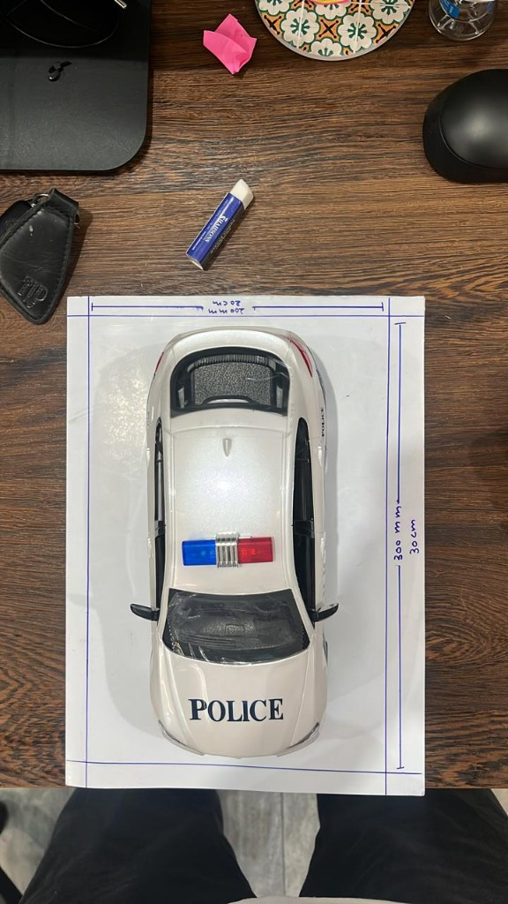
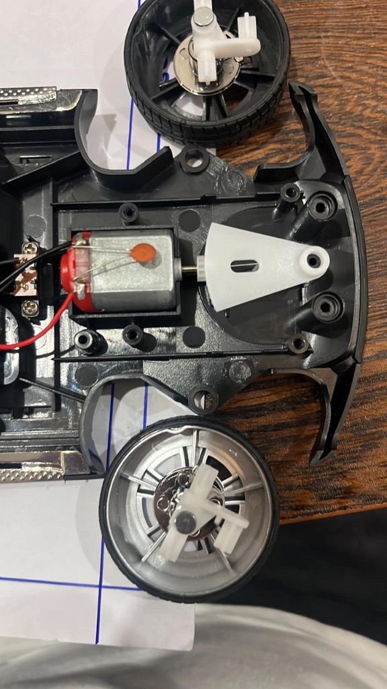
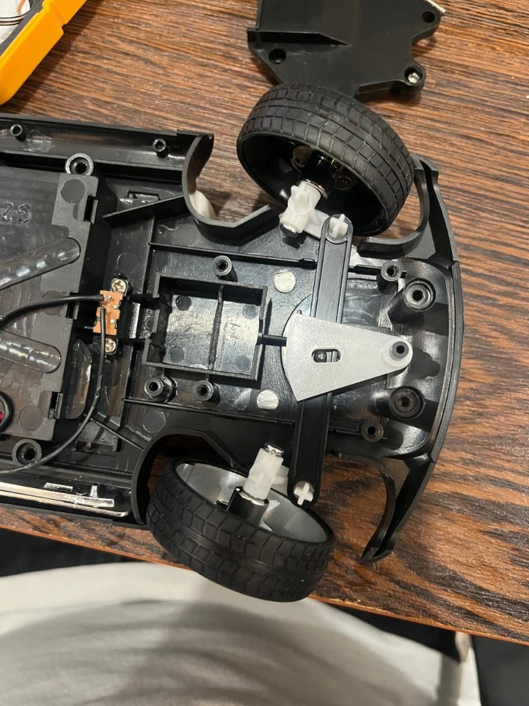
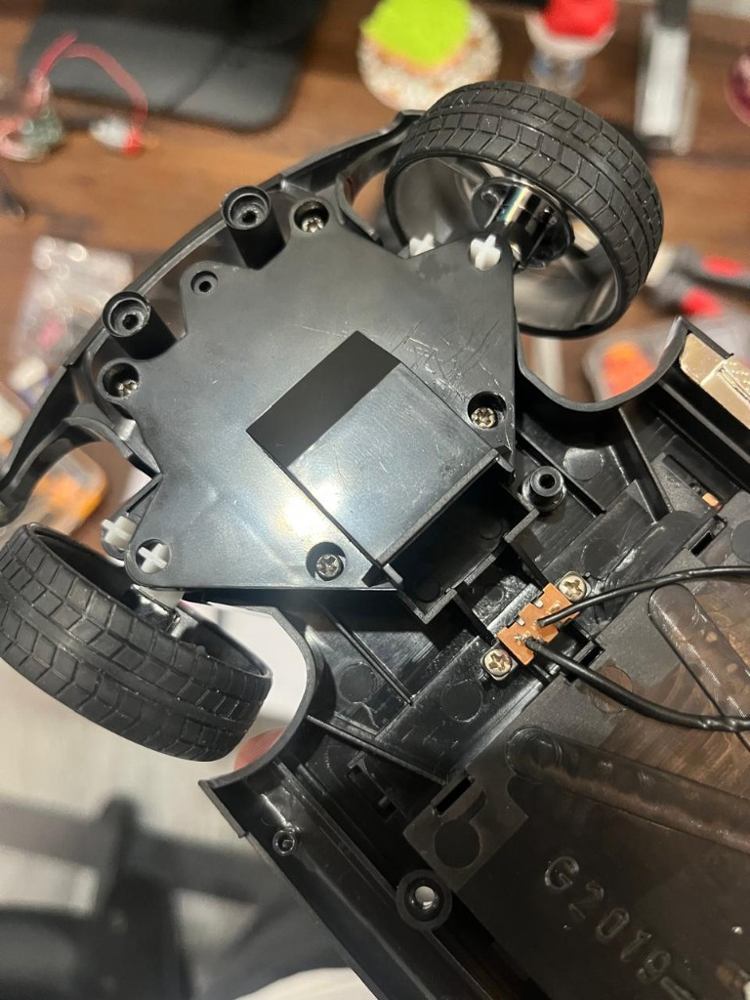
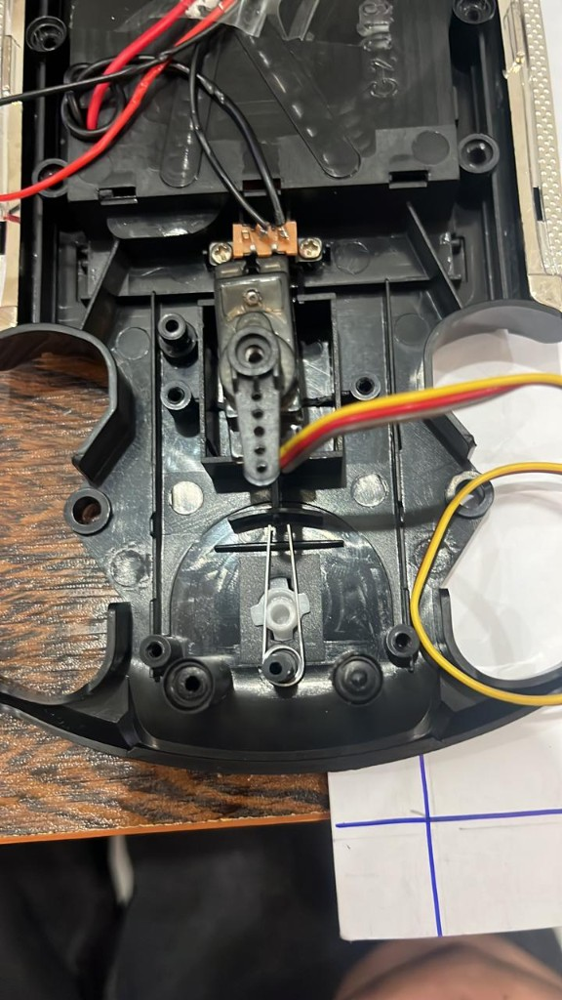
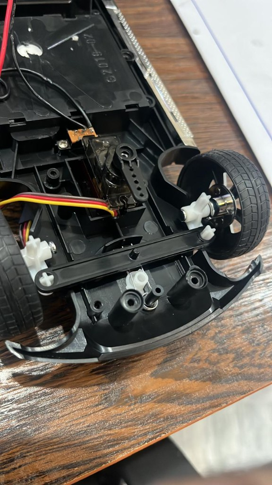
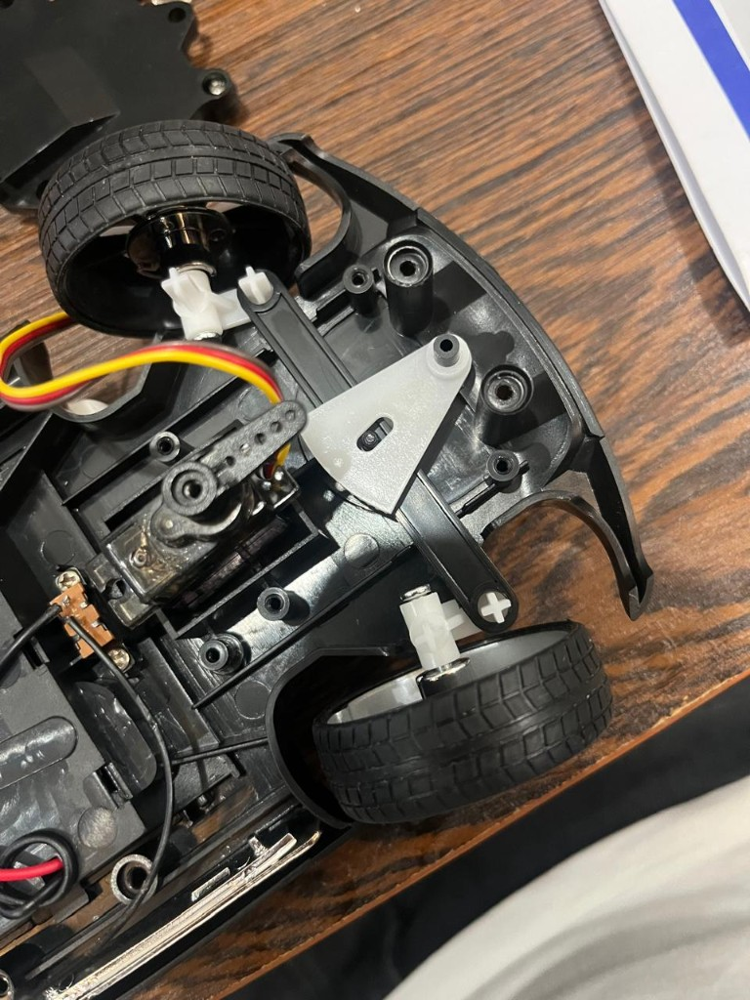
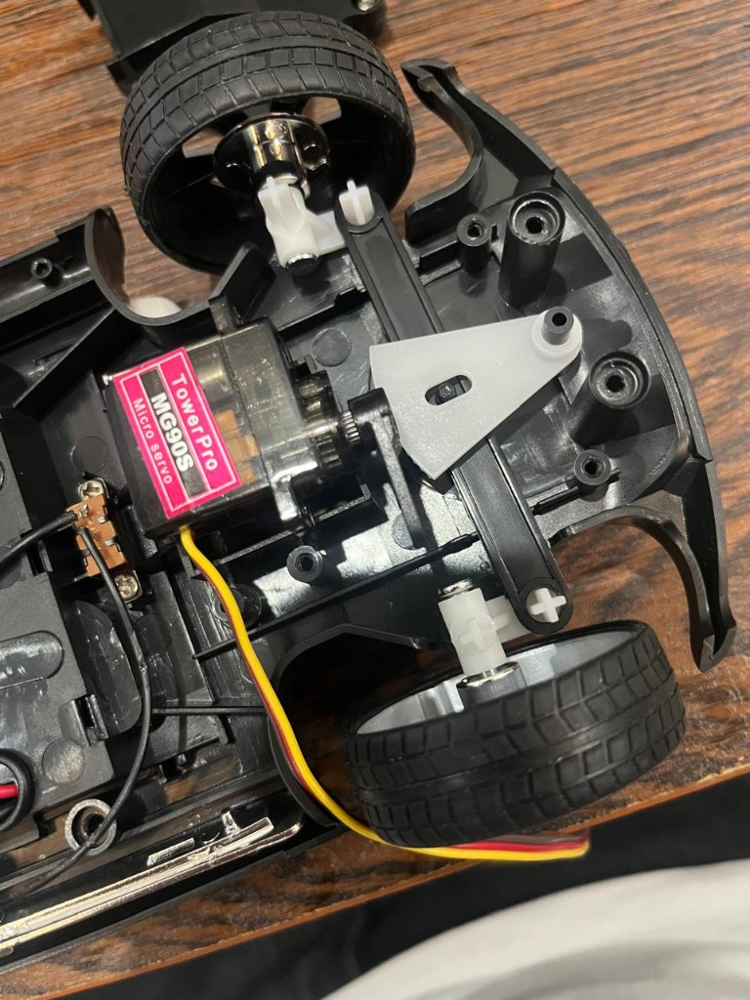
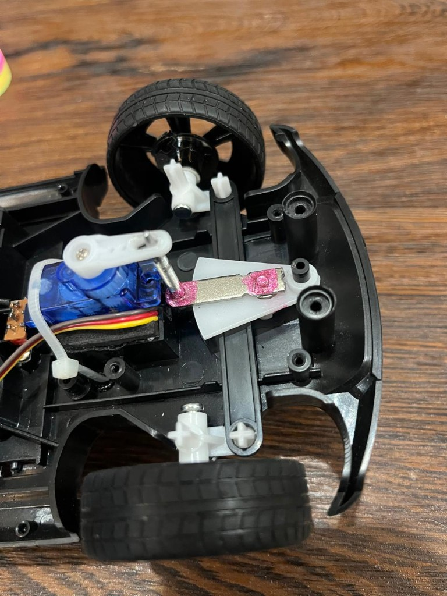
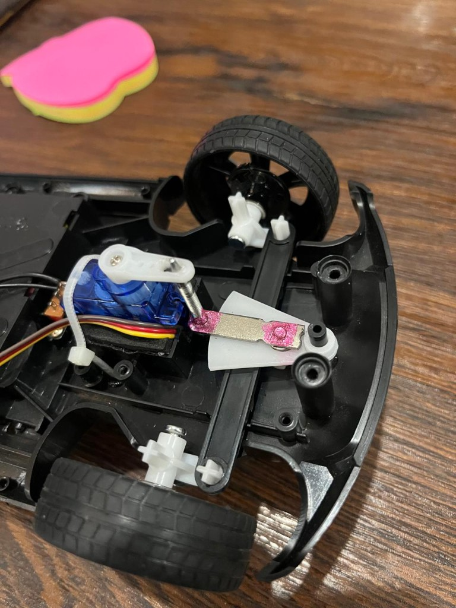

# SECTION 1 — Project Zero Error

We are Team Zero Error, a team of three students from St. Francis Schools and Colleges in
Sara-i-Alamgir, Pakistan, competing in the WRO 2026 Future Engineers category. For this
challenge, we developed an autonomous 1:16 scale self-driving car that independently navigates a
three-lap track, avoids obstacles, and parks itself without any remote control.

This document records **how the car was designed, not only what it became**. Where a subsystem is
not yet finished, the heading exists with a status marker so our progress is visible rather than
hidden.

| Marker | Meaning |
| --- | --- |
| `DONE` | Built, measured, and the measurement is recorded here |
| `IN PROGRESS` | Hardware exists, characterisation not complete |
| `PENDING` | Designed on paper, not yet built or measured |

---

# SECTION 2 — The Challenge

**Competition Overview**

The World Robot Olympiad (WRO) Future Engineers category is an advanced robotics competition
focused on the design and implementation of autonomous, self-driving cars. The challenge requires
engineering a scale vehicle capable of navigating complex, dynamic environments using real-time
sensor data, computer vision, and steering algorithms without any human intervention.

**Challenge Architecture**

The competition is divided into two distinct challenges. Note: parking is integrated into the
second challenge rather than existing as a standalone event.

1. **Open Challenge:** The vehicle must autonomously complete 3 full laps on a walled track. The
   robot must identify the correct driving direction, maintain lane control, and bring itself to a
   complete stop in the correct section after the final lap.

2. **Obstacle Challenge:** This phase adds traffic signs. The vehicle must complete 3 laps while
   navigating around red and green pillars, following the passing rules:
   - **Red pillars:** must be passed on the right (Rule 9.19)
   - **Green pillars:** must be passed on the left (Rule 9.19)

3. Upon completing the final lap, the vehicle must locate the designated magenta parking lot and
   execute a parallel parking manoeuvre.

**Field Specifications**

| Property | Value | Rule |
| --- | --- | --- |
| Mat size | 3200 × 3200 mm | 13.1 |
| Inner racetrack | 3000 × 3000 mm | 13.1 |
| Wall height, exterior and interior | 100 mm | 13.3, 13.5 |
| Corridor width, Open Challenge | **1000 mm or 600 mm** (randomised per round) | §8 |
| Corridor width, Obstacle Challenge | Always 1000 mm | §8 |
| Traffic sign dimensions | 50 × 50 × 100 mm | 13.19 |
| Red sign colour | RGB (238, 39, 55) | 13.21 |
| Green sign colour | RGB (68, 214, 44) | 13.22 |
| Parking limitation colour | Magenta, RGB (255, 0, 255) | 13.27 |
| Parking lot width | 200 mm | §5 |
| Parking lot length | **1.5 × robot length** | §5 |
| Maximum vehicle dimensions | 300 × 200 mm, 300 mm height | 9.17 |

Two constraints from this table shaped our design more than any other:

- **The 600 mm corridor.** The Open Challenge corridor can be narrow, and the width is randomised
  before each round. Our vehicle must fit and turn inside 600 mm, which puts a hard ceiling on
  both our vehicle length and our minimum turning radius.
- **The parking lot scales with our own vehicle.** Because the bay is 1.5 × our robot's length,
  a longer robot does *not* get a proportionally easier park — the clearance stays at 0.5 × our
  length regardless. But a longer robot needs a larger turning radius to enter that bay. **Shorter
  is strictly better for parking.**

**Scoring Breakdown**

| Assessment Area | Maximum Points |
| --- | --- |
| Open Challenge | 30 |
| Obstacle Challenge | 62 |
| Technical Documentation | 30 |
| **Total** | **122** |

**Easily missed rules we have written into our checklist**

| Rule | What it means for us |
| --- | --- |
| 9.17 | Dimensions are checked. Exceeding them after a 3-minute repair window ends the round |
| 9.18 | In the Open Challenge the vehicle **may not touch the outer boundary wall** at all |
| 9.20 / 13.15 | A pillar may be touched only if it stays within an 85 mm circle around its seat |
| 9.24.7 | Touching a **parking lot limitation** stops the round |
| 9.21 | Driving opposite the round direction is allowed for two sections only |
| 13.18 | Mat and object colours may differ from spec — on-site colour recalibration is expected |
| §6 | A **surprise rule** is expected in the 2026 season. Our software must be modular enough to absorb a new behaviour |

---

# SECTION 3 — The Team

<table>
  <tr>
    <td align="center">
      <br>
      <strong>Abiha Zainab</strong><br>Brain — Software
    </td>
    <td align="center">
      <br>
      <strong>Tawassal Zahra</strong><br>Body — Hardware
    </td>
    <td align="center">
      <br>
      <strong>Nukhba Tanveer</strong><br>Senses — Sensors, Power and Documentation
    </td>
  </tr>
</table>

**Student Biographies**

- **Abiha Zainab — Brain layer (Software)**
  - Responsible for architecting the vehicle's autonomous navigation logic and decision-making
    frameworks. Implements the finite state machine that handles the track environment, integrates
    sensor data into decisions, and tunes the steering control feedback loop for lane-keeping and
    obstacle avoidance.
  - Technical interest: software development, control algorithms, and system logic.

- **Tawassal Zahra — Body layer (Hardware)**
  - Responsible for the physical chassis, structural integrity, and mechanical integration.
    Manages the layout and mounting of the controllers, drive motor, steering servo, and power
    distribution, and owns the steering conversion described in Section 4c.
  - Technical interest: mechanical engineering principles, chassis dynamics, and robust hardware
    design.

- **Nukhba Tanveer — Senses layer (Sensors, Power and Documentation)**
  - Owns the sensing and power subsystems: ToF sensor configuration and addressing, IMU
    integration, encoder odometry, power distribution and wiring. Also owns the data-logging
    protocol and the technical documentation record.
  - Technical interest: `[NUKHBA TO WRITE IN HER OWN WORDS — do not inherit the previous
    member's text. Judges may ask a student to explain their own subsystem.]`

The three roles map directly onto the three layers described in Section 5 — Body, Senses and
Brain. Each of us owns one layer end to end, from the hardware to the code that drives it.

**Coaching & Guidance**

**Haider Abbas** provides organisational oversight and strategic guidance as the team coach. His
role covers administrative facilitation and milestone tracking, ensuring that the student
engineering team retains complete autonomy over both hardware fabrication and codebase execution.

---

# SECTION 4 — Our Vehicle

This section covers the physical setup and the compute setup of our autonomous car.

## a) Chassis

**Mechanical Specifications**

| Property | Value | Status |
| --- | --- | --- |
| Scale | 1:16 RC car, converted | `DONE` |
| Drive configuration | Rear-wheel drive, single motor | `DONE` |
| Steering | Front-wheel Ackermann, servo actuated | `DONE` |
| Wheelbase | 160 mm | `DONE` |
| Track width | `[PENDING]` | `PENDING` |
| Overall L × W × H | `[PENDING — must be inside 300 × 200 × 300 mm, Rule 9.17]` | `PENDING` |
| Mass, race-ready | `[PENDING]` | `PENDING` |
| Minimum turning radius | `[PENDING — see §4d]` | `PENDING` |



*Early packaging check against the 300 × 200 mm footprint limit. This is not the final
race-ready dimension measurement: the completed vehicle, including sensors and electronics,
must still be measured in length, width and height.*

**Why a converted RC chassis instead of a scratch build?**

We evaluated three options before committing.

- **Build from scratch (acrylic or aluminium plate, bought wheels and axles).** Maximum design
  freedom. Rejected because our team is code-strong and new to mechanical fabrication, and we do
  not have reliable access to machining. Building a rigid, square, low-backlash steering linkage
  from raw stock is a multi-week job with a high chance of a floppy result.
- **A kit robotics platform.** Fast and reliable, but the kits available to us are
  differential-drive. The category explicitly asks for kinematics *different* from differential
  drive, so this would have missed the point of the challenge.
- **Convert a commercial 1:16 RC car. — Chosen.** The chassis already gives us a rigid moulded
  frame, a proper Ackermann steering knuckle set, a rear differential and bearings that we could
  not fabricate to the same tolerance. The conversion work is bounded and specific: replace the
  radio receiver and the crude steering actuator with our own electronics.

**Trade-off accepted:** we lose control over the geometry. We inherit the manufacturer's
wheelbase, track and steering throw, and we must design our sensor and electronics mounting around
an existing shape. We judged this a good trade — mechanical rigidity is expensive to buy with
labour and cheap to buy with a donor chassis.

**Rule compliance — why a single motor and a mechanical differential are allowed**

The rules prohibit steering by commanding the left and right wheels at different speeds
(differential or skid steering). They do **not** restrict how many wheels are driven — front,
rear and four-wheel drive are all acceptable, provided direction of travel is set by a steering
mechanism.

Our chassis has a mechanical differential in the rear axle. This is not differential *drive*: it
passively splits torque between two wheels and is not commanded by the controller. Our single
motor physically cannot produce a commanded speed difference, which is exactly the property the
rule protects.

> We initially misread this rule during our own design discussion and nearly rejected a valid
> chassis option because of it. Re-reading the rule text — not a summary of it — corrected the
> mistake before it cost us anything.

**Sourcing and Redundancy Strategy**

- **Local sourcing.** The chassis was procured from local suppliers, so replacement parts can be
  obtained without long shipping delays. Given our competition timeline, a part that takes three
  weeks to arrive is effectively unavailable.
- **Hardware redundancy.** `[CONFIRM STATUS BEFORE PUBLISHING: does the second chassis physically
  exist and is it untouched? If it is still only planned, mark this PENDING rather than claiming
  it.]` Our intent is to keep an identical second chassis untouched as a backup so that a
  mechanical failure during testing can be resolved by swapping components rather than halting the
  project.

**Chassis modifications made so far**

| Modification | Reason | Status |
| --- | --- | --- |
| Radio receiver and ESC removed | Replaced by our own control electronics | `DONE` |
| Steering actuator replaced with SG90 servo | Original mechanism had no position feedback | `DONE` |
| Motor wired to TB6612FNG H-bridge | Bidirectional PWM control | `DONE` |
| Electronics deck | To carry Pi 5, Pico, power board | `PENDING` |
| Camera mast | Height set by Rule 9.17 envelope and pillar visibility | `PENDING` |
| ToF sensor brackets | Placement described in Section 4f | `PENDING` |
| Encoder disc and sensor mount | See Section 4f | `IN PROGRESS` |

> **Mechanical layout drawing to be added:** `schemes/mechanical_layout.png`
> Top view and side view showing wheelbase, track, sensor positions and centre of mass.
> *(Required for Criterion 1 above level 2.)*

---

## b) Compute Architecture

We split the processing into a two-layer compute architecture to handle high-level logic and
low-level physical control separately.

- **Raspberry Pi 5 (The Brain):** Runs Linux headless (Raspberry Pi OS Lite 64-bit) and handles
  high-level intelligence. It manages the state machine, processes camera vision for pillar
  colour, and calculates driving decisions.

- **Raspberry Pi Pico (The Body controller):** A dedicated real-time controller in constant serial
  communication with the Pi 5. It executes time-critical tasks: PWM for steering and drive, ToF
  sensor polling over I²C, IMU reads, and wheel encoder pulse counting.

**Why two layers?**

A Linux board like the Pi 5 is excellent for heavy computation, but it operates on a "best-effort"
schedule. The operating system is constantly juggling background tasks, so it cannot guarantee the
exact timing needed for stable motor control. Usually the interruption is microseconds.
Occasionally it is tens of milliseconds — and a control loop that should run every 5 ms but
occasionally runs 40 ms late produces a visible steering twitch.

The Pico fixes this with deterministic, real-time control. It runs a single dedicated loop that
executes predictably every time. This division of labour ensures the car's physical reactions are
correctly timed while the Pi 5 focuses on perception and strategy.

**Trade-off accepted:** two controllers means a serial link that can fail, two codebases and two
flashing procedures. We accepted this because the alternative — camera processing and hard
real-time motor control competing for one CPU — has a failure mode (intermittent control glitches)
that is far harder to diagnose than a link that is either up or down.

```
 ┌─────────────────────────────┐        ┌──────────────────────────────┐
 │      RASPBERRY PI 5         │        │      RASPBERRY PI PICO       │
 │                             │        │                              │
 │  Camera (pillar colour)     │ serial │  ToF sensors     (I²C)       │
 │  State machine / strategy   │<------>│  IMU heading     (I²C)       │
 │  Lap counting               │        │  Wheel encoder   (GPIO)      │
 │  Logging                    │        │  Motor PWM  (TB6612FNG)      │
 │                             │        │  Steering servo PWM          │
 └─────────────────────────────┘        └──────────────────────────────┘
          "think"                                  "act"
```

---

## c) Steering

Getting the steering right was our toughest mechanical hurdle. We had to completely re-engineer
the stock setup to get the precision an autonomous car needs. Because this subsystem went through
the most iteration, we document it as a sequence of versions rather than as a finished result.

### Version 0 — the stock mechanism

The chassis came with a DC motor driving a gear sector. The gear sector pushed a **yoke** — a
plastic arm with a slot in it, pinned to a pivot post on the chassis. The yoke pushed the track
rod, which turned both front knuckles together.

The critical limitation: **there is no position feedback anywhere in that chain.** The stock system
is a bang-bang actuator with exactly three achievable states — full left, centre, full right. A car
that can only steer at full lock cannot follow a wall at a controlled offset, and cannot execute a
parking manoeuvre that requires a specific radius.

<p>
  
  
</p>

*Version 0 before modification. Left: the stock DC steering motor and sector beside the white
yoke. Right: the yoke, its chassis pivot and the black track rod connecting the two front
knuckles.*



*The removed stock steering housing. Recording the original assembly before cutting or replacing
parts gave us a reference for the factory mounting points and linkage travel.*

### Version 1 — direct servo-to-track-rod coupling (rejected on paper)

The obvious first idea was to remove the whole stock assembly and connect a servo horn directly to
the track rod. We rejected it before cutting anything, for two reasons:

1. **Geometry.** The track rod sits low and off-centre. Mounting a servo so its horn arc lines up
   with the required travel meant either cutting into the chassis floor or building a raised
   bracket that would conflict with the front suspension.
2. **Throw mismatch.** A servo horn sweeps an arc; the track rod needs near-linear lateral travel.
   Coupling them directly across a large angle gives a non-linear servo-angle-to-wheel-angle
   relationship, making calibration harder for no benefit.

This is the cheapest kind of iteration — the one done on paper.

### Version 2 — retain the yoke, drive it with the servo (current design)

We mounted an upright SG90 servo into the old steering motor pocket so its horn rotates
horizontally, and kept **the original steering yoke on its original pivot post**. A **bicycle
spoke** drops from a slot in the servo horn down to the yoke.

```
   SG90 servo (upright, in the old motor pocket)
      |
   [ horn, with slot ]
      |
   bicycle spoke push-rod
      |
   [ steering yoke ]  <-- still on its original chassis pivot post
      |
   [ track rod ]
      |
   front knuckles  --->  factory Ackermann geometry, unchanged
```

**Why we built it this way:**

- **The pivot post takes the side-loads, not the servo.** This is the most important decision in
  the mechanism. We explicitly avoided making the servo shaft the pivot point — if we had, every
  bump and side-shock from driving would transmit straight into the servo's internal plastic gears
  and strip them. Keeping the pivot and the drive mechanism separate means the servo only has to
  supply rotating force.
- **The slot absorbs arc mismatch.** The servo horn moves in an arc; the yoke moves through a
  different arc. The slot lets the spoke slide slightly as the angle changes, so the linkage does
  not bind at sharp steering angles.
- **The factory geometry is preserved.** The yoke was designed for that post and the track rod was
  designed to be pushed by that yoke, so we did not have to re-derive any Ackermann geometry.
- **The bicycle spoke is a good push-rod.** Stiff in tension and compression, thin, locally
  available, and bendable with pliers — which gives a free mechanical adjustment for centring
  without touching code.

**Trade-off accepted:** the slot that prevents binding is also clearance, and clearance is
backlash. We have not yet quantified how much steering deadband this introduces.

#### Version 2 build evidence

<p>
  
  
</p>

*The servo fitted into the stock motor pocket. These views were used to check horn sweep,
wire clearance and access to the original yoke pivot before finalising the linkage.*

<p>
  
  
</p>

*Linkage trials during Version 2. They record the physical iteration rather than claiming that
each photographed arrangement was retained. The pivoting factory yoke remained the common
element while servo position, horn geometry and coupling method were evaluated.*

<p>
  
  
</p>

*A later SG90 linkage prototype from two angles. The images make the mechanical load path
visible: the servo moves the coupling, the coupling rotates the white yoke, and the yoke pushes
the original track rod. Final left- and right-lock photographs are still required after the
safe software endpoints have been calibrated.*

### Iteration inside Version 2 — the hunting-noise problem

After assembly the servo made a continuous straining noise at large steering angles and drew
current continuously instead of settling.

**Our first instinct was wrong.** We assumed the SG90 was too weak and began looking at metal-gear
replacements. Before buying anything, we measured servo current across a range of commanded angles.

**What the measurement showed:** at moderate angles the servo settled to idle current
(~10–20 mA). At large angles the current stayed high indefinitely. That is not the signature of a
weak servo — a weak servo fails to reach position and spikes current *regardless of angle*. Current
that is normal in the middle and continuous at the extremes means the servo is being commanded
**past the mechanical steering limit** and is pushing against a hard stop forever.

**The fix was in software:** define `LEFT_MAX` and `RIGHT_MAX` end-stops and never command outside
them. Cost: zero. The servo we already had was adequate.

**The lesson we wrote down:** *an unexpected reading is a reason to measure, not a reason to buy.*
We named this failure mode "anxiety → addition" and we now check for it deliberately.

### Software safeguards

Steering end-stops are enforced in the Pico firmware, so the servo can never be driven past its
safe physical range regardless of what the Brain layer asks for. A mechanical constraint belongs
in the layer closest to the mechanism — the state machine should not have to know about it.

### Servo calibration procedure

**Criterion:** the usable steering limit is the largest wheel deflection at which servo current
returns to idle (~10–20 mA) and stays there.

1. Vehicle on blocks, wheels free, ammeter in the servo supply line.
2. Command a small angle from centre. Wait 2 s. Record current.
3. Increase the commanded angle in steps, repeating step 2.
4. The last angle at which current returns to idle is that side's mechanical limit.
5. **Approach the same angle from the opposite direction and repeat.** Any difference between the
   limit found going outward and coming inward *is* the linkage backlash.
6. Repeat independently for left and right. **Expect asymmetry** — the linkage is not symmetric,
   so there is no reason for the two limits to match.

| Parameter | Value | Status |
| --- | --- | --- |
| `SERVO_CENTRE` | `[PENDING]` | `PENDING` |
| `LEFT_MAX` | `[PENDING]` | `PENDING` |
| `RIGHT_MAX` | `[PENDING]` | `PENDING` |
| Measured backlash / deadband | `[PENDING]` | `PENDING` |

Tool: `src/pico/calibrate_servo.py` — interactive, steps the servo from the serial console so
values can be found without re-flashing.

### Version 3 — planned improvements `PENDING`

- **Backlash reduction.** If the measured deadband affects wall following, a light spring preload
  would take up the slack in one direction.
- **Mount rigidity check.** If the servo mount flexes under cornering load, steering angle will
  vary with speed — a bug that only appears on the field.

---

## d) Drive

- **The motor setup.** We kept the stock small brushed DC motor, which drives the rear axle
  through the vehicle's built-in gearbox.
- **Why the stock motor?** Fitting a larger motor would require modifying the chassis in ways that
  compromise its structural integrity. Keeping it stock preserves chassis strength, and our torque
  demand is low: the vehicle is light, drives on a flat mat, and never climbs.
- **Motor rating: 5 V.** This is the number that drives the whole power decision below.
- **Control method.** PWM from the Pico through a TB6612FNG motor driver, supplied from a
  **dedicated 5 V buck converter** — not from the raw battery.

**Why the TB6612FNG over the L298N?**

| | TB6612FNG | L298N |
| --- | --- | --- |
| Switching element | MOSFET | Bipolar (BJT) |
| Voltage drop at load | ~0.5 V total | ~2 V+ total |
| Waste heat | Low, no heatsink needed | High, large heatsink required |
| Mass and volume | Small | Bulky |

The deciding argument is voltage drop. Every volt lost in the driver is a volt not delivered to
the wheels, and it returns as heat that must be carried around as heatsink mass. **Trade-off
accepted:** the TB6612FNG has a lower continuous current rating, which is not binding for a 1:16
chassis but would need revisiting on a larger vehicle.

### Motor driver bring-up measurements `DONE`

| Measurement | Result | Conditions | What it tells us |
| --- | --- | --- | --- |
| Free-run current | ~140 mA | Test rail, no load | Baseline for the power budget |
| Minimum effective duty cycle | ~13 % | **5 V rail, 1 kHz PWM** | Below this the motor does not turn at all |

Because these figures were taken **at 5 V / 1 kHz, which is the rail the motor now actually runs
on**, they are valid operating numbers rather than bench approximations. This was not true of an
earlier version of our design — see below.

The minimum duty result feeds directly into the control software. Any speed controller that
outputs below the floor is commanding a stall, not a slow crawl. The Body layer clamps its output
above this floor rather than assuming duty maps linearly to speed down to zero.

### Motor voltage: iteration from duty-capping to rail regulation

This is a design change we made after examining our own reasoning, and it is worth recording in
full because the first version was defensible-sounding and wrong.

**Version 1 — raw battery, limited by duty cycle.** Our original plan ran the motor directly from
the 11.1 V pack and capped the PWM duty cycle in firmware to roughly 45 %, on the reasoning that
45 % of 11.1 V gives an average of about 5 V, which is what the motor is rated for.

**Why we abandoned it.** The argument confuses average voltage with what the motor actually
experiences.

- A duty cap reduces the *average* voltage. It does **not** reduce the peak. During every ON pulse
  the motor still sees the full 11.1 V across its windings.
- Motor heating depends on **RMS current, not average voltage**. At the same average voltage, a
  chopped 11.1 V supply produces higher peak and RMS current than a steady 5 V supply.
- The problem is worst exactly where it matters most — at stall or breakaway, back-EMF is zero and
  current is limited only by winding resistance. That is when a 5 V-rated motor sees 11.1 V pulses
  through a near-short.
- We had also written that the high rail "gives plenty of instant torque headroom." That
  contradicts the cap: headroom above the cap is headroom the software will never use. We cannot
  claim the cap as protection and as headroom simultaneously.

**Version 2 — dedicated 5 V buck converter (current design).** The motor is now supplied from its
own TPS5450 buck regulated to 5 V, matching the motor's rating. Duty cycle now controls **speed
only**, which is what PWM is actually for.

**What this bought us:**

| Benefit | Detail |
| --- | --- |
| The motor never sees over-voltage | Not on average, not on peaks, not at stall |
| Full duty range is usable | We regained the 55 % of control range the cap was discarding |
| Our bench measurements became valid | The 140 mA and 13 % figures were taken at 5 V — they now describe the real operating condition instead of needing to be redone |
| Better resolution at low speed | The usable band runs from ~13 % to 100 % instead of ~6 % to 45 % |

**Trade-off accepted:** one more buck converter — more mass, more board area, one more component
that can fail. We judged that acceptable against destroying the motor, especially since the motor
is stock and the chassis cannot easily accept a replacement.

**A new failure mode this introduces — and it is a real one.** A battery and a buck converter
behave very differently under a current surge. A battery **sags**; a buck converter **current-limits,
hiccups, or shuts down**. Our motor stall current is not yet measured, and if it exceeds the
converter's limit, the motor rail will collapse at exactly the moment the car needs torque most —
breakaway from standstill.

Mitigations planned:
- Measure stall current at 5 V and compare against the converter's rated limit `PENDING`
- Bulk capacitance at the TB6612FNG input to supply the surge locally, so the converter sees an
  averaged load rather than the raw transient `PENDING`
- Firmware soft-start: ramp duty from the floor rather than stepping to the target `PENDING`

**Honest note on the driver drop.** The TB6612FNG loses roughly 0.5 V across its output stage.
On a 12 V rail that was 4 % and negligible; on a 5 V rail it is about 10 %, so the motor sees
closer to 4.5 V than 5 V. This slightly reduces top speed. We accept it — the same drop on an
L298N would have been over 2 V, which on a 5 V rail would have been disqualifying for that part.

| Parameter | Value | Status |
| --- | --- | --- |
| Motor rated voltage | 5 V | `DONE` |
| Motor rail | 5 V, dedicated TPS5450 buck from the actuator pack | `DONE` |
| PWM frequency | 1 kHz | `DONE` |
| Duty floor (minimum effective) | ~13 % at 5 V | `DONE` |
| Duty cap | None — the rail sets the voltage. Any cap is now a *speed* choice, not protection | `DONE` |
| Motor stall current at 5 V | `[PENDING]` | `PENDING` |
| Buck converter current limit vs stall current | `[PENDING]` | `PENDING` |
| Motor case temperature after a 3-lap run | `[PENDING]` | `PENDING` |

### Torque and speed reasoning

The vehicle does not need to be fast. It needs to be *controllable*. Constraints that set our
target speed:

- **The 600 mm corridor.** Higher speed means more distance covered before a correction takes
  effect, so achievable steering error grows with speed. The narrow-corridor rounds set the ceiling.
- **Rule 9.18.** In the Open Challenge, touching the outer wall is not permitted at all. Speed that
  produces occasional wall contact is not a minor cost — it is a zero.
- **The parking phase.** Parallel parking has a far tighter geometric tolerance than open-corridor
  driving and requires low speed with repeatable distance control.

Torque demand is dominated by **breakaway from standstill**, which is why the duty floor matters
more to us than peak power.

| Quantity | Value | Status |
| --- | --- | --- |
| Target cruise speed, 1000 mm corridor | `[PENDING]` | `PENDING` |
| Target cruise speed, 600 mm corridor | `[PENDING]` | `PENDING` |
| Target speed, parking manoeuvre | `[PENDING]` | `PENDING` |

### Turning radius measurement procedure `PENDING`

The Brain layer's path planner needs the minimum turning radius **measured at the rear axle
centre**. We will not estimate it from wheelbase and a claimed steering angle — linkage backlash
and real mechanical limits make the theoretical figure unreliable.

Method (requires encoder and IMU working):

1. Command full lock to one side.
2. Drive a slow, steady arc.
3. Record arc length `s` from the encoder and heading change `Δθ` from the IMU.
4. Compute `R = s / Δθ` (radians).
5. Apply a track-width correction — the encoder is on one wheel, not on the centreline.
6. **Repeat for the other lock direction.** The two will differ. Record both.

| Quantity | Value | Status |
| --- | --- | --- |
| Minimum turning radius, left lock | `[PENDING]` | `PENDING` |
| Minimum turning radius, right lock | `[PENDING]` | `PENDING` |
| Turning circle vs 600 mm corridor — does it fit? | `[PENDING]` | `PENDING` |

The last row is a go/no-go check. If the turning circle does not fit inside a 600 mm corridor, the
Open Challenge is not completable and the steering throw or wheelbase must change. This is the
single most important unmeasured number on the vehicle.

---


# SECTION 5 — How It Works (three-layer architecture)

Our car is organised into three layers, and each member of the team owns one. Splitting the system
this way lets each of us become the expert on our part, keeps the parts testable on their own, and
makes the whole system easier to debug. We call the three layers the **Senses**, the **Brain** and
the **Body** — by analogy with how a person navigates: you sense the world, your brain decides
what to do, and your body carries it out.

- **The Senses layer** measures the world around the car. It gathers how far away the walls are,
  which direction the car is facing, and how far it has travelled. Wall distance comes from the
  time-of-flight sensors; heading comes from the IMU; distance travelled comes from the wheel
  encoder. The camera also belongs to this layer, adding the ability to see colour — distinguishing
  red and green pillars and reading the boundary lines on the mat. The Senses layer's job is to
  turn all of this into clean, usable information and pass it on.

- **The Brain layer** makes decisions. It takes information from the Senses layer and works out
  what to do next: stay centred in the corridor, recognise that a corner is coming and turn, count
  laps, decide which side to pass a pillar, and run the parking manoeuvre. The Brain is built as a
  state machine — the car is always in one defined state, and it moves between states based on what
  the sensors report. We kept this modular so a new behaviour can be added as a new state without
  rewriting everything, which matters because the rules note that a **surprise rule is expected in
  the 2026 season** (Rule §6) and we cannot plan for it in advance.

- **The Body layer** carries out decisions. It sets the steering servo to the angle the Brain asked
  for and drives the motor at the requested speed, within safe limits built into its own code — the
  steering never exceeds the mechanical end-stops and the motor duty is capped. It also reports
  back what it is doing, so the rest of the system knows the car's actual state.

**How the layers work together.** The three layers form a continuous loop:

*Senses measure → Brain decides → Body acts → (repeat)*

Because the layers communicate through clear, simple hand-offs — the Senses give readings, the
Brain gives commands — each can be developed and tested separately and then connected. This
separation is also how we divide the work as a team.

```
      ┌──────────────────────────────────────────────┐
      │   BRAIN     state machine, lap count, plan   │   Abiha
      ├──────────────────────────────────────────────┤
      │   SENSES    wall angle, offset, pillars      │   Nukhba
      ├──────────────────────────────────────────────┤
      │   BODY      steering angle, motor duty       │   Tawassal
      └──────────────────────────────────────────────┘
```

**Interface rule the team follows:** a module may only be changed by its owner, and only its
*public functions* are used by other modules. If the Brain needs something from the Body layer, the
request is for a function signature, not a code edit. This is what makes three people working in
parallel possible without constant breakage.

## Module map

```
src/
├── pico/
│   ├── main.py               Entry point; the fast control loop
│   ├── drive.py              Motor: duty clamping, direction, stop
│   ├── steering.py           Servo: angle -> pulse, end-stop enforcement
│   ├── tof.py                VL53L1X init, XSHUT sequence, addressing, reads
│   ├── imu.py                BNO055 heading
│   ├── encoder.py            Pulse counting -> distance
│   ├── comms.py              Serial protocol, Pico side
│   └── calibrate_servo.py    Interactive calibration tool
└── pi/
    ├── main.py               Entry point; strategy loop
    ├── comms.py              Serial protocol, Pi side
    ├── vision.py             Camera capture, pillar colour, line crossings
    ├── state_machine.py      Challenge state machines
    ├── planner.py            Turn decisions, pillar side, parking sequence
    └── logger.py             Run logging for post-test analysis
```

## Pi ↔ Pico serial protocol `PENDING`

Our first real integration milestone. Design intent recorded before implementation:

- **Line-oriented ASCII, not binary.** Slower and larger, but a human can read the link with a
  serial monitor. During bring-up, debuggability beats efficiency. This is an explicit **prototype
  shortcut** — if bandwidth ever becomes a constraint we would move to a packed binary format, but
  at our loop rates we do not expect to need it.
- **Pico → Pi:** a periodic telemetry line with distances, heading and encoder count.
- **Pi → Pico:** a command line with target steering angle and target speed.
- **Watchdog on the Pico side.** If no command arrives within a timeout, the Pico stops the motor
  by itself. A vehicle that keeps driving after the Pi crashes is a vehicle that hits a wall at
  full speed — and under Rule 9.18 wall contact in the Open Challenge is not a recoverable error.

| Task | Status |
| --- | --- |
| Protocol format defined | `PENDING` |
| Bidirectional link working | `PENDING` |
| Watchdog tested by physically unplugging the link | `PENDING` |
| End-to-end latency measured | `PENDING` |

## Open Challenge state machine `PENDING`

```
        ┌──────────┐
        │  INIT    │  calibrate, confirm sensors, wait for start
        └────┬─────┘
             v
        ┌──────────┐   front distance still large
        │ FOLLOW   │◄──────────────────────┐
        │  WALL    │                       │
        └────┬─────┘                       │
             │ front distance < threshold  │
             v                             │
        ┌──────────┐                       │
        │  TURN    │  heading change ~90°  │
        │  CORNER  ├───────────────────────┘
        └────┬─────┘  section counter increments
             │
             │ 3 laps complete and in the correct section
             v
        ┌──────────┐
        │  STOP    │
        └──────────┘
```

> **Flowchart to be added as an image:** `schemes/state_machine_open.png`
> *(Required for Criterion 3 above level 2 — an ASCII sketch in the README is a placeholder, not a
> substitute.)*

**Wall following algorithm.** Using the paired-baseline geometry from Section 4f, we get two
independent error signals: lateral offset from the wall, and heading angle relative to it. A
proportional correction on offset alone oscillates — the car over-corrects, crosses the target and
swings back. Adding the heading term damps this, because the controller can see it is already
turning back before the offset error has closed.

**Tuning approach:** start with heading correction only and confirm the car drives straight; then
add offset correction and increase it until the car holds a lane without weaving. **One variable at
a time** — this is a team rule, not a suggestion.

**Edge cases we must handle explicitly:**

| Edge case | Why it matters |
| --- | --- |
| Driving direction is randomised per round | The car must determine at the first corner whether it is running clockwise or anticlockwise and follow the appropriate wall |
| Corridor width is randomised: 1000 mm or 600 mm | A wall-following setpoint tuned for 1000 mm will drive the car into a wall in a 600 mm round. The setpoint must be derived from measured corridor width, not hard-coded |
| Rule 9.18 — no outer wall contact in the Open Challenge | Our lane setpoint should bias toward the inner wall, not centre |
| Starting section is randomised | Lap counting must be relative to wherever the car started |

The randomised corridor width is the edge case most likely to catch us out, because everything
works in testing until the round where it does not.

## Control algorithm choice `PENDING`

We will start with **proportional only**, add a **derivative** term if the car oscillates, and add
**integral only** if a persistent steady-state offset appears that P and D cannot remove.

Reason for the ordering: an integral term accumulates error over time and can wind up during a
turn, producing a delayed overshoot that looks like an unrelated bug. Adding terms one at a time,
in response to an observed behaviour, keeps every gain traceable to the problem it solves.

| Gain | Value | Justification |
| --- | --- | --- |
| `Kp_heading` | `[PENDING]` | `[PENDING]` |
| `Kp_offset` | `[PENDING]` | `[PENDING]` |
| `Kd` | `[PENDING]` | `[PENDING]` |

## Obstacle Challenge strategy `PENDING`

**Detection pipeline, geometry-primary:**

1. **ToF geometry detects that a pillar exists** and estimates where it is — a distance return
   significantly closer than the expected wall distance, over a narrow angular span.
2. **The camera classifies its colour**, which determines the passing side: red on the right, green
   on the left (Rule 9.19).
3. **The planner offsets the wall-following setpoint** to route past the correct side, then returns
   to the nominal lane.

Rationale for geometry-primary is in Section 4f: a colour misread should degrade us to "obstacle
present, side uncertain" rather than "no obstacle".

**Rule-driven tuning targets:**

- Rule 9.20 and 13.15 — a pillar may be touched only if it stays inside an **85 mm circle** around
  its seat. The avoidance path is tuned for clearance margin, not minimum time. Scoring gives 10
  points for three laps with no signs moved versus 8 with signs moved, so clearance is worth about
  as much as a full lap.
- Appendix A §5 — passing on the wrong side only ends the round once the car **completely crosses
  the radius line** at that pillar. This gives us a recovery window: if the colour classification
  flips late, the car can still correct before crossing.

| Task | Status |
| --- | --- |
| Pillar detection from ToF geometry | `PENDING` |
| Colour classification under bench lighting | `PENDING` |
| Colour classification under varied lighting | `PENDING` |
| Avoidance path that keeps pillars inside the 85 mm circle | `PENDING` |
| Recovery to lane after passing | `PENDING` |
| Late-correction behaviour before crossing the radius | `PENDING` |
| Uncertain-colour fallback behaviour | `PENDING` |

## Parallel parking `PENDING`

The tightest geometric constraint in the project. Unlike corridor driving — where the car
continuously corrects against wall references — parking is largely a committed sequence executed
against measured distances.

**The bay scales with our vehicle.** Rule §5: the parking lot is 200 mm wide and
**1.5 × the length of our robot** long. A longer robot does not get an easier park — clearance
stays at 0.5 × our own length either way — but a longer robot needs a larger turning radius to
enter. **This is the argument for keeping the vehicle short.**

**Rule 9.24.7: touching a parking lot limitation stops the round.** Unlike pillars, which tolerate
movement inside an 85 mm circle, the parking limitations have zero tolerance. The manoeuvre must be
tuned for clearance, and the rear ToF sensor exists for this reason.

This is also why the wheel encoder matters. Open-loop timing is unreliable across battery states
(Section 4f), and the bay tolerance is small enough that a few centimetres of distance error is the
difference between 15 points and 7.

**Approach:** a scripted manoeuvre parameterised by the **measured** minimum turning radius from
Section 4d, with encoder-measured segment distances and IMU-measured heading changes as the
termination condition for each phase.

| Task | Status |
| --- | --- |
| Parking bay detected from ToF and magenta colour | `PENDING` |
| Manoeuvre geometry derived from measured turning radius | `PENDING` |
| Encoder-terminated segments implemented | `PENDING` |
| Repeatability measured over 10 attempts | `PENDING` |

---

# SECTION 6 — Build, Flash and Run Instructions

*(Required by the rules: the README must explain which modules the code consists of, how they
relate to the electromechanical components, and the process to build, compile and upload the code
to the vehicle's controllers.)*

## Raspberry Pi 5 setup `IN PROGRESS`

```bash
# Flash Raspberry Pi OS Lite 64-bit to the SD card.
# Enable SSH and set hostname and user during imaging.

# Connect over SSH:
ssh wrofes@wropi26.local

# Project location on the Pi:
cd /home/wrofes/wro-car
```

Recommended SSH config on the development machine:

```
Host wropi26
    HostName wropi26.local
    User wrofes
    AddressFamily inet
```

Development uses VS Code Remote-SSH against the host alias `wropi26`, so we can edit files on the
Pi with a normal editor instead of over a bare terminal.

| Task | Status |
| --- | --- |
| OS install and headless SSH access | `DONE` |
| Camera stack (Picamera2) verified | `DONE` |
| Python dependency list (`requirements.txt`) | `PENDING` |
| Autostart on boot for competition runs | `PENDING` |
| Step-by-step reproduction guide for a fresh Pi | `PENDING` |

## Raspberry Pi Pico setup `IN PROGRESS`

1. Hold `BOOTSEL`, connect USB — the Pico mounts as a USB drive.
2. Copy the MicroPython `.uf2` firmware onto it. It reboots into MicroPython.
3. Copy the files from `src/pico/` to the Pico filesystem (Thonny or `mpremote`).
4. `main.py` runs automatically at power-on.

| Task | Status |
| --- | --- |
| MicroPython flashed | `DONE` |
| PiicoDev VL53L1X driver installed | `DONE` |
| Deployment script for all `src/pico/` files | `PENDING` |

## Running the vehicle `PENDING`

```bash
cd /home/wrofes/wro-car
python3 src/pi/main.py --challenge open      # Open Challenge
python3 src/pi/main.py --challenge obstacle  # Obstacle Challenge
```

> Stop with `Ctrl+C`. Do **not** use `pkill -9` — force-killing leaves the camera resource locked
> and requires a reboot.

---

# SECTION 7 — Testing Workflow

## Testing principles

1. **Measure before deciding.** No component is replaced and no architecture changed on a
   suspicion. There must be a number first.
2. **Change one variable at a time.** If two things change and behaviour improves, we have learned
   nothing about which one mattered.
3. **An unexpected reading is a reason to investigate, not a reason to buy.** We named the opposite
   reflex "anxiety → addition" and we call it out by name when it appears.

## Test levels

| Level | What is tested | How |
| --- | --- | --- |
| Bench, component | One part in isolation | Car on blocks, single script, multimeter where relevant |
| Bench, integration | Two subsystems talking | Wheels off the ground, serial monitor open |
| Floor, straight line | Wall following on one wall | Two walls at a set spacing, one straight run |
| Floor, single corner | Corner detection and 90° turn | One corner, both directions |
| Full field | Complete challenge round | Full course, timed, repeated |
| **Repeatability** | Consistency, not best case | Same test 10 times; record the failures |

The repeatability level is the one teams skip and the one that decides competitions. A manoeuvre
that works 7 times in 10 will fail during at least one scored round, and the International Final
has at least four rounds.

**Both corridor widths must be tested.** Our practice setup must be reconfigurable between 1000 mm
and 600 mm, because the Open Challenge randomises it and a car tuned only at 1000 mm has never been
tested in the condition that will beat it.

## Metrics we record

| Metric | Why it matters | Status |
| --- | --- | --- |
| Lateral deviation from setpoint, straight | Wall-following quality | `PENDING` |
| Heading error after a 90° turn | Turn accuracy | `PENDING` |
| Minimum clearance to outer wall (Rule 9.18) | Contact means zero | `PENDING` |
| Lap time, 3 laps | Speed vs reliability trade | `PENDING` |
| **Successful laps out of 10 attempts** | Reliability — the number that matters | `PENDING` |
| Pillar passes on correct side, out of 10 | Obstacle logic accuracy | `PENDING` |
| Pillars displaced outside the 85 mm circle | Direct scoring penalty | `PENDING` |
| Parking success out of 10 | Parking repeatability | `PENDING` |
| Battery voltage at end of a 3-lap run | Runtime margin | `PENDING` |

Results are logged in `other/test_log.md`, dated, with the code version tested. A result without a
version reference cannot be acted on later.

## Debugging approach

**Bottom-up, one layer at a time.** When the car misbehaves, the question is never "what is wrong
with the robot" — it is "which layer is lying":

1. **Is the raw sensor reading correct?** Print it. Compare against a tape measure.
2. **Is the derived value correct?** Does the computed wall angle match the physical angle?
3. **Is the decision correct?** Does the state machine choose the right state for that input?
4. **Is the actuation correct?** Does the commanded steering angle produce that wheel angle?

Most bugs that look like intelligence failures are layer-1 failures. Checking in this order is
faster than guessing, every time.

**Tools:** the MJPEG camera stream on port 8000, serial telemetry from the Pico, and run logs from
`logger.py` for replaying a failed run afterwards.

---

# SECTION 8 — Engineering Decision Log

| # | Decision | Reason | Trade-off accepted |
| --- | --- | --- | --- |
| 1 | Convert a 1:16 RC chassis rather than build from scratch | Team is code-strong and fabrication-new; a donor chassis provides rigid Ackermann geometry and bearings we cannot make | Inherit fixed wheelbase, track and steering throw |
| 2 | Single drive motor, steering by front wheels | Rules prohibit differential/skid steering; the category focus is non-differential kinematics | No differential-steering tricks for tight turns |
| 3 | Keep the yoke on its original pivot post; drive it via a spoke from a slotted servo horn | The post absorbs side-loads that would otherwise strip the servo gears; the slot absorbs arc mismatch | One more joint, therefore backlash |
| 4 | Fix servo hunting in software, not by buying a stronger servo | Current measurement showed idle current at moderate angles — a limits problem, not a torque problem | None; the fix cost nothing |
| 5 | Keep the stock motor | Fitting a larger motor would compromise chassis structure; torque demand is low | Limited top speed; the 5 V rating constrains the power design |
| 6 | TB6612FNG over L298N | MOSFET switching: ~0.5 V drop vs ~2 V+, no heatsink, less mass | Lower continuous current rating; on a 5 V rail even 0.5 V is ~10 % of the supply |
| 7 | Two separate batteries, three buck converters | Motor and servo transients must not reach the Pi 5 supply | More mass, more charging work |
| 8 | Servo on the actuator pack, not the compute pack | The servo is the second-largest transient source; putting it on the logic rail would defeat the split | An extra buck converter |
| 8a | Regulate the motor rail to 5 V rather than duty-capping a 12 V rail | A duty cap limits *average* voltage but not peaks; the 5 V motor still saw 11.1 V pulses, worst at stall. A regulated rail matches the motor's actual rating | One more converter; and a buck current-limits under surge where a battery would merely sag |
| 8b | Separate bucks for motor and servo, not one shared on the actuator pack | Prevents a servo slam from disturbing the motor rail and vice versa | One extra part |
| 8c | Reject ultrasonic as the primary wall sensor | A 15–30° cone cannot resolve two distinct wall patches, so the paired-baseline angle method is impossible; blocking pings and sequential firing would also cut our measured loop rate | Loses colour-independence — the walls are black and absorb IR |
| 9 | Star ground topology | Prevents motor return current from shifting the sensor ground reference | More wiring discipline |
| 10 | Reject USB power bank and 4S LiPo | Power bank gives a "soft" 5 V under spiky Pi load; 4S adds voltage the driver does not want and weight we do not need | BTS7960 kept in reserve if 4S ever becomes necessary |
| 11 | Reject RPLidar A1 | Scan plane sits above the 100 mm wall height (Rules 13.3, 13.5) — it would see nothing | Lost a 360° map; discrete sensors must be placed deliberately |
| 12 | VL53L1X in SHORT distance mode | 1.3 m covers both the 1000 mm and 600 mm corridors; short mode barely degrades under bright light, long mode degrades badly | None — we gave up range we never needed |
| 13 | Paired dual-ToF baseline instead of a multizone sensor | Two points fully determine wall angle; simpler firmware and better per-reading SNR | Two mounts and two addresses per side |
| 14 | Reflective optical encoder rather than timed open-loop or IMU integration | Timed control drifts with battery state; double-integrated acceleration drifts quadratically | Mechanical work: disc fabrication and mounting |
| 15 | Split compute: Pi 5 for perception, Pico for control | OS scheduling jitter is unacceptable in a control loop; the Pico cannot run a camera | A serial link that can fail; two codebases |
| 16 | Geometry-primary pillar detection, colour secondary | A colour misread degrades to "side unknown" rather than "no obstacle" — and Rule 13.18 warns venue colours will differ | More ToF processing work |
| 17 | ASCII serial protocol rather than binary | Human-readable during bring-up | Larger and slower — a deliberate prototype shortcut |
| 18 | Verify sensor part number by model ID register | L0X and L1X boards are visually identical and often mislabelled | One line of code; no downside |

## Decisions reversed after measurement

Recorded separately, because these are the entries that show the process working.

| What we were about to do | What the measurement or check showed | Outcome |
| --- | --- | --- |
| Buy a stronger metal-gear servo | Servo current returned to idle at moderate angles — a software limits problem | Kept the SG90; end-stops in firmware |
| Add a second Pico to split sensor reads | ~555 loops/sec measured with two sensors at 400 kHz | Second Pico unnecessary |
| Split sensors across two I²C buses | Same measurement | Single bus retained |
| Shorten the ToF timing budget for speed | Same measurement | Accuracy preserved; no compromise needed |
| Buy an RPLidar A1 | Scan plane physically above the 100 mm wall height | Purchase avoided |
| Reject multi-wheel-drive chassis on rule grounds | Re-reading the rule: it prohibits *differential drive*, not multiple driven wheels | Selection criteria corrected |
| Document our ToF sensors as VL53L0X | Model ID register `0x010F` returned `0xEACC` — they are VL53L1X | Documentation and driver choice corrected |
| Put the steering servo on the compute rail | Reviewing our own transient-isolation argument — the servo is a transient source | Servo moved to its own buck on the actuator pack |
| Run the 5 V motor from a raw 11.1 V pack, capped at ~45 % duty | A duty cap sets average voltage, not peak. The motor would still see full 11.1 V during every ON pulse, and heating follows RMS current — worst at stall, where back-EMF is zero | Motor moved to its own regulated 5 V buck. Duty cycle now controls speed only, and our existing 5 V bench measurements became valid operating figures |
| Fit ultrasonic sensors alongside the ToF array "for safety" | We had not yet measured whether the ToF actually struggles against black wall material. Adding hardware against an unmeasured worry is our named failure mode | Deferred pending the black-wall reflectivity test. If ToF reads reliably, no ultrasonic is fitted |

The last three rows are corrections to our own earlier documentation. We record them rather than
quietly editing them out, because a design history that contains no reversals is not a history of
engineering.

## Prototype shortcuts vs production-worthy design

| Item | Classification | Note |
| --- | --- | --- |
| Two-battery split, three bucks, star ground | Production-worthy | We would keep this on any future vehicle |
| Servo end-stops enforced in firmware | Production-worthy | Correct place for a mechanical constraint |
| Bicycle spoke push-rod | Between the two | Functional and adjustable; a machined rod-end would be more repeatable |
| ASCII serial protocol | Prototype shortcut | Deliberate, for debuggability |
| Hard-coded calibration constants in source | Prototype shortcut | Should move to a config file |
| MJPEG debug stream | Prototype tool | Must be disabled for competition runs — it costs CPU |

---

# SECTION 9 — Risk Register

| Risk | Likelihood | Impact | Mitigation | Status |
| --- | --- | --- | --- | --- |
| Turning circle does not fit the 600 mm corridor | Unknown | Open Challenge not completable | Measure turning radius (Section 4d) — highest priority | `PENDING` |
| Serial link between Pi and Pico drops | Medium | Vehicle uncontrolled | Pico-side watchdog stops the motor | `PENDING` |
| Wall-following setpoint tuned only for 1000 mm | High | Fails in narrow rounds | Derive setpoint from measured corridor width; test both | `PENDING` |
| Pi brown-out from motor or servo transient | Low | Round lost | Separate packs, separate bucks, star ground | `DONE` |
| Colour thresholds fail at venue lighting (Rule 13.18) | High | Pillar passed on wrong side | Geometry-primary detection; on-site recalibration during testing rounds | `PENDING` |
| Touching a parking limitation (Rule 9.24.7) | Medium | Round stopped | Rear ToF; clearance-tuned manoeuvre | `PENDING` |
| Outer wall contact in Open Challenge (Rule 9.18) | Medium | Round zero | Bias lane setpoint toward the inner wall | `PENDING` |
| IMU heading drift over 3 laps | Medium | Turn accuracy degrades | Correct against wall references | `PENDING` |
| Motor stall current exceeds the buck's limit | Unknown | Motor rail collapses at breakaway | Measure stall current at 5 V; bulk capacitance at the driver; soft-start ramp | `PENDING` |
| Black walls absorb IR, degrading ToF returns | Unknown | Wall following unreliable — affects every round | Measure against real wall material at 300/600/1000 mm before deciding on ultrasonic redundancy | `PENDING` |
| Surprise rule announced (Rule §6) | Expected in 2026 | New behaviour required late | Modular state machine — a new behaviour is a new state | Design mitigates |
| Time: integration starts too late | **High** | Untested system at competition | Serial link is the next milestone, ahead of new features | Active |

The last row is the honest one. The dominant risk on this project is not a component — it is
finishing subsystems that never get integrated in time to be tuned together.

---

# SECTION 10 — Current Status and Next Steps

## Completed and verified

- Motor driver bring-up: free-run current ~140 mA; minimum effective duty ~13 % at 5 V / 1 kHz —
  and because the motor rail is now regulated to 5 V, these are valid operating figures
- Servo calibration method established (current-draw criterion, both approach directions)
- Steering conversion built and functional (servo in the old motor pocket, slotted horn, spoke to
  the original yoke on its original pivot post)
- Five VL53L1X sensors on one I²C bus, XSHUT-sequenced, readdressed `0x30`–`0x34`
- Sensor part verified as VL53L1X by model ID register (`0x010F` = `0xEACC`)
- Loop rate measured at ~555 loops/sec — retired three planned architectural workarounds
- LiPo packs verified; charge and storage protocol established
- Power architecture finalised: two packs, three bucks, star ground, servo on the actuator pack
- Raspberry Pi 5 headless setup, SSH and Remote-SSH development working
- Camera connected, MJPEG stream verified
- Public GitHub repository with WRO template structure

## Immediate next steps, in priority order

1. **BNO055 IMU bring-up** — verify at `0x28`, confirm no bus conflict, read fused heading
2. **Encoder hardware** — fabricate disc, verify contrast, relocate TCRT5000, calibrate mm/count
3. **Turning radius measurement** — needs both of the above; **blocks the parking manoeuvre and
   answers whether the car fits a 600 mm corridor**
4. **Black-wall reflectivity test** — VL53L1X against real wall material at 300/600/1000 mm.
   **Gates the ultrasonic redundancy decision; do not buy or fit anything before this runs**
5. **Motor stall current at 5 V vs the buck's current limit** — completes the power budget and
   tells us whether the motor rail can survive breakaway
6. **Servo `LEFT_MAX` / `RIGHT_MAX`** — via the interactive calibration tool
7. **Pi ↔ Pico serial link** — the first true integration milestone
8. **Wall-following control loop** — the first behaviour that looks like a self-driving car

## Commit schedule

The rules require at least three commits, with the **third — no later than two weeks before the
competition — being the one used for documentation scoring**. All important information must be
present at that point.

| Commit | Deadline | Content |
| --- | --- | --- |
| 1 | ≥2 months before | At least 1/5 of the final code; initial documentation |
| 2 | ≥1 month before | Integrated system; expanded documentation |
| 3 | ≥2 weeks before | **Scored commit** — complete code, photos, diagrams, videos, full README |

## Required media

| Item | Requirement | Status |
| --- | --- | --- |
| Vehicle photos: front, rear, left, right, top, bottom | Rules §7 | `PENDING` |
| Team photo | Rules §7 | Uploaded |
| Open Challenge video, ≥30 s autonomous driving | Rules §7 | `PENDING` |
| Obstacle Challenge video, ≥30 s autonomous driving | Rules §7 | `PENDING` |
| Wiring diagram | Criterion 2 | `PENDING` |
| State machine flowchart | Criterion 3 | `PENDING` |
| Mechanical layout drawing | Criterion 1 | `PENDING` |

---

# SECTION 11 — Repository Map

**`src/`** — The codebase, split into `pico/` for low-level vehicle firmware and `pi/` for
high-level computing and vision software. Module-by-module description in Section 5.

**`schemes/`** — Electrical wiring diagrams, power distribution diagrams, sensor placement drawings
and the software state machine flowchart.

**`models/`** — 3D-printing and laser-cutting design files for fabricated parts (sensor brackets,
electronics deck, encoder disc).

**`t-photos/`** — Team photographs.

## Our team members


*Team Zero Error: Tawassal Zahra (Body), Nukhba Tanveer (Senses) and Abiha Zainab (Brain).*

**`v-photos/`** — The six mandatory technical photographs showing the vehicle from every required
angle, plus the steering iteration photographs referenced in Section 4c.

**`video/`** — `video.md` with YouTube links demonstrating our autonomous runs for both challenges.

**`other/`** — Auxiliary reference material: component datasheets, the calibration log
(`calibration_log.md`), the test log (`test_log.md`), and software setup guides.

---

# SECTION 12 — What We Have Learned So Far

**Measure before you decide.** Three separate times, a measurement removed a problem we were about
to spend money or complexity solving. The servo did not need replacing. The second Pico was not
needed. The LiDAR would not have worked at all. Each was found in under an hour.

**An unexpected reading is a question, not an emergency.** Our named failure mode is
"anxiety → addition": something reads oddly and the reflex is to buy or replace. Our guardrail is a
rule — no mitigation without a measurement first.

**Read the rule text, not a summary of it.** We rejected a valid chassis option on a misreading of
the drive-configuration rule. The correct reading permits front, rear and four-wheel drive; only
commanded left/right speed steering is prohibited.

**Verify what you actually bought.** Our ToF sensors were documented as VL53L0X until we read the
model ID register and found `0xEACC` — VL53L1X. Identical-looking parts with different datasheets
are a trap.

**Check that your design matches its own justification.** We built a two-battery system to keep
transients away from the Pi, then wrote down a wiring plan that put the steering servo — a major
transient source — on the compute rail. Re-reading our own reasoning caught it.

**Understand the tool before architecting around it.** Our high loop rate was surprising until we
understood that the driver's `read()` returns the latest background measurement rather than
blocking for a fresh one. A whole timing concern rested on a wrong mental model of one function.

**GPIO number is not physical pin number.** Costs an afternoon exactly once.

**Read the line above the error.** An `unexpected indent` traceback almost always means the line
*before* the flagged line is malformed. The interpreter reports where it noticed, not where the
mistake is.

**Stop processes gracefully.** `Ctrl+C`, not `pkill -9`.

**Keep large files out of git.** Once a large file is in the history it cannot be cleanly removed.
Photos are resized to ~1600 px and under 500 KB before committing.

---

*Team Zero Error — WRO 2026 Future Engineers, Self-Driving Cars.*
*Maintained collaboratively: Tawassal owns the Body sections, Nukhba owns the Senses and Power
sections, Abiha owns the Brain, testing and decision-log sections.*

<!-- END OF PART 3 — Abiha Zainab (Brain / Software). End of README. -->
<!-- PART 2 — Nukhba Tanveer (Senses / Power / Documentation). Append below Part 1. -->

## e) Power

A stable power delivery system is critical for an autonomous vehicle. We designed a dual-battery
power distribution setup so that the compute boards and the actuators cannot interfere with each
other.

**The problem power architecture has to solve.** A drive motor and a steering servo are both
inductive loads that draw current in sudden steps. When the motor starts, or when the servo pushes
against a load, current demand jumps within a fraction of a millisecond, and any supply shared
with that load sees a voltage dip.

A Raspberry Pi 5 responds to a voltage dip by browning out — which mid-round means the vehicle
stops and the round is lost. Worse, it is an *intermittent* failure that only appears when the
motor happens to draw hard at the wrong moment, so it survives bench testing and shows up on the
field. The entire power design exists to make that failure impossible rather than unlikely.

**Battery specifications:** two 3S LiPo packs, 11.1 V nominal / 12.6 V full, 3200 mAh, sourced
locally from Electrobes Pakistan.

### The rail layout

```
  BATTERY A  (3S LiPo)                    BATTERY B  (3S LiPo)
   "compute pack"                          "actuator pack"
        |                                        |
  [ TPS5450 -> 5 V ]              [ TPS5450 -> 5 V ]   [ TPS5450 -> 5 V ]
        |                                  |                     |
   Raspberry Pi 5                    Drive motor            Steering servo
   Pico + sensor logic              (via TB6612FNG)
        |                                  |                     |
        +------------------ STAR GROUND ---+---------------------+
                        (single common ground point)
```

- **Rail 1 — compute.** Battery A through a TPS5450 buck to 5 V, feeding the Raspberry Pi 5, the
  Pico, and the sensors. **Nothing that switches current abruptly is connected to this rail.**
- **Rail 2 — drive.** Battery B through **its own TPS5450 buck to 5 V**, feeding the TB6612FNG,
  which drives the motor. The motor is rated 5 V, so the rail is regulated to match it rather than
  the motor being fed raw battery voltage and limited by duty cycle. The reasoning behind that
  change is in Section 4d.
- **Rail 3 — servo.** The steering servo has **its own TPS5450 buck, also fed from the actuator
  pack** — a separate converter from the motor's.

**Battery B therefore carries two independent 5 V converters**, one per actuator. Sharing a single
converter between motor and servo would have coupled them: a servo slam would disturb the motor
rail and a motor surge would disturb servo holding torque. Separate converters cost one extra part
and remove that interaction entirely.

**Why the servo is on the actuator battery and not with the logic.** This is a correction we made
to our own earlier plan. The servo is the second-largest transient source on the vehicle after the
motor — it slams to position against real mechanical load and draws a current spike each time. If
it shares a rail with the Pi 5, it reintroduces exactly the brown-out risk the two-battery split
was built to eliminate. Putting the servo on the compute rail would mean the design contradicted
its own justification.

Giving the servo a *separate buck* from the motor, rather than sharing one on the actuator pack,
also keeps a servo spike from disturbing motor control and vice versa.

**Why not one battery?** See the transient argument above. **Trade-off accepted:** two packs means
more mass, more charging work, and one more thing that can be left flat before a round. We
accepted it because brown-out failures are extremely hard to diagnose once they begin, and because
two packs also let us run compute on the bench without touching the actuator pack.

### Star ground

All ground returns meet at **one physical point**. They are not daisy-chained board to board.

Current flowing through a wire produces a voltage across that wire's resistance. If the Pi's
ground return shares a length of wire with the motor's return, then every time the motor pulls
hard, the Pi's ground reference *moves*. Sensor readings shift, I²C can corrupt, and the fault
looks like a sensor problem when it is a wiring topology problem. A star ground means motor return
current never flows through any conductor a sensor uses as its reference.

### Why TPS5450 buck converters

Fixed 5 V switching regulators, chosen over a linear regulator such as a 7805. A linear regulator
dropping 12.6 V to 5 V wastes roughly 60 % of the energy as heat — unacceptable on a battery
budget and a thermal problem in an enclosed chassis.

> **Wiring caution for anyone reproducing this:** the `EN` (enable) pin is *float-to-run,
> ground-to-stop*. It must **never** be tied to `VIN`. Doing so damages the part.

**A consequence of regulating the motor rail that we had to think about.** A battery and a buck
converter respond to a current surge in opposite ways. A battery **sags** — the voltage drops but
current keeps flowing. A buck converter **current-limits, hiccups, or shuts down** — it defends
itself rather than delivering.

For the compute rail that is exactly what we want; a converter that refuses to deliver a fault
current protects the Pi. For the motor rail it is a new risk: if motor stall current exceeds the
converter's limit, the motor rail collapses at breakaway, which is precisely when the car needs
current most.

| Mitigation | Status |
| --- | --- |
| Measure stall current at 5 V and compare to the converter's rated limit | `PENDING` |
| Bulk capacitance at the TB6612FNG input so the converter sees an averaged load | `PENDING` |
| Firmware soft-start — ramp duty from the floor rather than stepping | `PENDING` |

This is a trade we made knowingly: we exchanged a motor over-voltage risk (certain, cumulative,
destroys the motor) for a rail-collapse risk (uncertain, recoverable, and testable in an afternoon).

### Rejected power alternatives

| Option | Why rejected |
| --- | --- |
| USB power bank for the Pi | Provides a "soft" 5 V that cannot handle the sudden spiky demand of a Pi 5 under load; many also cut out below a minimum draw |
| 4S LiPo | Too much voltage for our motor driver setup, and unnecessary added weight. We keep a BTS7960 driver in reserve as a contingency if we ever need to move to 4S |
| Single shared battery | Motor and servo transients would reach the Pi 5 supply |

### Battery maintenance and charge protocol

Charged with a SkyRC iMax B6 balance charger.

| Setting | Value | Reason |
| --- | --- | --- |
| Mode | LiPo **BALANCE** | Charges each cell equally; without it cells drift apart and the pack degrades |
| Current | 1.6 A (0.5 C) | Conservative rate, longer pack life than 1 C |
| Cutoff | 12.60 V | 4.20 V per cell — full, not over |
| Capacity backstop | 3500 mAh | The charger stops if it ever puts in more than the pack can hold — a fault detector |

**Storage charge.** Packs sitting more than 2–3 days are brought to **3.80–3.85 V per cell**, not
left full. A LiPo held at full charge degrades measurably faster. This is our default resting
state.

**Safety practice:** charge in a fire-safe container, never unattended, never a puffed pack.

### Power budget `IN PROGRESS`

| Consumer | Rail | Current | Status |
| --- | --- | --- | --- |
| Raspberry Pi 5, idle | A | `[PENDING]` | `PENDING` |
| Raspberry Pi 5 + camera streaming | A | `[PENDING]` | `PENDING` |
| Pico + sensors on I²C | A | `[PENDING]` | `PENDING` |
| Drive motor, free-run | B | ~140 mA | `DONE` |
| Drive motor, stall | B | `[PENDING]` | `PENDING` |
| Servo, idle / holding | B | ~10–20 mA | `DONE` |
| Servo, moving under load | B | `[PENDING]` | `PENDING` |
| **Worst-case total** | | `[PENDING]` | `PENDING` |
| **Predicted runtime per pack** | | `[PENDING]` | `PENDING` |

Runtime matters practically: we need to know how many practice runs fit between charges, and
whether a pack survives a full round with margin. The stall test also yields the pack's effective
internal resistance from the voltage sag under load.

### Connectors and wire gauge

| Interface | Connector | Reason |
| --- | --- | --- |
| Battery to board | XT60 | High current, polarity-keyed, cannot be reversed |
| Power distribution | KF301 5.08 mm screw terminal | Serviceable without soldering during debugging |
| Signal lines | 2.54 mm screw terminal | Fine pitch for many low-current lines |

| Function | Gauge |
| --- | --- |
| Motor | 14 AWG |
| Compute feed | 16 AWG |
| Rail taps | 18 AWG |
| Signal | 22–24 AWG |

Gauge follows from the star-ground argument: thick wire has low resistance, and low resistance
means less voltage lost and less ground shift under load.

> **Wiring diagram to be added:** `schemes/power_wiring.png`
> Must show both packs, all three TPS5450 converters, the star ground point, and fusing.
> *(Required for Criterion 2 above level 2.)*

---

## f) Sensors

To navigate and track its own movement, the vehicle relies on spatial and positional sensors
feeding data to the compute layer.

### Sensor inventory

| Sensor | Qty | Purpose | Status |
| --- | --- | --- | --- |
| **VL53L1X** time-of-flight | 6 | Wall distance and wall angle | 5 brought up `DONE`, 6th `PENDING` |
| BNO055 IMU | 1 | Absolute heading | `IN PROGRESS` |
| Reflective optical wheel encoder | 1 | Distance travelled | `PENDING` |
| Raspberry Pi Camera Module 3 Wide | 1 | Pillar colour, line detection | `IN PROGRESS` |

### Part verification — we have VL53L1X, not VL53L0X

VL53L0X and VL53L1X breakout boards are visually identical and are frequently mislabelled by
sellers. We verified ours by reading the **model ID register `0x010F`**, which returned
**`0xEACC`** — confirming **VL53L1X**. The L0X returns a different value.

This check takes one line of code and prevented us from working against the wrong datasheet. It
also corrected our own early documentation, which described the parts as L0X.

### Distance mode: SHORT — a configuration decision that matters

| Mode | Nominal range | Behaviour under bright ambient light |
| --- | --- | --- |
| Long | up to ~4 m | Degrades severely — ambient light swamps the return signal |
| Short | up to ~1.3 m | Negligible range loss |

The competition corridor is 1000 mm wide, and narrows to 600 mm in some Open Challenge rounds.
Both fit **entirely inside short mode's range**, so we get ambient-light robustness for free with
no loss of usable range.

This reframes a common complaint: "ToF sensors are unreliable under bright light" is usually a
*configuration* problem, not a hardware limitation. Teams run long mode because it is the default,
then blame the sensor. Given Rule 13.18 warns that venue conditions will differ from our workshop,
this margin is worth having.

**Driver: PiicoDev VL53L1X**, chosen for two specific features:
- **Per-reading status flags** — we can distinguish a valid reading from a failed one instead of
  treating a garbage value as a real distance.
- **A working `change_addr()` method** — required for the multi-sensor scheme below.

### Why ToF and not ultrasonic rangefinders

Ultrasonic sensors such as the HC-SR04 are the cheapest and most familiar distance sensor
available to us, and they were our first instinct. We rejected them as the primary wall sensor
after reading through public repositories and documentation from previous Future Engineers seasons,
where the same problems recur across teams.

`[ADD CITATIONS: link the specific previous-season repositories and documentation we read. A judge
weighs "we studied prior solutions and found a recurring failure" far more heavily than an
unsourced claim, and it is evidence of engineering research rather than opinion.]`

**The decisive argument — beam width breaks our wall-angle method.**

Our entire wall-following strategy depends on the paired-baseline technique described below: two
sensors on the same side, separated by a known distance, whose *difference* in reading gives the
angle to the wall. This only works if each sensor measures a **distinct, narrow patch** of wall.

An HC-SR04 emits a cone roughly 15–30° wide. At a 500 mm wall distance that cone is 130–270 mm
across. Two ultrasonic sensors mounted 100 mm apart would have almost completely overlapping
footprints — they would be measuring the same patch of wall and returning nearly the same number.
The difference we need to extract would be buried in noise.

Worse, an ultrasonic cone returns the distance to the **nearest object anywhere in the cone**, not
the object straight ahead. Angled toward a wall, the sensor reports the closest point of the cone
rather than the point in front of it, which is a systematic error in exactly the measurement we
care about.

**The rest of the comparison:**

| | VL53L1X (ToF) | HC-SR04 (ultrasonic) |
| --- | --- | --- |
| Beam / field of view | Narrow, ~27°, and the region of interest can be narrowed further in software | Wide cone, ~15–30°, not adjustable |
| Update rate | Continuous background measurement; we measured ~555 loops/sec for two sensors | Round-trip flight of sound: ~6 ms at 1 m plus settling, so tens of Hz at best |
| Multiple sensors | Six share one I²C bus, addressed individually | Must be fired **sequentially** to avoid hearing each other's echoes — the rate divides by the sensor count |
| Pin cost for 6 sensors | 2 pins (shared I²C) + 6 XSHUT | 12 pins, or extra multiplexing hardware |
| Behaviour at an oblique angle | Degrades, but usable at short range | Sound reflects specularly off a smooth wall — the echo bounces away and returns nothing or a phantom long reading |
| Physical size and mounting | Small, easy to aim within the 100 mm wall height | Bulky twin transducers, harder to package |

The oblique-angle row is the same problem as the beam-width row seen from another direction. Both
mean the sensor is least trustworthy when the car is angled to a wall — which is the one situation
where we most need a correct reading.

**The honest counter-argument, which we have not yet closed.** The competition walls are **black**
(Rules 13.4, 13.6). Black surfaces absorb infrared, which reduces the return signal a ToF sensor
depends on. Ultrasonic does not care about colour at all — sound reflects off a black wall exactly
as it does off a white one.

This is a genuine weakness in our choice and we will not know its size until we measure it.

| Test | Status |
| --- | --- |
| VL53L1X reading against the **actual black wall material** at 300 / 600 / 1000 mm | `PENDING` |
| Same test under bright ambient light | `PENDING` |
| Reading validity rate (status flags) over 1000 samples against black wall | `PENDING` |

If the L1X reads black wall material reliably at 1000 mm in short mode, our choice is confirmed.
If it degrades, this becomes the argument for the redundancy discussed next.

### Ultrasonic as a redundant sensor — under evaluation `PENDING`

We are considering retaining **one** ultrasonic sensor, front-facing, as a redundant check rather
than as a control input.

**The argument for it.** Redundancy is only worth its cost when the backup fails *differently* from
the primary. Two ToF sensors both fail on a black, oblique, brightly-lit wall. An ultrasonic
sensor fails on soft or angled surfaces but is completely indifferent to colour and ambient light.
That is genuine sensor diversity — different physics, different failure modes — rather than simply
having two of something.

**The arguments against it, which we are taking seriously.**

- **It costs loop time.** An ultrasonic ping is blocking: the code must wait for the echo. At 1 m
  that is roughly 6 ms, plus settling time before the next ping. Dropped naively into a control
  loop that currently runs at ~555 Hz, a single sensor could cut our loop rate substantially — we
  would be spending our best-measured asset to buy an unmeasured one.
- **Redundancy without an arbiter is not redundancy.** If the ToF says 400 mm and the ultrasonic
  says 700 mm, which does the car believe? Adding a second opinion with no rule for resolving
  disagreement does not increase reliability; it adds a second thing that can be wrong, and a
  branch in the code that has never been tested.
- **This is our named failure mode.** Adding hardware because a reading *might* be bad, before
  measuring whether it is bad, is exactly the "anxiety → addition" pattern we have caught ourselves
  in three times already.

**Our decision process, in order:**

1. Run the black-wall reflectivity test above. **This gates everything.**
2. If the ToF reads reliably against real wall material — no ultrasonic. The redundancy would be
   solving a problem we proved we do not have.
3. If the ToF degrades — the ultrasonic becomes justified, and the decision is then based on
   evidence rather than worry.
4. If we do fit one, define its role narrowly **before** wiring it: a **sanity check on the front
   distance only**, read on a slow non-blocking timer, empowered to trigger an emergency stop when
   it disagrees with the front ToF by more than a set threshold — but **never** used as an input to
   the steering controller.

Point 4 is the part that matters. A redundant sensor with a defined, narrow job and an explicit
disagreement policy is an engineering decision. A spare sensor bolted on "just in case" is a
liability with wires.

### Why ToF and not a 360° LiDAR

We evaluated an **RPLidar A1** and rejected it after a physical check, not on price.

A 360° LiDAR would give a full distance map of the corridor from one device and would simplify
perception considerably. The problem is geometric: the A1's scan plane sits at a fixed height above
its mounting base, and in our chassis configuration that plane ends up **above the 100 mm wall
height** specified in Rules 13.3 and 13.5.

A scan plane passing over the walls sees nothing. The sensor would report open space in every
direction while the vehicle drove into a wall. Lowering it enough to bring the plane under 100 mm
was not achievable without conflicting with the chassis and the Rule 9.17 dimensional envelope.

The decision was made by holding the part against the vehicle and measuring. It took ten minutes
and avoided a wasted purchase.

**Trade-off accepted:** discrete ToF sensors give distance in a few fixed directions rather than
everywhere. We must choose those directions carefully, and we cannot detect an obstacle in a
direction where we did not point a sensor.

### Multi-sensor addressing on one I²C bus `DONE`

Every VL53L1X powers up at the **same default I²C address**, so several on one bus collide. The
solution uses the `XSHUT` (shutdown) pin:

1. Hold all sensors in shutdown by pulling every `XSHUT` low.
2. Release sensor 1 only. It appears at the default address. Reassign it to `0x30`.
3. Release sensor 2. It appears at the now-free default address. Reassign it to `0x31`.
4. Repeat for the remaining sensors.

| Item | Assignment |
| --- | --- |
| I²C bus | I²C0, SDA = GP8, SCL = GP9 |
| Bus speed | 400 kHz |
| XSHUT control pins | GP10 – GP14 |
| Assigned ToF addresses | `0x30`, `0x31`, `0x32`, `0x33`, `0x34` |
| IMU on the same bus | expected at `0x28` — verification `PENDING` |

> **Note we keep repeating to ourselves:** GPIO number is not physical pin number. `GP8` is not
> pin 8. Read the pinout diagram every time.

### Loop rate measurement — and the three complications it retired `DONE`

Before designing around a timing assumption, we measured the actual read rate.

**Result: approximately 555 loop iterations per second with two sensors on a 400 kHz bus.**

We had expected far worse and had already sketched three architectural workarounds for the
bottleneck we assumed existed:

1. Add a **second Pico** to split sensor reading across two microcontrollers.
2. Split the sensors across **two separate I²C buses**.
3. Shorten the sensor **timing budget**, trading accuracy for speed.

**All three were unnecessary.** One measurement retired all of them.

**Why the rate is so high:** the PiicoDev `read()` call fetches the **most recent completed
background measurement**. It does not block while a new measurement is taken — the sensor
integrates continuously in hardware and the read is a register fetch. Our mental model, "reading a
sensor means waiting for a measurement", was simply wrong for this part.

**The lesson, recorded because it generalises:** we nearly added a second microcontroller, a second
bus and an accuracy compromise to solve a bottleneck that did not exist. *Measure the thing before
you architect around it.*

### Sensor placement and the paired-baseline technique `PENDING`

**The problem with a single side sensor.** One ToF pointed at a wall gives distance. It cannot
distinguish "parallel to the wall at 200 mm" from "angled toward the wall, currently at 200 mm" —
and those need opposite steering corrections. A controller using one sensor per side oscillates.

**Solution: two sensors on the same side, separated by a known baseline.**

```
        wall
  ======================
      |         |
      | d1      | d2          Sensors A and B, separation L
  +---A---------B---+
  |    vehicle      |
  +-----------------+

  heading error  ≈  atan( (d2 - d1) / L )
  lateral offset ≈  (d1 + d2) / 2
```

Two numbers from two sensors: how far from the wall, and at what angle. The controller can then
correct heading and offset independently, which is the difference between smooth wall following
and weaving.

**Why not a multizone sensor (VL53L5CX)?** One multizone sensor would also yield wall angle. We
chose paired discrete sensors because the firmware is much simpler (two distance reads versus
parsing a zone array), each discrete sensor puts its full optical budget into one spot giving
better signal-to-noise per reading, and the task only requires the angle to a flat wall — which
two points fully determine. The extra zones would be unused complexity.

**Trade-off accepted:** two mounts and two addresses per side instead of one.

**Planned placement:**

| Position | Sensors | Purpose | Status |
| --- | --- | --- | --- |
| Left side, paired baseline | 2 | Left wall distance + angle | `PENDING` |
| Right side, paired baseline | 2 | Right wall distance + angle | `PENDING` |
| Front | 1 | Corner detection, stop distance | `PENDING` |
| Rear | 1 | Parking and reversing reference | `PENDING` |

The rear sensor exists specifically for the parking manoeuvre, where the vehicle reverses into a
bay bounded by magenta limitations that Rule 9.24.7 forbids us to touch.

Placement will be finalised from corridor geometry and confirmed by test, not guessed. The
baseline separation `L` must be measured precisely once mounted — the angle calculation depends
directly on it.

> **Sensor placement diagram to be added:** `schemes/sensor_placement.png`
> Top view with field-of-view cones and the baseline separation dimensioned.

### BNO055 Inertial Measurement Unit `IN PROGRESS`

The BNO055 performs sensor fusion **on-chip**, outputting absolute orientation rather than raw gyro
and accelerometer data. That matters for a student team: implementing a stable complementary or
Kalman filter from raw IMU data is a serious project in itself. Buying the fusion in silicon buys
us weeks of schedule.

**What we use it for:**
- Heading during turns — the primary reference for "have I turned 90°?"
- Heading hold on straights, combined with wall following
- Arc angle for the turning-radius measurement in Section 4d

**What we explicitly do not use it for:** distance, by double-integrating acceleration. Integrating
noisy acceleration twice produces error that grows quadratically with time. This is a known dead
end, not a tuning problem — which is why the encoder exists.

| Task | Status |
| --- | --- |
| Verify presence at `0x28` on the shared bus | `PENDING` |
| Confirm no conflict with ToF addresses `0x30`–`0x34` | `PENDING` |
| Read fused heading at loop rate | `PENDING` |
| Characterise drift over a 3-lap-duration run | `PENDING` |
| Document the calibration ritual for competition day | `PENDING` |

The drift characterisation matters because the state machine must not assume the IMU stays correct
for a whole round. Wall references correct it.

### Optical wheel encoder `PENDING`

**Why we need one at all.** Two alternatives were considered and rejected:

- **Timed open-loop control** ("drive forward for 1.2 seconds"). Distance covered in a fixed time
  depends on battery state of charge. A routine tuned on a full pack under-runs on a half-empty
  one — a silent failure that appears late in a round.
- **Double-integrated IMU acceleration.** See above.

**Chosen approach: a reflective optical encoder.** A disc with alternating light and dark radial
sectors is fixed to the drive shaft, and a TCRT5000-style reflective sensor counts transitions.

`[NOTE: earlier drafts described this as a slotted IR sensor. The chosen design is reflective —
a printed disc read from one side — not a slotted disc passing through a gap. The two are different
components and different mountings.]`

Design notes:
- **12–20 stripes.** Enough resolution for distance control, few enough to resolve cleanly at speed.
- **Matte finish on the dark sectors.** Gloss black reflects specularly and can read as light at
  the wrong angle. Matte is what makes the contrast reliable.
- **Verify contrast before committing.** Read the raw sensor output across a slowly rotated disc
  and confirm unambiguous light/dark separation *before* irreversible mechanical work.
- **The TCRT5000 is an integrated emitter-detector package.** When relocating it from a breakout
  board, desolder the entire block as one unit and extend it on four wires. Do not separate the
  emitter and detector — their alignment and spacing are part of the design.

| Task | Status |
| --- | --- |
| Disc fabricated | `PENDING` |
| Contrast verified against raw sensor output | `PENDING` |
| TCRT5000 desoldered and extended on wires | `PENDING` |
| Mounted at correct standoff distance | `PENDING` |
| Counts per revolution and mm per count calibrated | `PENDING` |

### The camera `IN PROGRESS`

Raspberry Pi Camera Module 3 Wide (`imx708_wide`). Connected and verified; an MJPEG stream runs via
Picamera2 on port 8000, letting us see what the vehicle sees from a laptop during bench testing — a
debugging capability, not a competition feature.

**Pillar colour detection.** In the Obstacle Challenge the car must pass red pillars on their right
and green pillars on their left (Rule 9.19). Distance sensors can detect that an obstacle is
present but cannot tell red from green, and the correct side depends entirely on colour. The camera
identifies each pillar's colour as the car approaches — red is RGB (238, 39, 55) and green is
RGB (68, 214, 44) per Rules 13.21–13.22 — and reports colour and rough position to the Brain layer.

**Deliberate design decision — geometry first, colour second.** The primary detection that a pillar
*exists*, and where it is, comes from ToF geometry. The camera answers only "what colour is it".

Colour thresholding is the least reliable part of any vision pipeline, and Rule 13.18 explicitly
warns that venue colours may differ from specification. By making geometry primary, a colour
misread degrades us to "obstacle detected, side uncertain" rather than "no obstacle detected". The
first is recoverable; the second is a collision.

**Line reading for lap counting.** The mat has orange and blue boundary lines 20 mm thick marking
section divisions (Rule 13.9). The camera can detect these crossings, giving a reference for lap
counting and for knowing which section the car is in. Line colours are specified in CMYK, which we
must convert and then verify against the real mat rather than trusting the conversion.

**Operational note:** stop the camera process with `Ctrl+C`. Force-killing with `pkill -9` leaves
the camera resource locked and requires a reboot to clear. This cost us time once already.

| Task | Status |
| --- | --- |
| Camera connected, stream verified | `DONE` |
| Mast height and angle fixed | `PENDING` |
| Colour thresholds characterised under varied lighting | `PENDING` |
| Line crossing detection | `PENDING` |
| Fusion with ToF pillar geometry | `PENDING` |

---

## g) Pin Assignment and Calibration Register

| Function | Controller | Pin | Status |
| --- | --- | --- | --- |
| I²C0 SDA (ToF + IMU) | Pico | GP8 | `DONE` |
| I²C0 SCL (ToF + IMU) | Pico | GP9 | `DONE` |
| ToF XSHUT ×5 | Pico | GP10 – GP14 | `DONE` |
| Steering servo PWM | Pico | `[PENDING]` | `PENDING` |
| Motor PWM (TB6612FNG PWMA) | Pico | `[PENDING]` | `PENDING` |
| Motor direction (AIN1 / AIN2) | Pico | `[PENDING]` | `PENDING` |
| Motor driver STBY | Pico | `[PENDING]` | `PENDING` |
| Encoder input | Pico | `[PENDING]` | `PENDING` |
| Pi ↔ Pico serial (TX/RX) | Both | `[PENDING]` | `PENDING` |
| Camera | Pi 5 | CSI | `DONE` |

Every calibration procedure and its result is logged in `other/calibration_log.md` with a date, so
any number in this document can be traced back to the test that produced it.

| Calibration | Method | Status |
| --- | --- | --- |
| Servo centre and end-stops | Current-draw method, Section 4c | `PENDING` |
| Motor minimum duty cycle | Step duty until motion | ~13 % at 5 V `DONE` |
| ToF address assignment | XSHUT sequencing | `DONE` |
| ToF offset and crosstalk | Known-distance reference target | `PENDING` |
| Baseline separation `L` | Physical measurement after mounting | `PENDING` |
| Encoder mm per count | Roll a measured distance, count pulses | `PENDING` |
| IMU calibration state | BNO055 built-in routine | `PENDING` |
| Camera colour thresholds | Sample pillars under varied lighting | `PENDING` |

### Failure modes at the sensor and power layer

| Failure mode | Effect | Mitigation | Status |
| --- | --- | --- | --- |
| Motor transient browns out the Pi | Round lost | Two packs, separate bucks, star ground | `DONE` |
| Servo transient reaches compute rail | Round lost | Servo on its own buck off the actuator pack | `DONE` |
| ToF returns invalid reading | Controller acts on garbage distance | Check PiicoDev status flag; hold last good value | `PENDING` |
| Bright venue light degrades ToF | Range collapses | Short distance mode | `DONE` (config) |
| Black wall absorbs IR, weakening ToF return | Wall distance unreliable | Measure against real wall material; ultrasonic redundancy only if measurement justifies it | `PENDING` |
| Motor stall current exceeds buck limit | Motor rail collapses at breakaway | Measure stall current; bulk capacitance; soft-start ramp | `PENDING` |
| I²C bus lockup | All sensors lost at once | Timeout detection, bus reset, re-run XSHUT init | `PENDING` |
| IMU heading drift over 3 laps | Turns become inaccurate | Correct against wall references | `PENDING` |
| Colour thresholds fail at venue (Rule 13.18) | Wrong pillar side chosen | Geometry-primary detection; on-site recalibration | `PENDING` |
| Encoder disc contrast insufficient | No distance feedback | Verify contrast before final mounting | `PENDING` |
| Pack flat mid-round | Round lost | Voltage monitoring and a pre-round checklist | `PENDING` |

---

<!-- END OF PART 2 — Nukhba Tanveer (Senses / Power / Documentation). Part 3 continues below. -->

